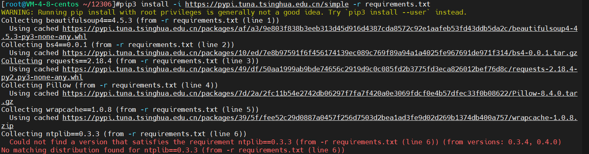
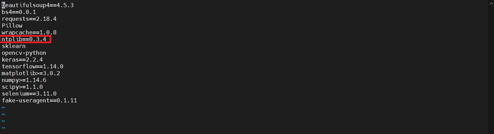
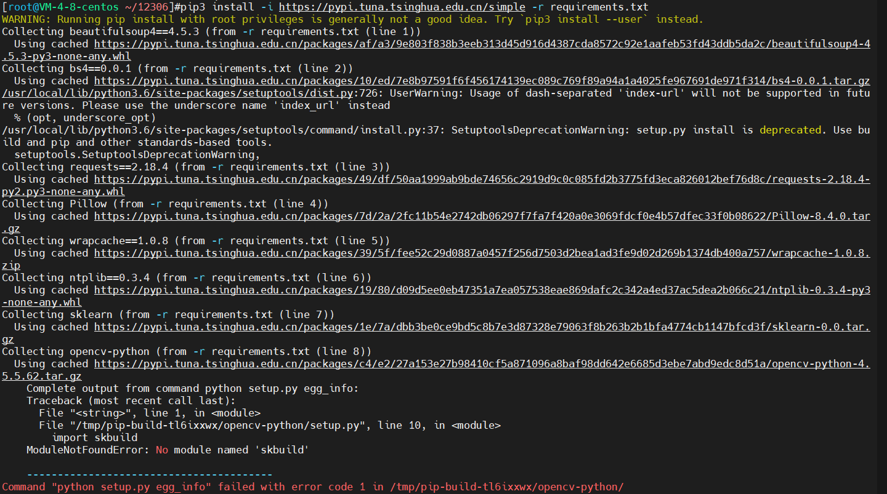
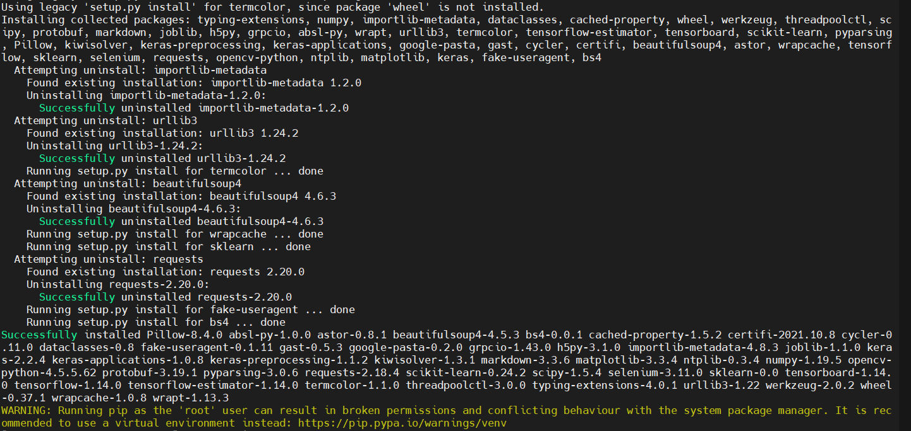

## GitHub上 [testerSunshine/12306](https://github.com/testerSunshine/12306) 抢票教程

### 安装环境
* CentOS 8
* Python 3.7.4
* Pip3

### 下载项目
```shell
# 拉去github中的项目
git clone https://github.com/testerSunshine/12306.git

# 进入下载后的项目
cd 12306

# 下载模型
git clone https://github.com/testerSunshine/12306model.git
```

### 模型的安装需要一些依赖，具体如下（可以先忽略，出现安装问题，下面会给步骤）
```shell
beautifulsoup4==4.5.3
bs4==0.0.1
requests==2.18.4
Pillow
wrapcache==1.0.8
ntplib==0.3.3
sklearn
opencv-python
keras==2.2.4
tensorflow==1.14.0
matplotlib>=3.0.2
numpy>=1.14.6
scipy>=1.1.0
selenium==3.11.0
fake-useragent==0.1.11
```

### 先安装好Python3环境
* python：参考【【HMCXY001】python安装-linux.md】
* pip：参考【【YC】安装pip3.md】

### 安装
```shell
# root用户(避免多python环境产生问题) 
pip3 install -i https://pypi.tuna.tsinghua.edu.cn/simple -r requirements.txt

# 非root用户（避免安装和运行时使用了不同环境）
pip3 install -i https://pypi.tuna.tsinghua.edu.cn/simple -r requirements.txt
```
#### 安装出现的问题
##### requirements.text中的ntplib版本问题

##### 调整下版本
```shell
# 默认在12306文件夹下，修改requirements.text配置中的ntplib
vi requirements.text
```


##### 12306-python中ModuleNotFoundError问题

##### python的问题，参考下【HMCXY001】python安装-linux.md中的解决方法即可

### 安装完成


### 下面的就不写了，项目没人维护，12306的验证码改为滑块验证了，所以验证码一直失败

