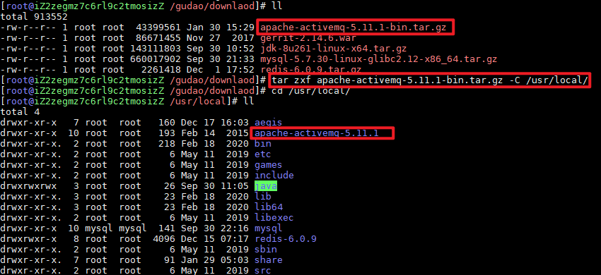
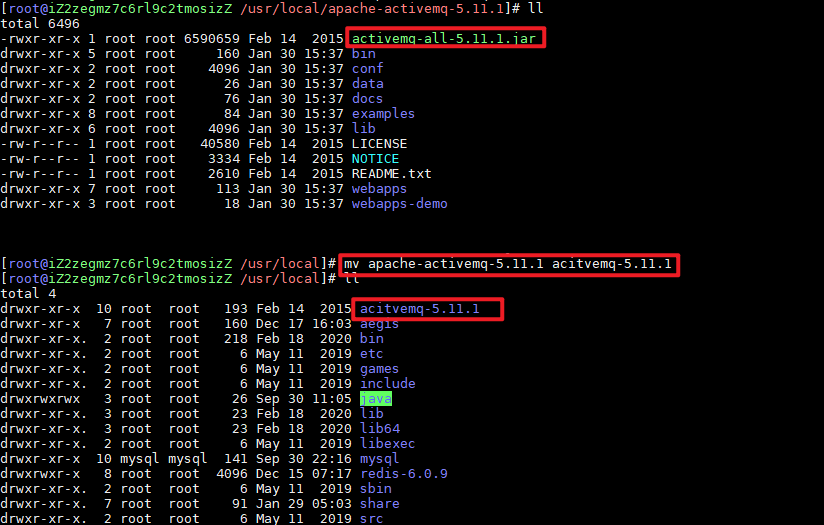
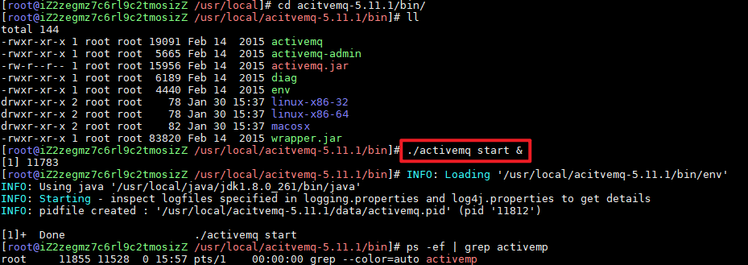
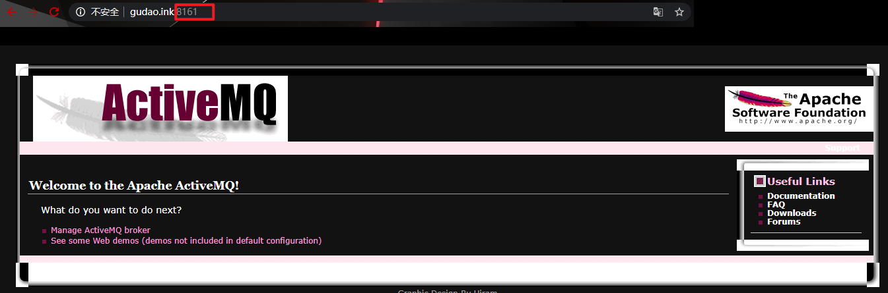
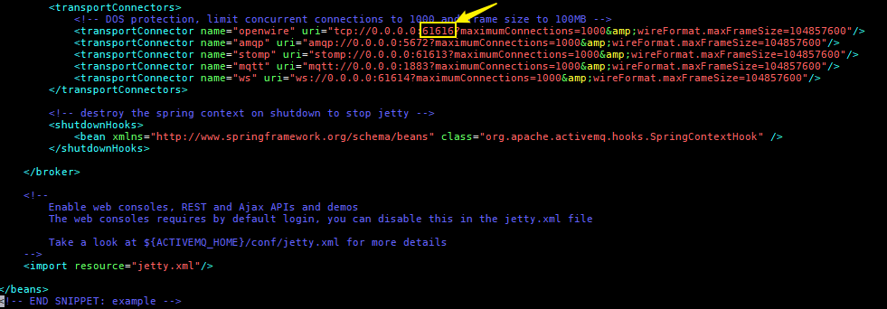
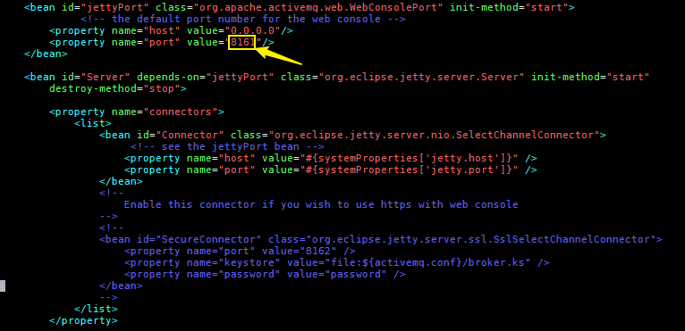

## ActiveMQ介绍及安装启动

### ActiveMQ
> ActiveMQ是一种开源的基于JMS（Java Message Servie）规范的一种消息中间件的实现，ActiveMQ的设计目标是提供标准的，面向消息的，能够跨越多语言和多系统的应用集成消息通信中间件。

### 使用环境
> ActiveMQ常被应用与系统业务的解耦，异步消息的推送，增加系统并发量，提高用户体验。例如以我在工作中的使用，在比较耗时且异步的远程开锁操作时

### 下载地址
[ActiveMQ](http://archive.apache.org/dist/activemq)

### 上传到Linux中
```shell
#安装命令插件
yum -y install lrzsz
#按下回车键，选择自己windows中要上传的文件
rz
```

### 将安装包解压到指定文件路径下
```shell
tar zxf apache-activemq-5.11.1-bin.tar.gz -C /usr/local/
```


### 文件夹重命名
```shell
# 命令格式：mv 老文件名称 新文件名称
mv apache-activemq-5.11.1 acitvemq-5.11.1
```


### 启动
```shell
# 进入安装包中的bin目录下
cd /../bin
# 启动
./activemq start
```


### 界面访问


### 修改端口号
#### 修改tcp端口号
> 修改安装目录下的conf/activemq.xml


#### 修改管理页面的访问端口号
> 安装目录下的conf/jetty.xml



