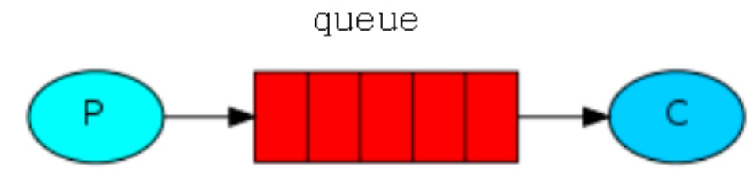

## ActiveMQ介绍及安装启动

### ActiveMQ
> ActiveMQ是一种开源的基于JMS（Java Message Servie）规范的一种消息中间件的实现，ActiveMQ的设计目标是提供标准的，面向消息的，能够跨越多语言和多系统的应用集成消息通信中间件。

### 图解MQ
> 三个角色: Producer, Queue, Consumer


### MQ应用场景
* 服务解耦
  > 双11是购物狂节,用户下单后,订单系统需要通知库存系统，中间通过MQ来过渡处理
  
* 削峰填谷
  > 秒杀活动，一般会因为流量过大，导致应用挂掉,为了解决这个问题，一般在应用前端加入消息队列
  
* 异步化缓冲
  > 用户注册后，需要发注册邮件和注册短信，并行处理
  

### 应用思考点
* 生产端可靠投递性
* 消费端幂等性
* 高可用
* 低延迟
* 可靠性
* 扩展性
* 堆积能力

### 使用环境
> ActiveMQ常被应用与系统业务的解耦，异步消息的推送，增加系统并发量，提高用户体验。例如以我在工作中的使用，在比较耗时且异步的远程开锁操作时

### ActiveMQ的两种消息传递类型
1. 点对点传输，即一个生产者对应一个消费者，生产者向broke推送数据，数据存储在broke的一个队列中，当消费者接受该条队列里的数据。
2. 基于发布/订阅模式的传输，即根据订阅话题来接收相应数据，一个生产者可向多个消费者推送数据，与MQTT协议的实现是类似的。
* 两种消息传递类型的不同，点对点传输消费者可以接收到在连接之前生产者所推送的数据，而基于发布/订阅模式的传输方式消费者只能接收到连接之后生产者推送的数据。

### 下载地址
[ActiveMQ](http://archive.apache.org/dist/activemq)

### 上传到Linux中
```shell
#安装命令插件
yum -y install lrzsz
#按下回车键，选择自己windows中要上传的文件
rz
```

### 将安装包解压到指定文件路径下
```shell
tar zxf apache-activemq-5.11.1-bin.tar.gz -C /usr/local/
```


### 文件夹重命名
```shell
# 命令格式：mv 老文件名称 新文件名称
mv apache-activemq-5.11.1 acitvemq-5.11.1
```


### 启动
```shell
# 进入安装包中的bin目录下
cd /../bin
# 启动
./activemq start
```


### 界面访问


### 修改端口号
#### 修改tcp端口号
> 修改安装目录下的conf/activemq.xml


#### 修改管理页面的访问端口号
> 安装目录下的conf/jetty.xml


