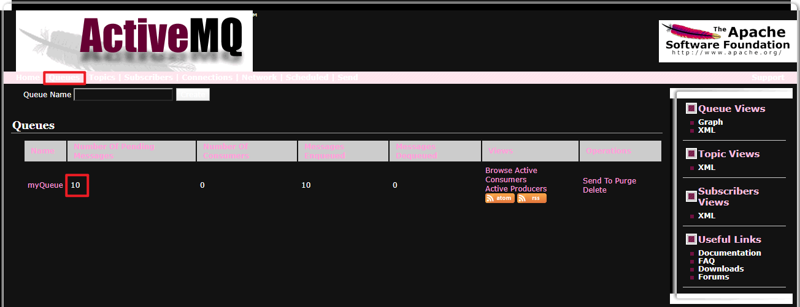
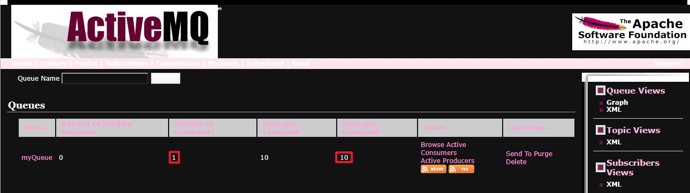
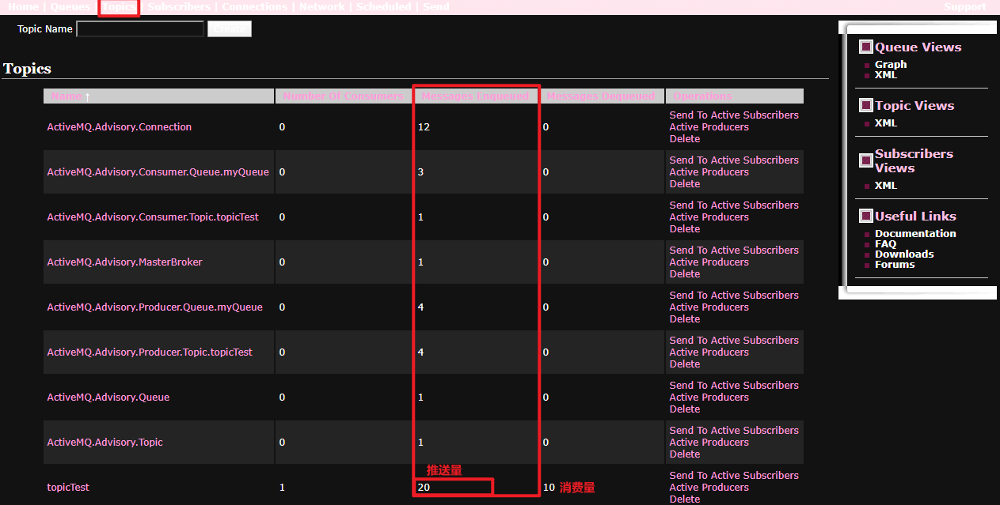

## 使用案例
[GitHub-ActiveMQ](https://github.com/GudaoFQ/ActiveMQ_Demo)

### 点对点
#### 运行Producer端，向服务器mq注册message

#### 运行Comsumer端

### 发布/订阅
#### 先运行Consumer端，然后在运行Producer端
> 只有订阅服务开启，发布的消息才能推送到订阅的服务器上，不然订阅服务就会接收不到

