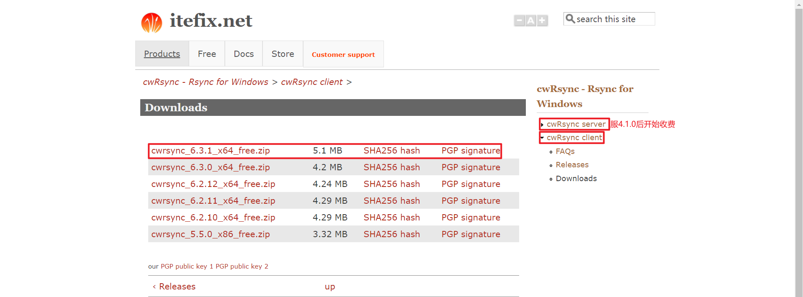
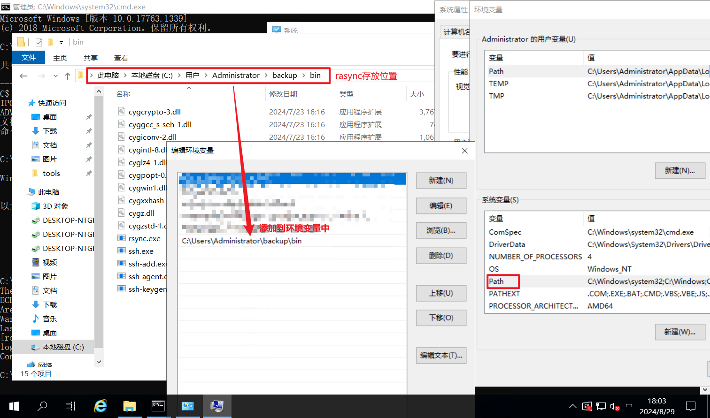
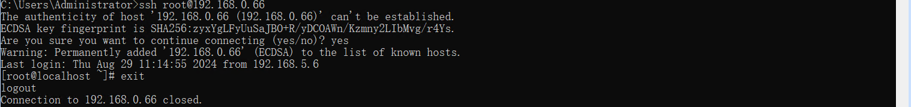
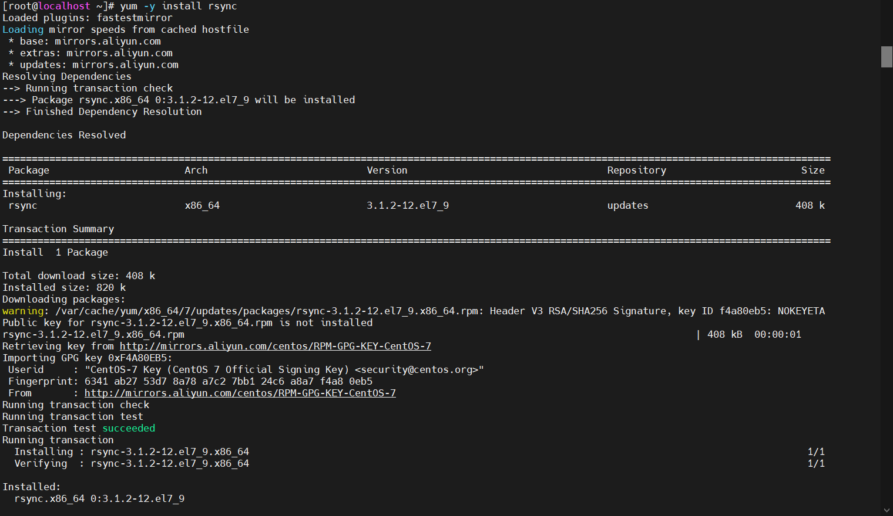
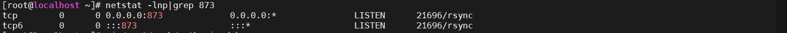
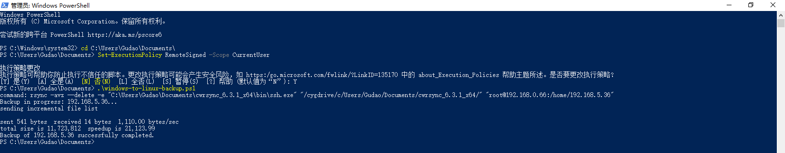

## Windows向Centos进行定期数据备份

### 环境说明
* Windows Server 2019 Standard
* CentOS Linux release 7.7.1908
* win客户端：cwrsync_6.3.1_x64_free.zip
* centos服务端：rsync  version 3.1.2  protocol version 31

### 备份方法一：rsync工具同步
> 支持多台Windows向单台Centos进行数据同步；适用`win to win` 、 `win to linux` 、 `linux to linux`

#### 下载Windows客户端：cwrsync_6.3.1_x64
[下载地址](https://itefix.net/cwrsync/client/downloads)



#### Windows客户解压后添加环境变量


#### 配置win to centos密钥对免密登录：[【YC】ssh通过预置密钥对，开启免密登录.md](../centos/【YC】ssh通过预置密钥对，开启免密登录.md)

* 注意：SSH客户端在首次连接到新的服务器时显示的安全提示，**输入 "yes"** 后，SSH 客户端会将此服务器的密钥添加到已知主机列表中（通常在 ~/.ssh/known_hosts 文件中）。

#### Centos安装rsync工具（国内需要配置阿里镜像源：[【YC】修改为阿里yum源.md](../centos/【YC】修改为阿里yum源.md)）
```shell
# 安装
yum -y install rsync

# 启动
systemctl start rsyncd.service

# 查看状态
## 安装net-tools查看端口
yum install install net-tools
## 873
netstat -lnp | grep 873
```



#### 测试传输命令
```shell
# 查询ssh工具位置，防止多个ssh工具冲突；得到结果后，找到rsync工具位置下的ssh.exe，在命令中将ssh改成rsync中的ssh.exe具体位置即可
where ssh

# 执行传输命令
rsync -avz --delete -e C:\Users\Administrator\backup\bin\ssh.exe /cygdrive/c/Users/Gudao/Documents/cwrsync_6.3.1_x64 root@ip:/home/
# 修改说明
C:\Users\Administrator\backup\bin\ssh.exe                 修改为 自己系统中rsync工具位置下的ssh.exe
/cygdrive/c/Users/Gudao/Documents/cwrsync_6.3.1_x64       修改为 自己需要备份的文件夹路径：格式为 /cygdrive/盘符/文件路径
```
##### 命令说明
* -a: 归档模式，保留几乎所有文件属性，相当于 -rlptgoD。
* -v: 详细模式，提供更多输出信息。
* -z: 在传输过程中压缩文件数据。
* --delete: 删除目标目录中存在但源目录中不存在的文件。
* -e ssh: 指定使用 SSH 作为远程 shell。
* /cygdrive/x/xxx: 源路径：在 Cygwin 环境下的 Windows 指定盘下的 指定文件夹
* root@ip:/home/: 目标路径：ip 为备份目标服务的ip地址或主机名，文件将被同步到远程服务器的 /home/ 目录下

##### 执行脚本
结合[win10备份脚本](../backup/windows-to-linux-backup.ps1)进行自己的修改即可使用
```shell
# 通过管理员启动Powershell命令行

# 进入脚本所在位置
cd C:\Users\Gudao\Documents

# 调整 PowerShell 的执行策略，以允许运行从互联网下载的脚本（可选）
## Set-ExecutionPolicy: 这个 cmdlet 用于设置 PowerShell 的执行策略。
## RemoteSigned: 这表示只有经过数字签名的脚本，或来自受信任发布者的脚本，才能在本地运行。这有助于提高脚本的安全性，防止恶意脚本的执行。
## -Scope CurrentUser: 这表示该设置只适用于当前用户，不会影响其他用户
Set-ExecutionPolicy RemoteSigned -Scope CurrentUser

# 执行脚本
.\windows-to-linux-backup.ps1
```


#### 配置定时任务
详细配置参考[【YC】win添加定时任务](../backup/【YC】win添加定时任务.md)
##### 注意
* 使用定时任务，请使用bat脚本，不要使用提供的ps1脚本。

### 报错解决
#### ssh冲突
```shell
# 报错信息
rsync: connection unexpectedly closed (0 bytes received so far) [receiver] 
rsync error: error in rsync protocol data stream (code 12) at io.c(600) [receiver=3.0.5]

# 解决方法
## 通过 where ssh 命令查找系统中的ssh.exe路径，找到rsync工具自带的，并在命令中指定ssh命令具体的位置
C:\Users\Administrator>where ssh
C:\Windows\System32\OpenSSH\ssh.exe
C:\Users\Administrator\backup\bin\ssh.exe   // rsync工具自带的ssh.exe

## 修改命令，指定ssh具体位置
rsync -avz --delete -e [ssh.exe路径](C:\Users\Administrator\backup\bin\ssh.exe) 本地备份文件路径 备份机器信息与保存位置（root@ip:/home/）
``` 


