## Windows添加定时任务

### 环境说明
* 服务器：Windows 10
* 任务周期：每天一次

### 通过创建基本任务生成定时任务
#### 进入任务创建界面
```shell
# win + R 输入“taskschd.msc”
taskschd.msc
```
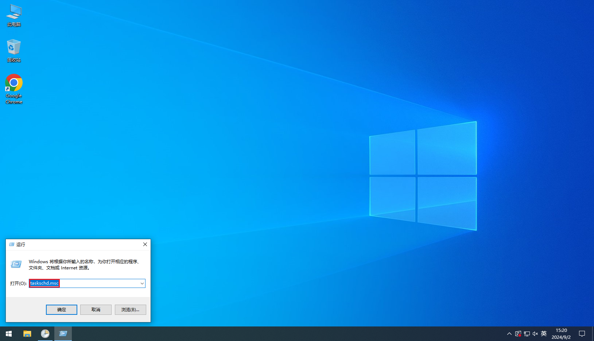

#### 创建基本任务
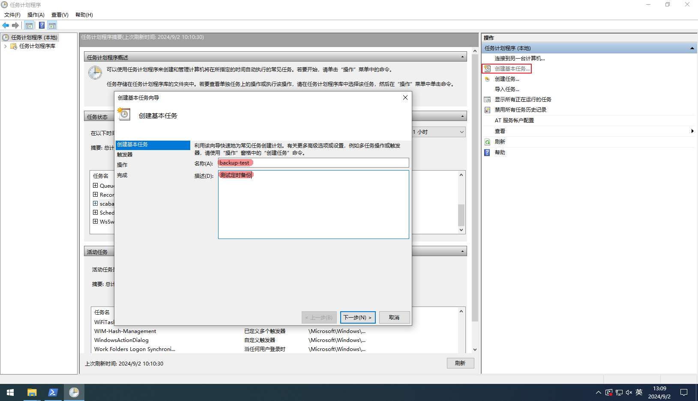

#### 添加触发器
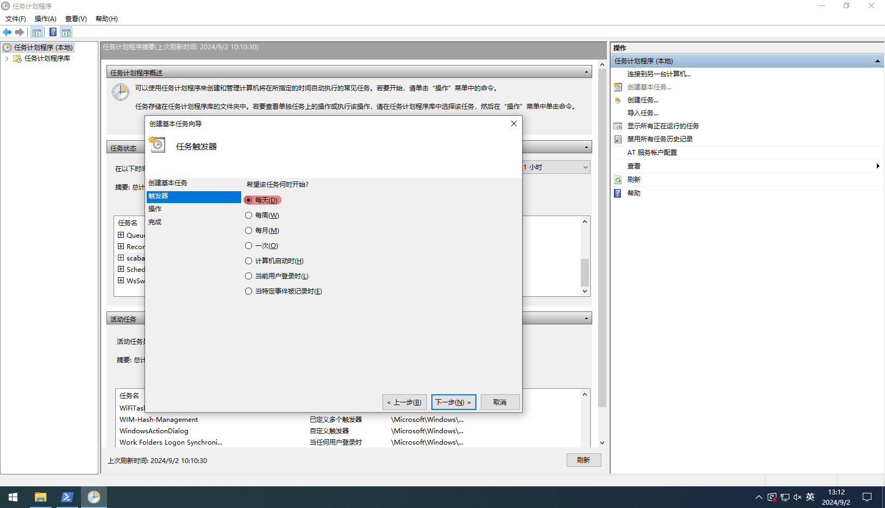

#### 添加触发时间
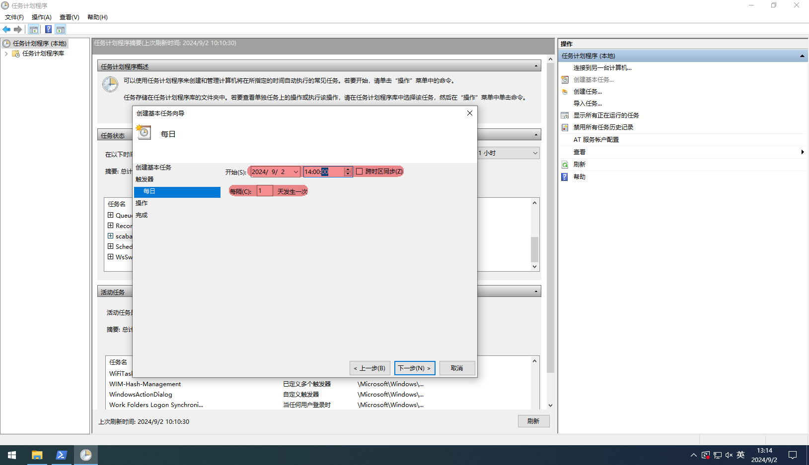

#### 添加操作
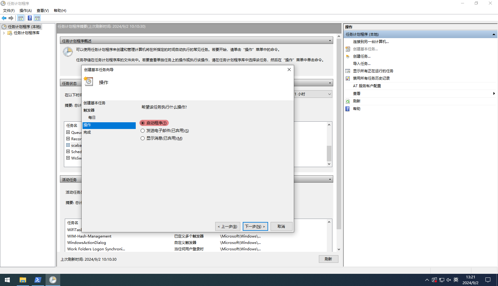

#### 添加执行脚本路径
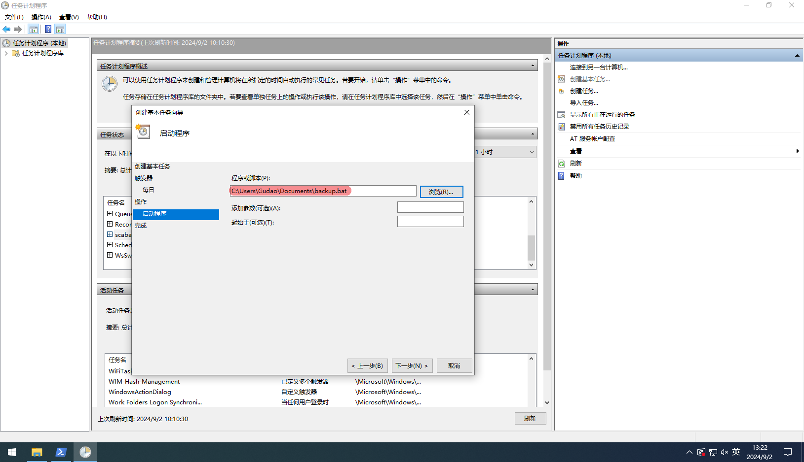

#### 任务添加完成
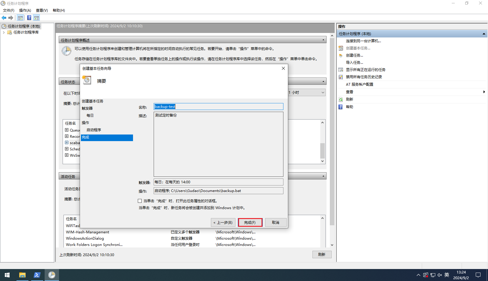

#### 查看任务列表
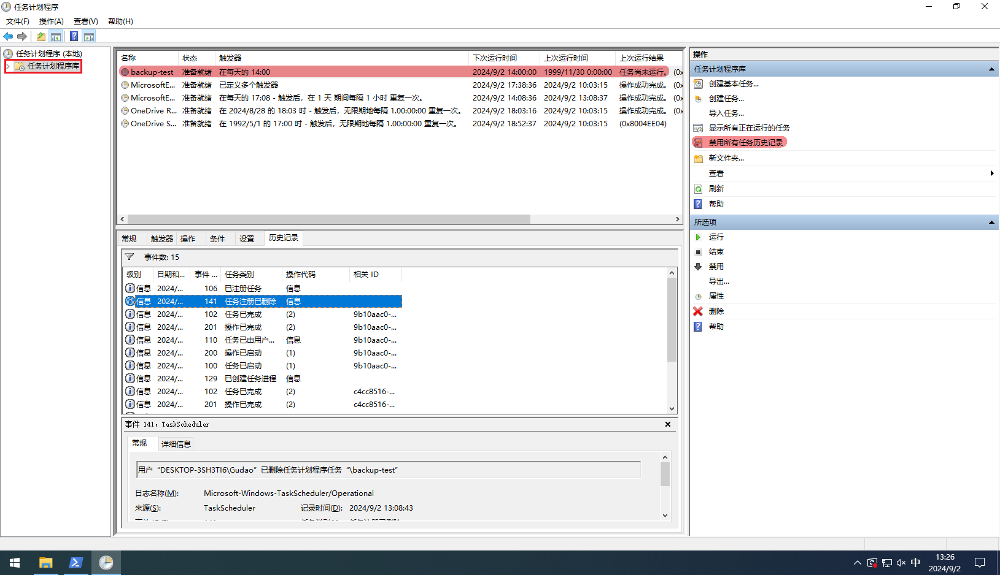

#### 开启或关闭日志记录


#### 注意
* 每次任务需要刷新后才能看到他的准确“状态”

### 通过创建任务生成定时任务
#### 进入任务创建界面
```shell
# win + R 输入“taskschd.msc”
taskschd.msc
```


#### 创建任务


#### 添加触发器
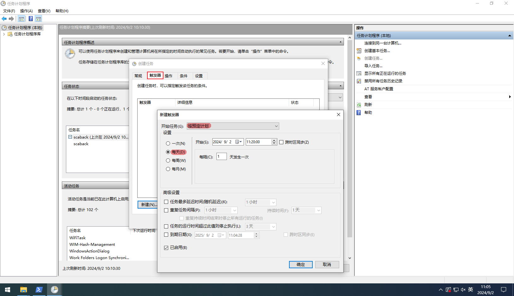

#### 添加任务操作
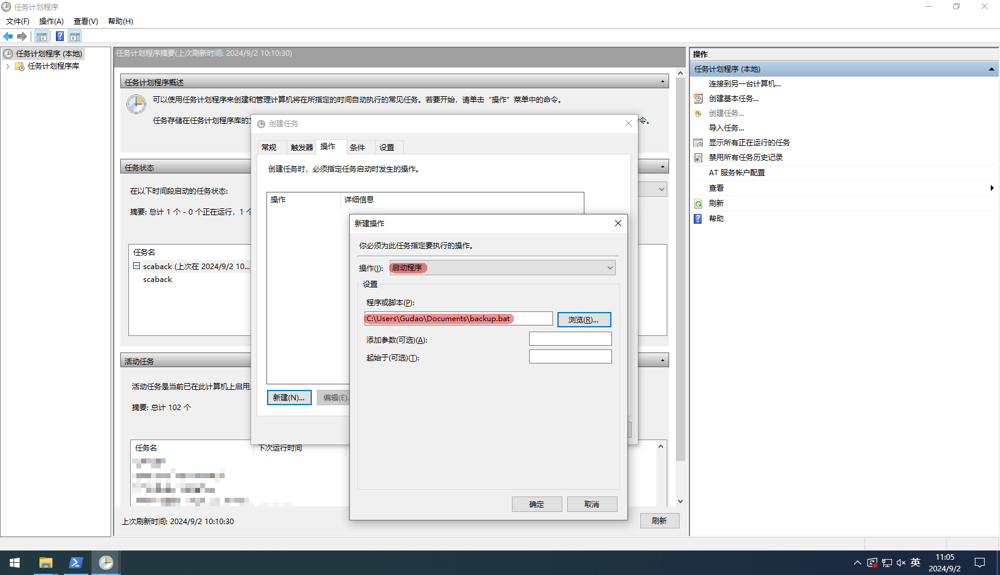

#### 添加条件配置
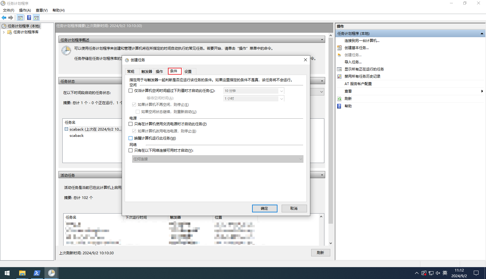

#### 修改设置信息
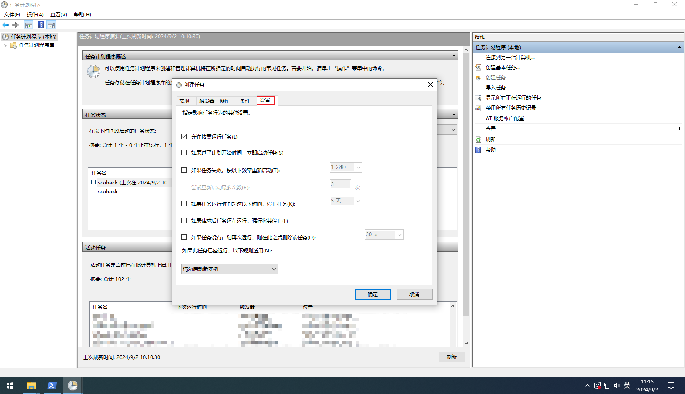

#### 配置执行人账号
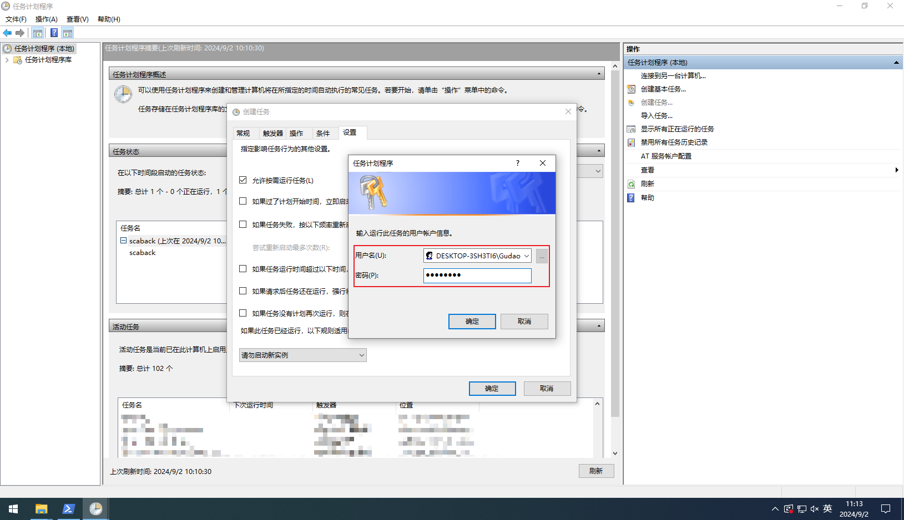

#### 执行日志

