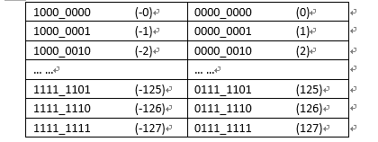
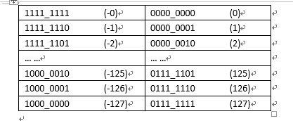
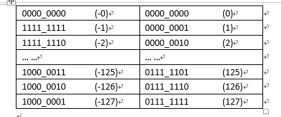

## 原码，补码，反码

### 原码
> 用第一位表示符号，其余位表示值。因为第一位是符号位，所以8位二进制数的取值范围就是：[1111_1111 , 0111_1111]  即 [-127 , 127] ,原码是容易被人脑所理解的表达方式
* 为二进制的数
    > 如：10    原码0000 1010

### 反码
> 正数的补码反码是其本身，负数的反码是符号位保持不变，其余位取反。例如正数1的原码是[0000_0001]，它的反码是是其本身；[0000_0001],-1的原码是[1000_0001],其反码是[1111_1110]
* 正数与原码相同
    > 如：10 -> 反码0000 1010
* 负数为原码0变1，1变0，（符号位不变）
    > 如：-10 -> 原码1000 1010 反码1111 0101

### 补码
> 正数的补码是其本身，负数的补码是在其反码的基础上+1，例如正数1的原码是[0000_0001],他的补码是其本身[0000_0001]；-1的补码是[1111_1111]
* 正数的补码与原码相同
    > 如：10 -> 补码0000 1010
* 负数的反码+1为补码
    > 如：-10 -> 反码：1111 0101 补码：1111 0110

计算机中数字以补码储存，因为原码和反码计算不准确，而补码是准确的。

### 有了原码为什么要使用反码和补码
> 因为人脑可以知道第一位是符号位，可以根据符号位对真值的绝对值进行加减乘除，但是对于计算机来说，加减乘除是最最最基本的运算，要设计的尽量简单，计算机辨别符号位会让计算机的设计电路变得很复杂，于是人们想出了让符号位也参与到运算上来。减去一个数，等于加上他的负数。

#### 使用原码参数运算的缺陷

* 从上面的原码表中可以看见左边每增加一个二进制单位对应的真数是递减的，而右边每增加一个二进制单位对应的真数是递增的，所以对于原码来说，能满足正数的加法，但无法满足负数的加法
```shell
2+1 = [0000_0010]原  + [0000_0001]原 = [0000_0011]原 = 3
1+-1 = [0000_00001]原 + [1000_0001]原 = [1000_0010]原 = -2
```
* 为了满足负数对加法的需求，就必须让负数与他对应的二进制码是同步递增或者同步递减。于是就通过符号位不变，其余位取反来满足这个同步递增或者递减的要求，由于正数本来就满足它本身的加法，所以不需要做任何改变。这就是反码的定义由来。


* 从上图的反码表中可以看到在运算不跨过0的时候，正负数的加法已经能满足要求
```shell
-2+1 = [1111_1101]反 + [0000_0001]反 = [1111_1110]反 = -1
```
127+1=[1000_0000]反=-127=128 加法算出来是128，由于128超过最大值，余1，所以取最小值开始的第一位，也就是最小值-127，但是这里有个不合理的地方，就是[1111_1111]和[0000_0000]都表示0，这导致在实际计算中每当跨过0一次，就有一个单位的误差
```shell
-1+2 = [1111_1110]反 + [0000_0010]反 = [0000_0000]反 = 0
```
要解决这个问题就必须让反码中的[1111_1111]和[0000_0000]合并，

由于[1111_1111]+[0000_0001]=[0000_0000],所以在负数反码的基础上+1就可以解决反码中跨0的误差问题，同时不会对负数与它对应的二进制反码的同步递增产生影响，所以在反码的基础上+1就完美的解决了符号参与预算的问题，这就是补码为什么是在负数反码的基础上+1的由来。


* 从上面的图中发现还有一个[1000_0000]的二进制没有对应任何真数，于是就规定了这个数的真数是-128；
> 所以补码的表示范围是[-128~127] ，这样一来256个二进制正好表示256个整数，在实际二进制的运算中超过范围其实就是对256的取余预算（x+128）mod 256 - 128。
