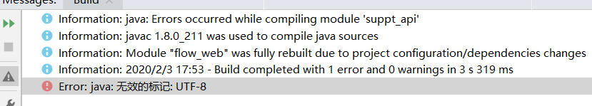
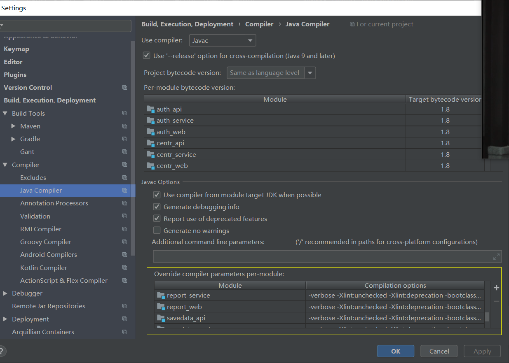

## 无效标记
> 出现无效标记的问题有很多，下面只是我在工作中遇见的

#### 问题描述
> 当项目在build的时候，项目无法编译并抛出如下异常

#### 解决方法
添加要编译的模块，根据项目配置编译参数`-verbose -Xlint:unchecked -Xlint:deprecation -bootclasspath "E:\Program Files\Java\jdk1.8.0_131/jre/lib/rt.jar;E:\Program Files\Java\jdk1.8.0_131/jre/lib/jce.jar;E:\Program Files\Java\jdk1.8.0_131/jre/lib/ext/nashorn.jar"`

