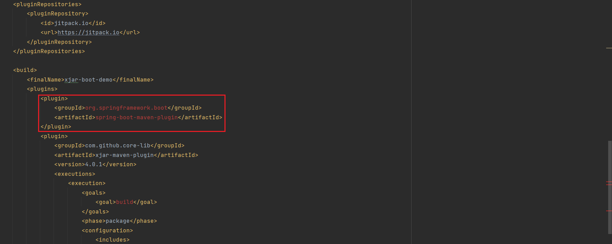
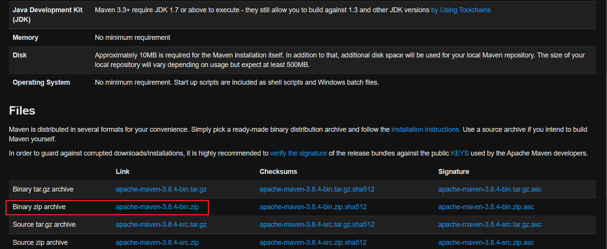
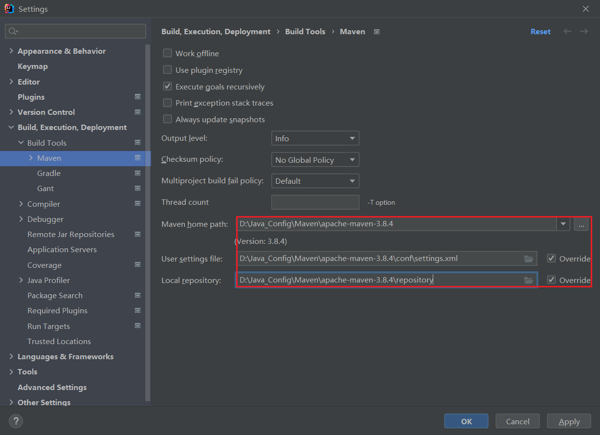
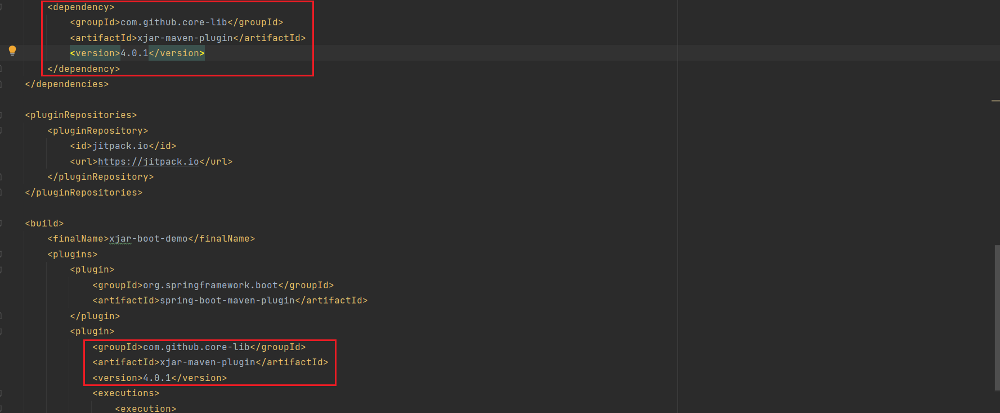
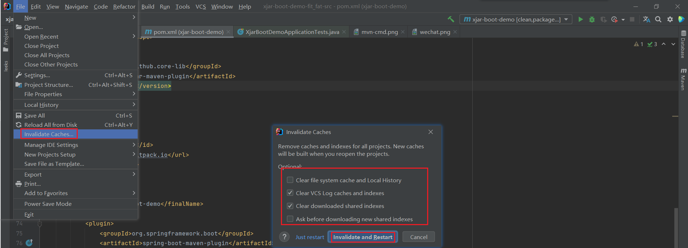
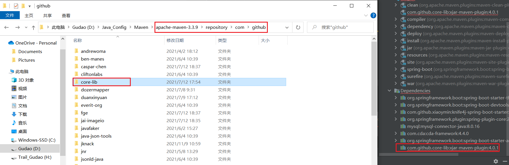
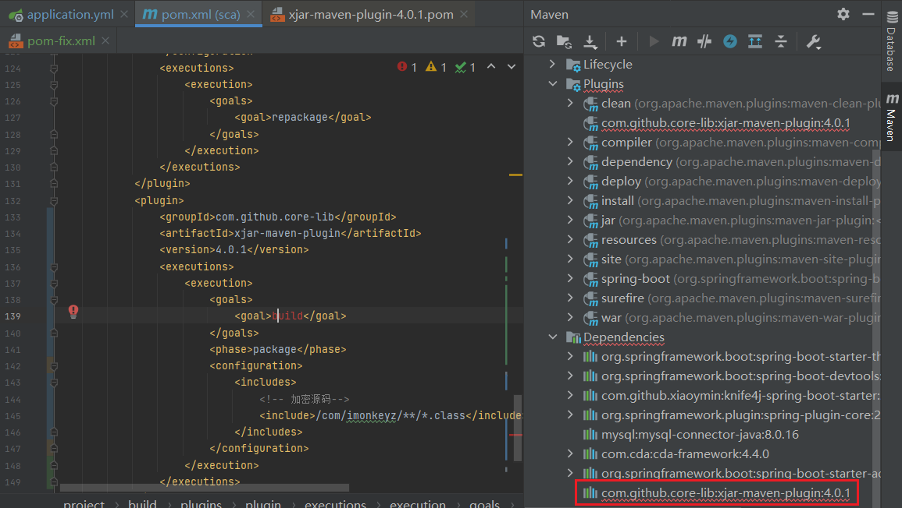

## pom文件下的plugin标签下的jar包报错

### 问题描述
> 项目中使用xjar-maven-plugin插件报错，也不能通过该插件进行打包

### 问题解决
#### maven问题
* maven的settings文件是否正确，如果不确定，直接进 [maven官网](https://maven.apache.org/download.cgi) 重新下一个
  
* idea配置maven
  

#### 本地仓库没有下载过这个jar包
> 因为项目中使用的打包插件，没有在`<dependencies>`标签下进行声明，所以maven不会去下载（我这边是这样），但是我又在maven下的`<plugins>`中进行使用，导致maven去自己本地仓库找不到，所以报红了
* 在`<dependencies>`声明下使用的jar包
  
* 最后把`<dependencies>`下声明的信息删除就行了（一定要删除）

#### 注意：
* 解决问题的过程中如果出现刷新maven没反应，直接重启项目就可以了
  
* 如果还是解决不了，直接去idea中的maven配置仓库、maven仓库或者默认仓库.m2中删除这个jar包，让maven重新下载，然后重启idea（没有删除<dependencies>下的声明jar包也会出现这个问题）
  
  * 问题jar包如图：
    
