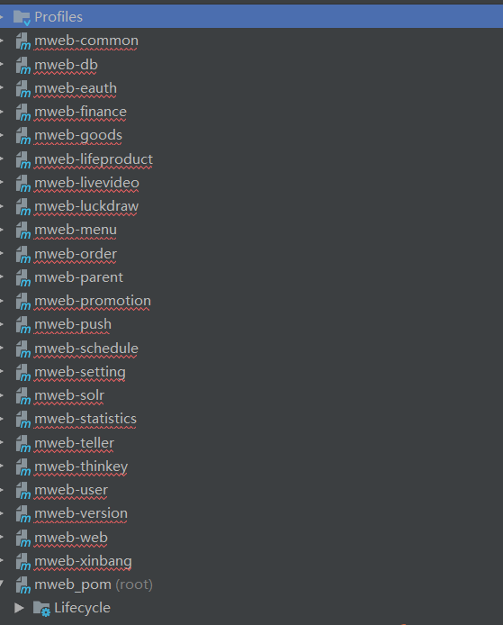
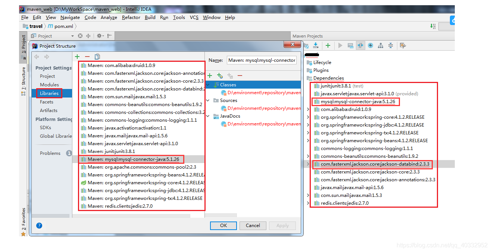
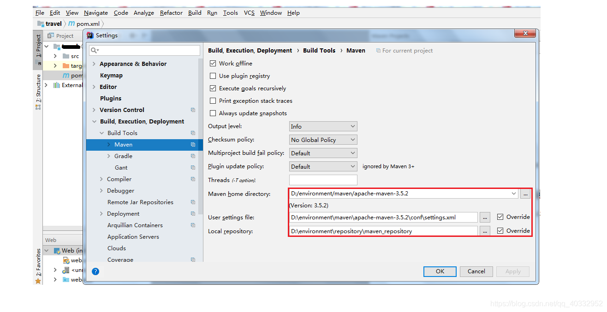
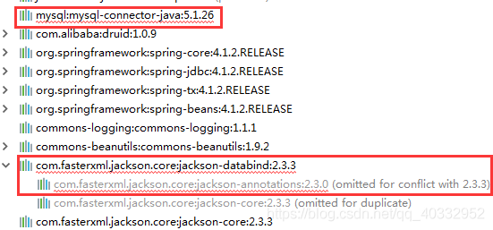
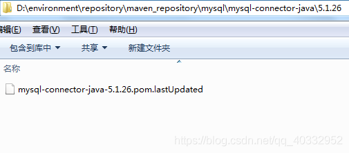
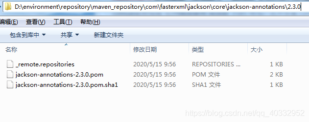
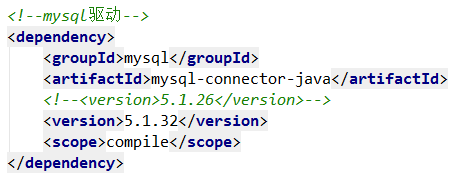

## 项目导入后Maven中全部飘红Unable to import maven project: See logs for details

#### 问题描述
> 将项目导入到IDEA中之后，配置好项目的maven仓库，但是项目一直飘红，找不到jar包，并且弹出：Unable to import maven project: See logs for details



#### 解决方法
因为Maven的版本过高，导致项目问题，换一个版本低些的就行了

### 另一种问题
* 从外部引入Mavn项目依赖还是飘红,查看问题打开File->Project Structure->Libraies,看依赖是否存在


* 查看Maven配置和本地仓库是否配置有问题，没有问题


* 在通过报错的依赖到本地仓库去查看是否少了jar包。


* 通过查看本地仓库，发现是这些jar包没有，也没有自动通过中央仓库下载下来，原因是默认的中央仓库不是在国内，所以很慢。



#### 有两个解决方法
* 将pom文件报错的jar包替换为,本地仓库存在的其他版本的jar包。



* 还有就是替换中央仓库为阿里的中央仓库，速度就很快了。但是jar包版更新版本很慢
```pom
<!--配置阿里中央仓库-->
    <repositories>
        <repository>
            <id>central</id>
            <name>aliyun maven</name>
            <url>http://maven.aliyun.com/nexus/content/groups/public/</url>
            <layout>default</layout>
            <!-- 是否开启发布版构件下载 -->
            <releases>
                <enabled>true</enabled>
            </releases>
            <!-- 是否开启快照版构件下载 -->
            <snapshots>
                <enabled>false</enabled>
            </snapshots>
        </repository>
    </repositories>
```