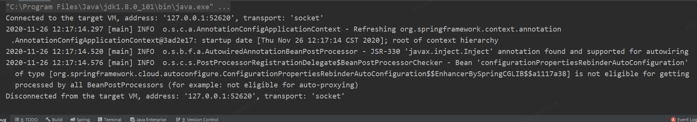
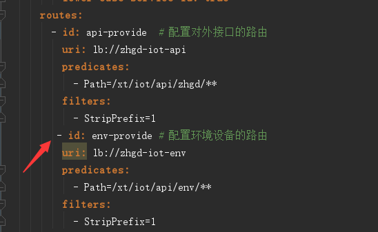

## configurationPropertiesRebinderAutoConfiguration报错问题

#### 错误描述
> 项目无法启动，并抛出如下异常

##### 解决方法
SpringBoot启动在读取配置文件（properties、yml）时发生错误。图中可以看出是spring下的cloud配置出错。
我出错问题是yml文件配置对齐问题；一定要仔细看配置文件，当实在是找不到时，重写配置文件，一点一点的配置并启动，切勿直接cv。

