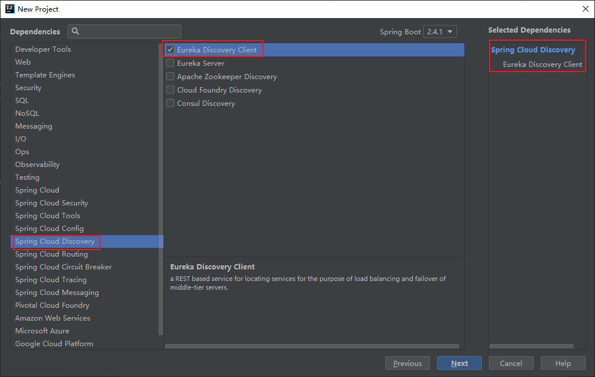
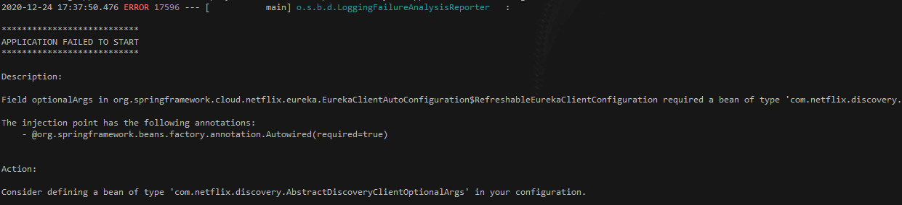
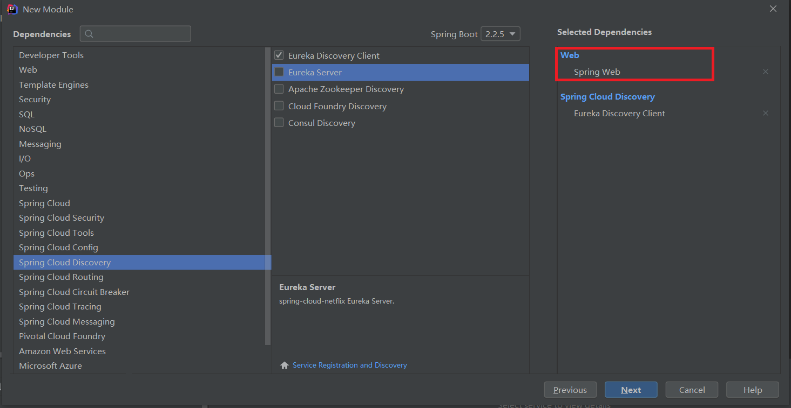

## Field optionalArgs in org.springframework.cloud.netflix.eureka.EurekaClientAutoConfiguration$RefreshableEurekaClientConfiguration required a bean of type 'com.netflix.discovery.AbstractDiscoveryClientOptionalArgs' that could not be found.

#### 问题描述
> 创建springcloud中的eureka的client模块的时候配置如下


> 异常日志

```shell
Error starting ApplicationContext. To display the conditions report re-run your application with 'debug' enabled.
2020-12-24 17:37:50.476 ERROR 17596 --- [           main] o.s.b.d.LoggingFailureAnalysisReporter   : 

***************************
APPLICATION FAILED TO START
***************************

Description:

Field optionalArgs in org.springframework.cloud.netflix.eureka.EurekaClientAutoConfiguration$RefreshableEurekaClientConfiguration required a bean of type 'com.netflix.discovery.AbstractDiscoveryClientOptionalArgs' that could not be found.

The injection point has the following annotations:
	- @org.springframework.beans.factory.annotation.Autowired(required=true)


Action:

Consider defining a bean of type 'com.netflix.discovery.AbstractDiscoveryClientOptionalArgs' in your configuration.
```

#### 问题解决
> pom文件中缺少springboot的启动jar包
```xml
<dependency>
    <groupId>org.springframework.boot</groupId>
    <artifactId>spring-boot-starter-web</artifactId>
    <version>2.4.1</version>
    <scope>compile</scope>
</dependency>
```
* 或者直接在创建项目的是后添加springboot-web配置



