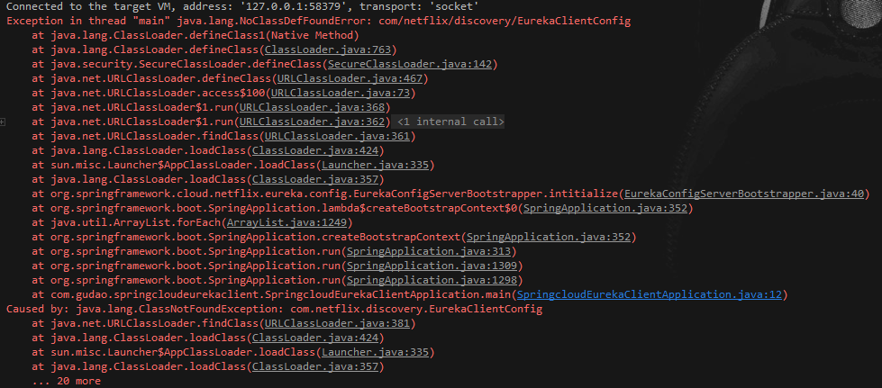
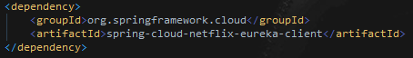

## Exception in thread "main" java.lang.NoClassDefFoundError: com/netflix/discovery/EurekaClientConfig

## Caused by: java.lang.ClassNotFoundException: com.netflix.discovery.AbstractDiscoveryClientOptionalArgs

#### 问题描述
> 项目搭建添加的配置项


> 异常日志[下面两个问题都由下述问题产生]

```shell
Exception in thread "main" java.lang.NoClassDefFoundError: com/netflix/discovery/EurekaClientConfig
	at java.lang.ClassLoader.defineClass1(Native Method)
	at java.lang.ClassLoader.defineClass(ClassLoader.java:763)
	at java.security.SecureClassLoader.defineClass(SecureClassLoader.java:142)
	at java.net.URLClassLoader.defineClass(URLClassLoader.java:467)
	at java.net.URLClassLoader.access$100(URLClassLoader.java:73)
	at java.net.URLClassLoader$1.run(URLClassLoader.java:368)
	at java.net.URLClassLoader$1.run(URLClassLoader.java:362)
	at java.security.AccessController.doPrivileged(Native Method)
	at java.net.URLClassLoader.findClass(URLClassLoader.java:361)
	at java.lang.ClassLoader.loadClass(ClassLoader.java:424)
	at sun.misc.Launcher$AppClassLoader.loadClass(Launcher.java:335)
	at java.lang.ClassLoader.loadClass(ClassLoader.java:357)
	at org.springframework.cloud.netflix.eureka.config.EurekaConfigServerBootstrapper.intitialize(EurekaConfigServerBootstrapper.java:40)
	at org.springframework.boot.SpringApplication.lambda$createBootstrapContext$0(SpringApplication.java:352)
	at java.util.ArrayList.forEach(ArrayList.java:1249)
	at org.springframework.boot.SpringApplication.createBootstrapContext(SpringApplication.java:352)
	at org.springframework.boot.SpringApplication.run(SpringApplication.java:313)
	at org.springframework.boot.SpringApplication.run(SpringApplication.java:1309)
	at org.springframework.boot.SpringApplication.run(SpringApplication.java:1298)
	at com.gudao.springcloudeurekaclient.SpringcloudEurekaClientApplication.main(SpringcloudEurekaClientApplication.java:12)
Caused by: java.lang.ClassNotFoundException: com.netflix.discovery.EurekaClientConfig
	at java.net.URLClassLoader.findClass(URLClassLoader.java:381)
	at java.lang.ClassLoader.loadClass(ClassLoader.java:424)
	at sun.misc.Launcher$AppClassLoader.loadClass(Launcher.java:335)
	at java.lang.ClassLoader.loadClass(ClassLoader.java:357)
	... 20 more
```
```shell
java.lang.IllegalStateException: Error processing condition on org.springframework.cloud.netflix.eureka.config.DiscoveryClientOptionalArgsConfiguration.defaultEurekaClientHttpRequestFactorySupplier
	at org.springframework.boot.autoconfigure.condition.SpringBootCondition.matches(SpringBootCondition.java:60) ~[spring-boot-autoconfigure-2.4.1.jar:2.4.1]
	at org.springframework.context.annotation.ConditionEvaluator.shouldSkip(ConditionEvaluator.java:108) ~[spring-context-5.3.2.jar:5.3.2]
	at org.springframework.context.annotation.ConfigurationClassBeanDefinitionReader.loadBeanDefinitionsForBeanMethod(ConfigurationClassBeanDefinitionReader.java:193) ~[spring-context-5.3.2.jar:5.3.2]
	at org.springframework.context.annotation.ConfigurationClassBeanDefinitionReader.loadBeanDefinitionsForConfigurationClass(ConfigurationClassBeanDefinitionReader.java:153) ~[spring-context-5.3.2.jar:5.3.2]
	at org.springframework.context.annotation.ConfigurationClassBeanDefinitionReader.loadBeanDefinitions(ConfigurationClassBeanDefinitionReader.java:129) ~[spring-context-5.3.2.jar:5.3.2]
	at org.springframework.context.annotation.ConfigurationClassPostProcessor.processConfigBeanDefinitions(ConfigurationClassPostProcessor.java:348) ~[spring-context-5.3.2.jar:5.3.2]
	at org.springframework.context.annotation.ConfigurationClassPostProcessor.postProcessBeanDefinitionRegistry(ConfigurationClassPostProcessor.java:252) ~[spring-context-5.3.2.jar:5.3.2]
	at org.springframework.context.support.PostProcessorRegistrationDelegate.invokeBeanDefinitionRegistryPostProcessors(PostProcessorRegistrationDelegate.java:285) ~[spring-context-5.3.2.jar:5.3.2]
	at org.springframework.context.support.PostProcessorRegistrationDelegate.invokeBeanFactoryPostProcessors(PostProcessorRegistrationDelegate.java:99) ~[spring-context-5.3.2.jar:5.3.2]
	at org.springframework.context.support.AbstractApplicationContext.invokeBeanFactoryPostProcessors(AbstractApplicationContext.java:751) ~[spring-context-5.3.2.jar:5.3.2]
	at org.springframework.context.support.AbstractApplicationContext.refresh(AbstractApplicationContext.java:569) ~[spring-context-5.3.2.jar:5.3.2]
	at org.springframework.boot.web.servlet.context.ServletWebServerApplicationContext.refresh(ServletWebServerApplicationContext.java:144) ~[spring-boot-2.4.1.jar:2.4.1]
	at org.springframework.boot.SpringApplication.refresh(SpringApplication.java:767) [spring-boot-2.4.1.jar:2.4.1]
	at org.springframework.boot.SpringApplication.refresh(SpringApplication.java:759) [spring-boot-2.4.1.jar:2.4.1]
	at org.springframework.boot.SpringApplication.refreshContext(SpringApplication.java:426) [spring-boot-2.4.1.jar:2.4.1]
	at org.springframework.boot.SpringApplication.run(SpringApplication.java:326) [spring-boot-2.4.1.jar:2.4.1]
	at org.springframework.boot.SpringApplication.run(SpringApplication.java:1309) [spring-boot-2.4.1.jar:2.4.1]
	at org.springframework.boot.SpringApplication.run(SpringApplication.java:1298) [spring-boot-2.4.1.jar:2.4.1]
	at com.gudao.springcloudclient.SpringcloudClientApplication.main(SpringcloudClientApplication.java:12) [classes/:na]
Caused by: java.lang.IllegalStateException: Failed to introspect Class [org.springframework.cloud.netflix.eureka.config.DiscoveryClientOptionalArgsConfiguration] from ClassLoader [sun.misc.Launcher$AppClassLoader@18b4aac2]
	at org.springframework.util.ReflectionUtils.getDeclaredMethods(ReflectionUtils.java:481) ~[spring-core-5.3.2.jar:5.3.2]
	at org.springframework.util.ReflectionUtils.doWithMethods(ReflectionUtils.java:358) ~[spring-core-5.3.2.jar:5.3.2]
	at org.springframework.util.ReflectionUtils.getUniqueDeclaredMethods(ReflectionUtils.java:414) ~[spring-core-5.3.2.jar:5.3.2]
	at org.springframework.beans.factory.support.AbstractAutowireCapableBeanFactory.lambda$getTypeForFactoryMethod$2(AbstractAutowireCapableBeanFactory.java:754) ~[spring-beans-5.3.2.jar:5.3.2]
	at java.util.concurrent.ConcurrentHashMap.computeIfAbsent(ConcurrentHashMap.java:1688) ~[na:1.8.0_131]
	at org.springframework.beans.factory.support.AbstractAutowireCapableBeanFactory.getTypeForFactoryMethod(AbstractAutowireCapableBeanFactory.java:753) ~[spring-beans-5.3.2.jar:5.3.2]
	at org.springframework.beans.factory.support.AbstractAutowireCapableBeanFactory.determineTargetType(AbstractAutowireCapableBeanFactory.java:692) ~[spring-beans-5.3.2.jar:5.3.2]
	at org.springframework.beans.factory.support.AbstractAutowireCapableBeanFactory.predictBeanType(AbstractAutowireCapableBeanFactory.java:663) ~[spring-beans-5.3.2.jar:5.3.2]
	at org.springframework.beans.factory.support.AbstractBeanFactory.isFactoryBean(AbstractBeanFactory.java:1665) ~[spring-beans-5.3.2.jar:5.3.2]
	at org.springframework.beans.factory.support.DefaultListableBeanFactory.doGetBeanNamesForType(DefaultListableBeanFactory.java:570) ~[spring-beans-5.3.2.jar:5.3.2]
	at org.springframework.beans.factory.support.DefaultListableBeanFactory.getBeanNamesForType(DefaultListableBeanFactory.java:542) ~[spring-beans-5.3.2.jar:5.3.2]
	at org.springframework.boot.autoconfigure.condition.OnBeanCondition.collectBeanNamesForType(OnBeanCondition.java:238) ~[spring-boot-autoconfigure-2.4.1.jar:2.4.1]
	at org.springframework.boot.autoconfigure.condition.OnBeanCondition.getBeanNamesForType(OnBeanCondition.java:231) ~[spring-boot-autoconfigure-2.4.1.jar:2.4.1]
	at org.springframework.boot.autoconfigure.condition.OnBeanCondition.getBeanNamesForType(OnBeanCondition.java:221) ~[spring-boot-autoconfigure-2.4.1.jar:2.4.1]
	at org.springframework.boot.autoconfigure.condition.OnBeanCondition.getMatchingBeans(OnBeanCondition.java:169) ~[spring-boot-autoconfigure-2.4.1.jar:2.4.1]
	at org.springframework.boot.autoconfigure.condition.OnBeanCondition.getMatchOutcome(OnBeanCondition.java:144) ~[spring-boot-autoconfigure-2.4.1.jar:2.4.1]
	at org.springframework.boot.autoconfigure.condition.SpringBootCondition.matches(SpringBootCondition.java:47) ~[spring-boot-autoconfigure-2.4.1.jar:2.4.1]
	... 18 common frames omitted
Caused by: java.lang.NoClassDefFoundError: com/netflix/discovery/AbstractDiscoveryClientOptionalArgs
	at java.lang.Class.getDeclaredMethods0(Native Method) ~[na:1.8.0_131]
	at java.lang.Class.privateGetDeclaredMethods(Class.java:2701) ~[na:1.8.0_131]
	at java.lang.Class.getDeclaredMethods(Class.java:1975) ~[na:1.8.0_131]
	at org.springframework.util.ReflectionUtils.getDeclaredMethods(ReflectionUtils.java:463) ~[spring-core-5.3.2.jar:5.3.2]
	... 34 common frames omitted
Caused by: java.lang.ClassNotFoundException: com.netflix.discovery.AbstractDiscoveryClientOptionalArgs
	at java.net.URLClassLoader.findClass(URLClassLoader.java:381) ~[na:1.8.0_131]
	at java.lang.ClassLoader.loadClass(ClassLoader.java:424) ~[na:1.8.0_131]
	at sun.misc.Launcher$AppClassLoader.loadClass(Launcher.java:335) ~[na:1.8.0_131]
	at java.lang.ClassLoader.loadClass(ClassLoader.java:357) ~[na:1.8.0_131]
	... 38 common frames omitted

2020-12-25 16:56:44.534  WARN 16972 --- [           main] o.s.boot.SpringApplication               : Unable to close ApplicationContext

java.lang.IllegalStateException: Failed to introspect Class [org.springframework.cloud.netflix.eureka.config.DiscoveryClientOptionalArgsConfiguration] from ClassLoader [sun.misc.Launcher$AppClassLoader@18b4aac2]
	at org.springframework.util.ReflectionUtils.getDeclaredMethods(ReflectionUtils.java:481) ~[spring-core-5.3.2.jar:5.3.2]
	at org.springframework.util.ReflectionUtils.doWithMethods(ReflectionUtils.java:358) ~[spring-core-5.3.2.jar:5.3.2]
	at org.springframework.util.ReflectionUtils.getUniqueDeclaredMethods(ReflectionUtils.java:414) ~[spring-core-5.3.2.jar:5.3.2]
	at org.springframework.beans.factory.support.AbstractAutowireCapableBeanFactory.lambda$getTypeForFactoryMethod$2(AbstractAutowireCapableBeanFactory.java:754) ~[spring-beans-5.3.2.jar:5.3.2]
	at java.util.concurrent.ConcurrentHashMap.computeIfAbsent(ConcurrentHashMap.java:1688) ~[na:1.8.0_131]
	at org.springframework.beans.factory.support.AbstractAutowireCapableBeanFactory.getTypeForFactoryMethod(AbstractAutowireCapableBeanFactory.java:753) ~[spring-beans-5.3.2.jar:5.3.2]
	at org.springframework.beans.factory.support.AbstractAutowireCapableBeanFactory.determineTargetType(AbstractAutowireCapableBeanFactory.java:692) ~[spring-beans-5.3.2.jar:5.3.2]
	at org.springframework.beans.factory.support.AbstractAutowireCapableBeanFactory.predictBeanType(AbstractAutowireCapableBeanFactory.java:663) ~[spring-beans-5.3.2.jar:5.3.2]
	at org.springframework.beans.factory.support.AbstractBeanFactory.isFactoryBean(AbstractBeanFactory.java:1665) ~[spring-beans-5.3.2.jar:5.3.2]
	at org.springframework.beans.factory.support.DefaultListableBeanFactory.doGetBeanNamesForType(DefaultListableBeanFactory.java:570) ~[spring-beans-5.3.2.jar:5.3.2]
	at org.springframework.beans.factory.support.DefaultListableBeanFactory.getBeanNamesForType(DefaultListableBeanFactory.java:542) ~[spring-beans-5.3.2.jar:5.3.2]
	at org.springframework.beans.factory.support.DefaultListableBeanFactory.getBeansOfType(DefaultListableBeanFactory.java:667) ~[spring-beans-5.3.2.jar:5.3.2]
	at org.springframework.beans.factory.support.DefaultListableBeanFactory.getBeansOfType(DefaultListableBeanFactory.java:659) ~[spring-beans-5.3.2.jar:5.3.2]
	at org.springframework.context.support.AbstractApplicationContext.getBeansOfType(AbstractApplicationContext.java:1305) ~[spring-context-5.3.2.jar:5.3.2]
	at org.springframework.boot.SpringApplication.getExitCodeFromMappedException(SpringApplication.java:899) [spring-boot-2.4.1.jar:2.4.1]
	at org.springframework.boot.SpringApplication.getExitCodeFromException(SpringApplication.java:887) [spring-boot-2.4.1.jar:2.4.1]
	at org.springframework.boot.SpringApplication.handleExitCode(SpringApplication.java:874) [spring-boot-2.4.1.jar:2.4.1]
	at org.springframework.boot.SpringApplication.handleRunFailure(SpringApplication.java:815) [spring-boot-2.4.1.jar:2.4.1]
	at org.springframework.boot.SpringApplication.run(SpringApplication.java:336) [spring-boot-2.4.1.jar:2.4.1]
	at org.springframework.boot.SpringApplication.run(SpringApplication.java:1309) [spring-boot-2.4.1.jar:2.4.1]
	at org.springframework.boot.SpringApplication.run(SpringApplication.java:1298) [spring-boot-2.4.1.jar:2.4.1]
	at com.gudao.springcloudclient.SpringcloudClientApplication.main(SpringcloudClientApplication.java:12) [classes/:na]
Caused by: java.lang.NoClassDefFoundError: com/netflix/discovery/AbstractDiscoveryClientOptionalArgs
	at java.lang.Class.getDeclaredMethods0(Native Method) ~[na:1.8.0_131]
	at java.lang.Class.privateGetDeclaredMethods(Class.java:2701) ~[na:1.8.0_131]
	at java.lang.Class.getDeclaredMethods(Class.java:1975) ~[na:1.8.0_131]
	at org.springframework.util.ReflectionUtils.getDeclaredMethods(ReflectionUtils.java:463) ~[spring-core-5.3.2.jar:5.3.2]
	... 21 common frames omitted
Caused by: java.lang.ClassNotFoundException: com.netflix.discovery.AbstractDiscoveryClientOptionalArgs
	at java.net.URLClassLoader.findClass(URLClassLoader.java:381) ~[na:1.8.0_131]
	at java.lang.ClassLoader.loadClass(ClassLoader.java:424) ~[na:1.8.0_131]
	at sun.misc.Launcher$AppClassLoader.loadClass(Launcher.java:335) ~[na:1.8.0_131]
	at java.lang.ClassLoader.loadClass(ClassLoader.java:357) ~[na:1.8.0_131]
	... 25 common frames omitted
```

#### 问题解决
> pom文件中client的jar包引错


> 正确jar包[要添加start]
```xml
<dependency>
    <groupId>org.springframework.boot</groupId>
    <artifactId>spring-boot-starter-web</artifactId>
    <version>2.4.1</version>
    <scope>compile</scope>
</dependency>
```


