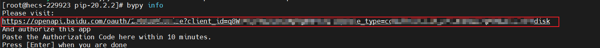
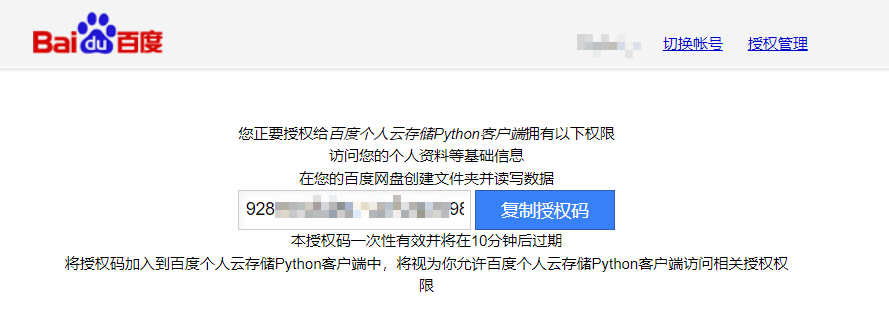
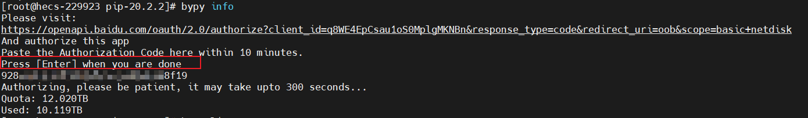
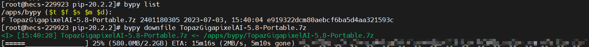

## Pip3安装教程

### 说明
* CentOS：8

<details>
<summary>【YC】安装pip3.md详情</summary>

### 安装setuptools
```shell
# 下载安装文件
wget --no-check-certificate https://pypi.python.org/packages/source/s/setuptools/setuptools-19.6.tar.gz#md5=c607dd118eae682c44ed146367a17e26

# 解压
tar -zxvf setuptools-19.6.tar.gz
cd setuptools-19.6

# 执行安装
sudo python3 setup.py build
sudo python3 setup.py install
```

### 安装pip3
```shell
# 下载安装文件
wget --no-check-certificate https://pypi.python.org/packages/source/p/pip/pip-20.2.2.tar.gz#md5=3a73c4188f8dbad6a1e6f6d44d117eeb
 
# 解压
tar -zxvf pip-20.2.2.tar.gz 
cd pip-20.2.2

# 执行安装
python3 setup.py build 
sudo python3 setup.py install
```
</details>

## Python版百度网盘使用

### 安装screen

```shell
pip install screen
# 上面命令安装不成功，就用下面这个命令
yum install screen

screen -S bypy
```

### 安装百度网盘Python版

```shell
pip install bypy
```

### 初始化

> 初始化后会出现一个百度网盘授权地址，需要发送给我们，进行授权

```shell
bypy info
```



### 界面授权



### CentOs进行登录

> 出现红框中的内容，粘贴授权码即可



### 查看与下载文件

```shell
# 查看命令
bypy list

# 下载命令
bypy downfile 文件名称
```


