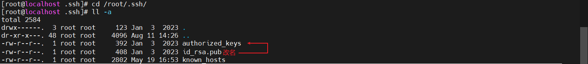
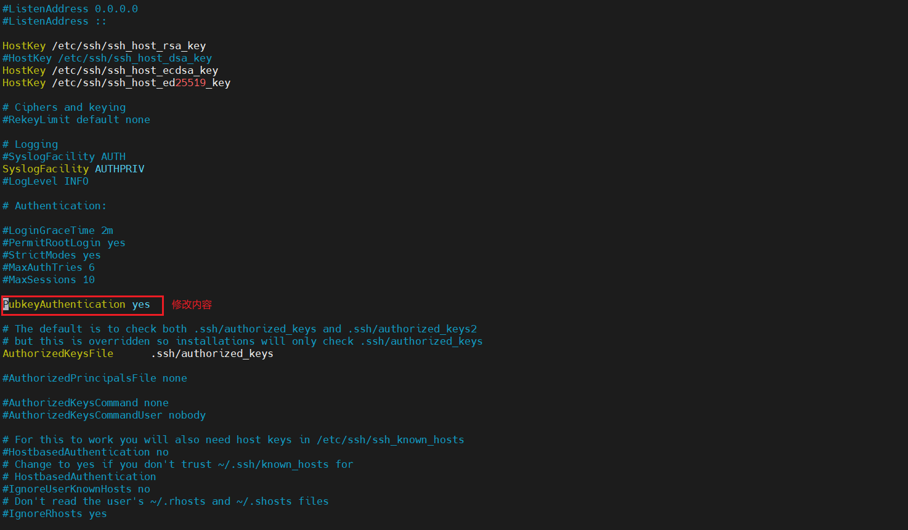
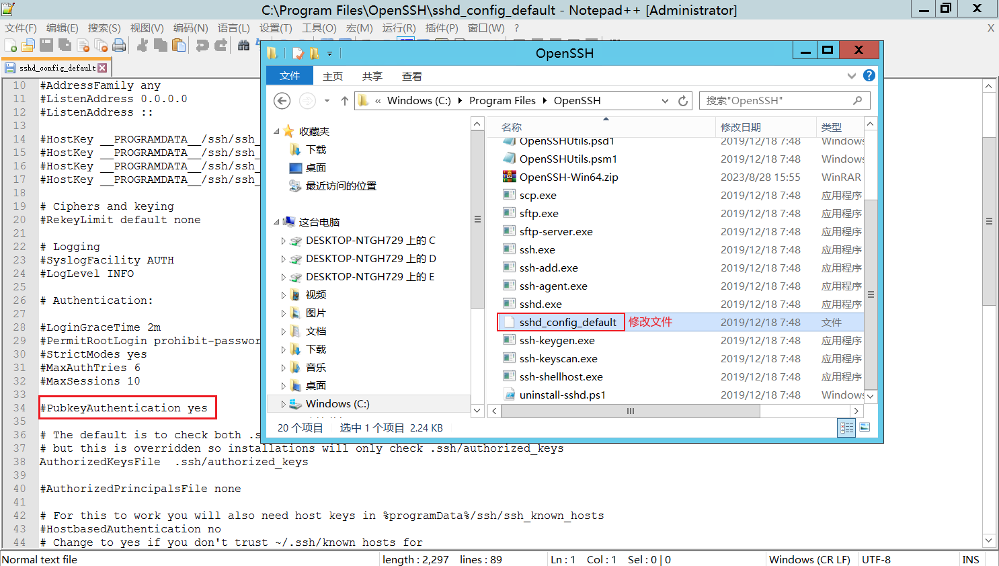

## SSH通过ssh-key开启免密登录（window，linux均适用）
> 如果A想SSH连接B，又不想输入密码；此时就可以通过A中生成的SSH密钥对，上传PublicKey到B，配置如下操作后，A就能直接连接B了

### 生成密钥对
> 采用rsa算法，可以使用其他算法，但dsa默认不支持；最好生成rsa密钥，ssh支持
```shell
ssh-keygen -t rsa
```

### 将公钥(id_rsa.pub)传到远程主机的~/.ssh目录下，重命名文件名为authorized_keys
> 这一步骤也可以通过在服务器`/root/.ssh`路径下创建`authorized_keys`文件，然后把公钥内容复制进去，然后重启sshd服务即可
```shell
## 这个root和用户名称可以自定，想给哪个用户开，就传到那个用户的.ssh文件夹下面
# linux
cd /root/.ssh
# windows
C:\Users\用户名称\.ssh

## 复制公钥内容到authorized_keys
mkdir /root/.ssh/
# 通过cat复制公钥内容或者vi命令将.pub文件内容复制到authorized_keys
cat id_rsa.pub > authorized_keys
或
vi authorized_keys
```

* 注意：如果有**多台服务器**需要想**一台服务器添加公钥**，需要将**多台服务器的公钥（.pub文件）内容**复制到服务器的`/root/.ssh/authorized_keys`文件，然后重启sshd服务（**一个公钥一行，切记要换行**）

### 修改远程主机sshd_config配置，重启sshd服务
```shell
## centos7 修改 
vi /etc/ssh/sshd_config
# 修改为如下配置
PubkeyAuthentication yes
StrictModes no

# 重启ssh
systemctl restart sshd
```
#### windows server 2012修改
配置如图，需要注意：windows的方式，需要通过[【YC】windows-server开启ssh服务器.md](../windows/【YC】windows-server开启ssh服务器.md)中的说明安装OpenSSH



