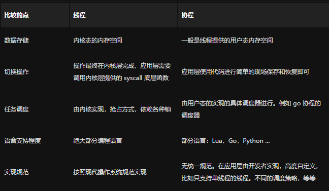
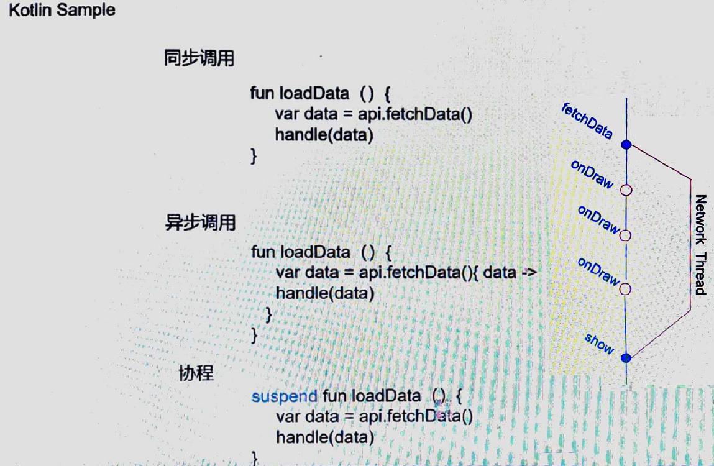
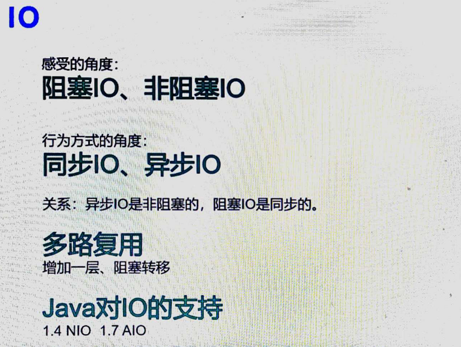

## 协程
> 一种用户态的轻量级线程，协程的调度完全由线程控制
【java的线程和os操作系统的线程一一对应，我们就是将用户态的东西交给了内核态，最终这个我们就控制不住了，让它自己执行了，中途可能抛异常，也肯能执行结束】
【协程是用户可以自己控制的，中途就没有了内核切换是的开销，不用加锁等】

#### 个人理解
加入了一个第三方的异步【两人发送邮件，通过邮箱来解耦】

#### 用途
> J2EE的传统系统中，每个请求都占用一个线程去完成自己的业务逻辑（包括事务），所以系统的吞吐量取决于每个线程的操作耗时；当遇到很耗时的I/O操作，整个系统的性能会立即下降，因为这个时候的线程是一直处于阻塞状态的，如果线程很多的时候，会存在很多线程处于等待状态，造成资源应用不彻底

#### 协程的其它名字
Fiber 【纤程】
Preemptive Non-preemptive【独占与非独占】
Cooperative Thread Green Thread

#### 信息交换的方式
> 不要以共享内存的方式来通信，相反，要通过通信来共享内存
##### 传统并发模型
> 共享内存，通过锁来访问共享数据；线程安全、非安全数据结构

####　协程与纤程的比较
> Java第三方支持协程的jar：kilim、quasar、loom【java本身还没有支持协程，只能依靠第三方的包实现协程】

| 比较项   | 线程                                                         | 协程                                                         | 
| -------- | ------------------------------------------------------------ | ------------------------------------------------------------ | 
| 占用资源 | 初始单位为1MB,固定不可变                                     | 初始一般为2KB,可随需要而增大                                 | 
| 调度所属 | 由Os的内核完成                                               | 由用户完成                                                   | 
| 切换开销 | 涉及模式切换(从用户态切换到内核态)16个寄存器、PC, SP...等寄存器的刷新等 | 只有三个寄存器的值修改-PC / SP /DX                           | 
| 性能问题 | 资源占用太高,频繁创建销毁会带来严重的性能问题                | 资源占用小不会带来严重的性能问题                             | 
| 数据同步 | 需要用锁等机制确保数据的一直性和可见性                       | 不需要多线程的锁机制,在协程中控制不加锁,只需要判断状态就好了,所以比多线程高很多 |

#### IO

> 阻塞：我给你发消息，你要回应我，在等待期间，我不能做其它的事情
> 非阻塞：我给你发消息，不管你会回不回应我，我都可以去做其它的事情
> 多路复用：很多Thread都在阻塞，此时就可以将所有阻塞的转移到一个Thread

#### 并发模型(多线程vs异步vs协程)
* 多线程能够在多核条件下,充分利用资源,达到并行计算的目的,但会导内存占用、频繁切换耗损、并发锁以及由此产生等待。
* 异步在Java领域的技术迭代(Future, Callback, Sevlet3.0. Reactive)
* 异步和协程都可以消除等待,提高CPU的利用效率。
* 思考问题方式不同,协程(线性思维);异步(事件驱动)
* IO密集型服务(例如网关)
* 计算耗时并且具有主动可控性(Ai计算)
* 基于事件触发的金融交易

 