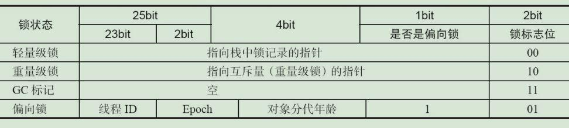
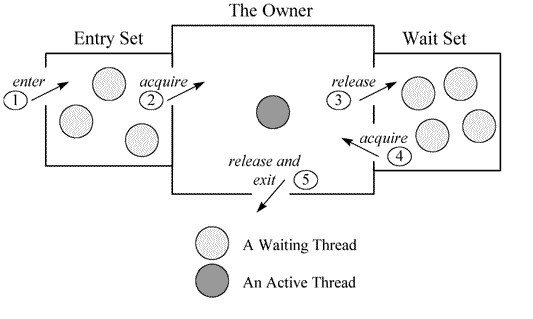
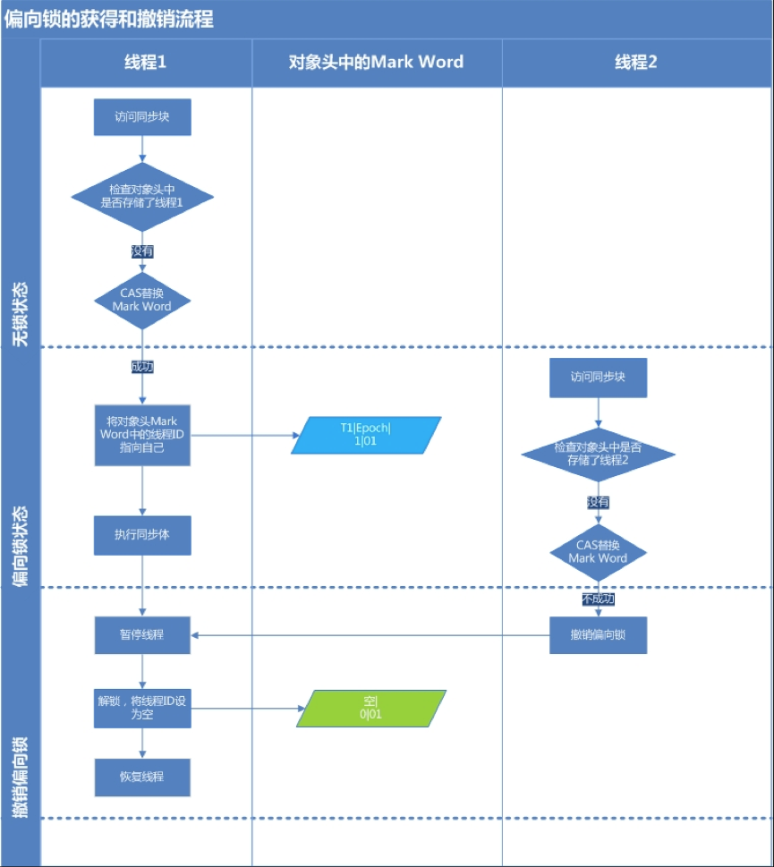
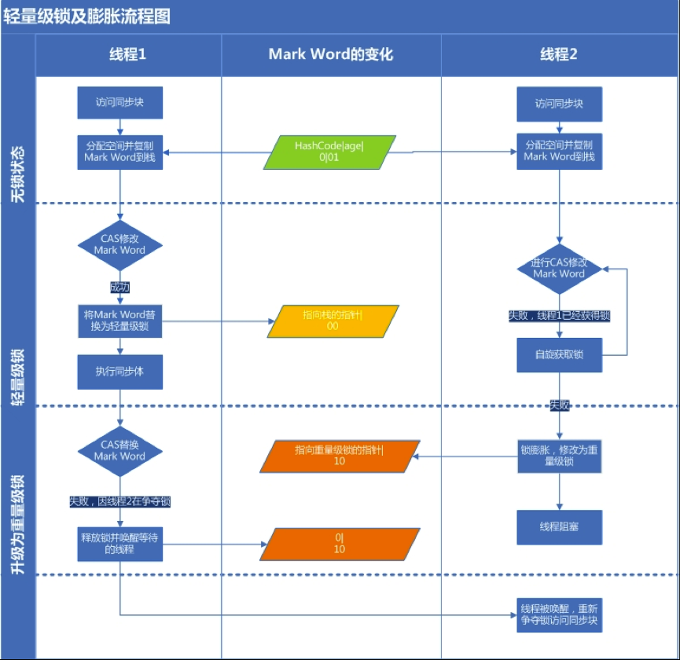
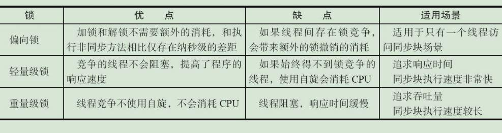

## 引言
> 并发编程中synchronized是重量级锁，但随着JVM1.6对synchronized进行优化后，有些情况下它并不那么重，本文介绍了Java SE1.6中为了减少获得锁和释放锁带来的性能消耗而引入的偏向锁和轻量级锁，以及锁的存储结构和升级过程。

#### 术语定义
> CAS(Compare and Swap): 比较并交换。用于在硬件层面上提供原子性操作。在 Intel 处理器中，比较并交换通过指令cmpxchg实现。比较是否和给定的数值一致，如果一致则修改，不一致则不修改。

### 同步的基础
> Java中的每一个对象都可以作为锁。 对于同步方法，锁是当前实例对象。 对于静态同步方法，锁是当前对象的Class对象。 对于同步方法块，锁是synchonized括号里配置的对象。

#### 我们通过java代码和字节码分析下 java代码如下：
```java
public class SyncTest {

    private static double a = 1;

    public synchronized void plusNumber() {
        a++;
    }

    public void minusNumber() {
        System.out.println(a);
        synchronized (this) {
            a--;
        }
    }

    public synchronized static void divide() {
        a = a / 0.1;
    }

}
```
#### 解析成字节码指令:
```shell
//同步方法
public synchronized void plusNumber();                                                                       
  descriptor: ()V                                                                                            
  flags: ACC_PUBLIC, ACC_SYNCHRONIZED                                                                        
  Code:                                                                                                      
    stack=4, locals=1, args_size=1                                                                           
       0: getstatic     #2                  // Field a:D                                                     
       3: dconst_1                                                                                           
       4: dadd                                                                                               
       5: putstatic     #2                  // Field a:D                                                     
       8: return                                                                                             
    LineNumberTable:                                                                                         
      line 12: 0                                                                                             
      line 13: 8                                                                                             

//同步块                                                                                                             
public void minusNumber();                                                                                   
  descriptor: ()V                                                                                            
  flags: ACC_PUBLIC                                                                                          
  Code:                                                                                                      
    stack=4, locals=3, args_size=1                                                                           
       0: getstatic     #3                  // Field java/lang/System.out:Ljava/io/PrintStream;              
       3: getstatic     #2                  // Field a:D                                                     
       6: invokevirtual #4                  // Method java/io/PrintStream.println:(D)V                       
       9: aload_0                                                                                            
      10: dup                                                                                                
      11: astore_1                                                                                           
      12: monitorenter                                                                                       
      13: getstatic     #2                  // Field a:D                                                     
      16: dconst_1                                                                                           
      17: dsub                                                                                               
      18: putstatic     #2                  // Field a:D                                                     
      21: aload_1                                                                                            
      22: monitorexit                                                                                        
      23: goto          31                                                                                   
      26: astore_2                                                                                           
      27: aload_1                                                                                            
      28: monitorexit                                                                                        
      29: aload_2                                                                                            
      30: athrow                                                                                             
      31: return                                                                                             
    Exception table:                                                                                         
       from    to  target type                                                                               
          13    23    26   any                                                                               
          26    29    26   any                                                                               
                                                                   
//静态同步方法                                                                                                             
public static synchronized void divide();                                                                    
  descriptor: ()V                                                                                            
  flags: ACC_PUBLIC, ACC_STATIC, ACC_SYNCHRONIZED                                                            
  Code:                                                                                                      
    stack=4, locals=0, args_size=0                                                                           
       0: getstatic     #2                  // Field a:D                                                     
       3: ldc2_w        #5                  // double 0.1d                                                   
       6: ddiv                                                                                               
       7: putstatic     #2                  // Field a:D                                                     
      10: return                                                                                             
    LineNumberTable:                                                                                         
      line 24: 0                                                                                             
      line 26: 10 
```
##### 从上述指令我们可以得出以下结论： 
1. 同步代码块是使用monitorenter和monitorexit指令实现的，会在同步块的区域通过监听器对象去获取锁和释放锁，从而在字节码层面来控制同步scope. 
2. 同步方法和静态同步方法依靠的是方法修饰符上的ACC_SYNCHRONIZED实现。JVM根据该修饰符来实现方法的同步。当方法调用时，调用指令将会检查方法的 ACC_SYNCHRONIZED 访问标志是否被设置，如果设置了，执行线程将先获取monitor，获取成功之后才能执行方法体，方法执行完后再释放monitor。在方法执行期间，其他任何线程都无法再获得同一个monitor对象
3. 当一个线程访问同步代码块时，根据happens-before原则，它必须获取锁才能进入代码块，退出或抛出异常时必须释放锁。那么锁存在哪里？锁里面会存储什么信息？

### 同步的原理
#### Java对象头 HotSpot虚拟机中，对象在内存中存储分为三块区域：
> 对象头、实例数据和对齐填充 HotSpot虚拟机的对象头(Object Header)包括两部分信息: 
1. 第一部分“Mark Word”: 用于存储对象自身的运行时数据， 如哈希码（HashCode）、GC分代年龄、锁状态标志、线程持有的锁、偏向线程ID、偏向时间戳等等.
2. 第二部分“Klass Pointer”: 对象指向它的类的元数据的指针，虚拟机通过这个指针来确定这个对象是哪个类的实例。(数组，对象头中还须有一块用于记录数组长度的数据，因为虚拟机可以通过普通Java对象的元数据信息确定Java对象的大小，但是从数组的元数据中无法确定数组的大小。 )

* 对象头默认存储结构


* 在运行期间，Mark Word里存储的数据会随着锁标志位的变化而变化。Mark Word可能变化为存储以下4种数据（32位系统）


##### 对象头的数据结构C++源码可以查看 openjdk\hotspot\src\share\vm\oops.markOop.hpp
```shell
// 32 bits:
//  --------
//     hash:25 ------------>| age:4    biased_lock:1 lock:2 (normal object)
//     JavaThread*:23 epoch:2 age:4    biased_lock:1 lock:2 (biased object)
//     size:32 ------------------------------------------>| (CMS free block)
//     PromotedObject*:29 ---------->| promo_bits:3 ----->| (CMS promoted object)
//
hash： 保存对象的哈希码
age： 保存对象的分代年龄
biased_lock： 偏向锁标识位
lock： 锁状态标识位
JavaThread*： 保存持有偏向锁的线程ID
epoch： 保存偏向时间戳
```
#### Monitor Record
##### 监听器的实现依赖于objectMonitor对象源码如下： openjdk\hotspot\src\share\vm\runtime\objectMonitor.hpp
> 监听器具体存储的数据结构
```shell
ObjectMonitor() {
    _header       = NULL;//markOop对象头
    _count        = 0;
    _waiters      = 0,//等待线程数
    _recursions   = 0;//重入次数
    _object       = NULL;//监视器锁寄生的对象。锁不是平白出现的，而是寄托存储于对象中。
    _owner        = NULL;//初始时为NULL表示当前没有任何线程拥有该monitor record，当线程成功拥有该锁后保存线程唯一标识，当锁被释放时又设置为NULL
    _WaitSet      = NULL;//处于wait状态的线程，会被加入到wait set；
    _WaitSetLock  = 0 ;
    _Responsible  = NULL ;
    _succ         = NULL ;
    _cxq          = NULL ;
    FreeNext      = NULL ;
    _EntryList    = NULL ;//处于等待锁block状态的线程，会被加入到entry set；
    _SpinFreq     = 0 ;
    _SpinClock    = 0 ;
    OwnerIsThread = 0 ;// _owner is (Thread *) vs SP/BasicLock
  }
```
每个线程都有两个ObjectMonitor对象列表，分别为free和used列表，如果当前free列表为空，线程将向全局global list请求分配ObjectMonitor。 ObjectMonitor对象中有两个队列：_WaitSet 和 _EntryList，用来保存ObjectWaiter对象列表； monitor


### JVM中锁的优化
#### 锁机制升级流程 偏向锁–》轻量级锁–》重量级锁
##### synchronized在JVM被编译为monitorenter、monitorexit指令来获取和释放互斥锁.。 解释器执行monitorenter时会进入到openjdk\hotspot\src\share\vm\interpreter\InterpreterRuntime.cpp的InterpreterRuntime::monitorenter函数， 具体实现如下：
```shell
//%note monitor_1
IRT_ENTRY_NO_ASYNC(void, InterpreterRuntime::monitorenter(JavaThread* thread, BasicObjectLock* elem))
#ifdef ASSERT
  thread->last_frame().interpreter_frame_verify_monitor(elem);
#endif
  if (PrintBiasedLockingStatistics) {
    Atomic::inc(BiasedLocking::slow_path_entry_count_addr());
  }
  Handle h_obj(thread, elem->obj());
  assert(Universe::heap()->is_in_reserved_or_null(h_obj()),
         "must be NULL or an object");
  if (UseBiasedLocking) {//标识虚拟机是否开启偏向锁功能,默认开启
    //偏向锁逻辑
    ObjectSynchronizer::fast_enter(h_obj, elem->lock(), true, CHECK);
  } else {
    //轻量级锁逻辑
    ObjectSynchronizer::slow_enter(h_obj, elem->lock(), CHECK);
  }
  assert(Universe::heap()->is_in_reserved_or_null(elem->obj()),
         "must be NULL or an object");
#ifdef ASSERT
  thread->last_frame().interpreter_frame_verify_monitor(elem);
#endif
IRT_END
```

#### 偏向锁 
> 大多数情况下，锁不仅不存在多线程竞争，而且总是由同一线程多次获得，为了让线程获得锁的代价更低而引入了偏向锁。当一个线程访问同步块并获取锁时，会在对象头和栈帧中的锁记录里存储锁偏向的线程ID，以后该线程在进入和退出同步块时不需要进行CAS操作来加锁和解锁，只需简单地测试一下对象头的Mark Word里是否存储着指向当前线程的偏向锁。如果测试成功，表示线程已经获得了锁。如果测试失败，则需要再测试一下Mark Word中偏向锁的标识是否设置成1（表示当前是偏向锁）：如果没有设置，则使用CAS竞争锁；如果设置了，则尝试使用CAS将对象头的偏向锁指向当前线程。 注意：当锁有竞争关系的时候，需要解除偏向锁，进入轻量级锁。 偏向锁执行流程，线程1演示了偏向锁初始化的流程，线程2演示了偏向锁撤销的流程
偏向锁在Java 6和Java 7里是默认启用的，但是它在应用程序启动几秒钟之后才激活，如有必要可以使用JVM参数来关闭延迟：XX:BiasedLockingStartupDelay=0。如果确定应用的锁通常情况下处于竞争状态，可以通过JVM参数关闭偏向锁：-XX:-UseBiasedLocking=false，那么程序默认会进入轻量级锁状态。



##### 偏向锁获取的具体逻辑在openjdk\hotspot\src\share\vm\runtime\synchronizer.cpp的ObjectSynchronizer::fast_enter函数下，具体代码如下：
```shell
void ObjectSynchronizer::fast_enter(Handle obj, BasicLock* lock, bool attempt_rebias, TRAPS) {
 if (UseBiasedLocking) {//jvm是否开启了偏向锁
    //是否在全局安全点，如达到安全点撤销偏向锁，同时升级为轻量级锁
    if (!SafepointSynchronize::is_at_safepoint()) {
      //偏向锁的获取
      BiasedLocking::Condition cond = BiasedLocking::revoke_and_rebias(obj, attempt_rebias, THREAD);
      if (cond == BiasedLocking::BIAS_REVOKED_AND_REBIASED) {
        return;
      }
    } else {
      assert(!attempt_rebias, "can not rebias toward VM thread");
     //偏向锁的撤销
      BiasedLocking::revoke_at_safepoint(obj);
    }
    assert(!obj->mark()->has_bias_pattern(), "biases should be revoked by now");
 }
 //获取轻量级锁
 slow_enter (obj, lock, THREAD) ;
}
```

#### 轻量级锁 
1. 加锁 线程在执行同步块之前，JVM会先在当前线程的栈桢中创建用于存储锁记录的空间，并将对象头中的Mark Word复制到锁记录中，官方称为Displaced Mark Word。然后线程尝试使用CAS将对象头中的Mark Word替换为指向锁记录的指针。如果成功，当前线程获得锁，如果失败，表示其他线程竞争锁，当前线程便尝试使用自旋来获取锁。 
2. 解锁 轻量级解锁时，会使用原子的CAS操作将Displaced Mark Word替换回到对象头，如果成功，则表示没有竞争发生。如果失败，表示当前锁存在竞争，锁就会膨胀成重量级锁。 下图展示两个线程同时争夺锁，导致锁膨胀的流程图:



3. 自旋的线程在自旋过程中，成功获得资源(即之前获的资源的线程执行完成并释放了共享资源)，则整个状态依然处于轻量级锁的状态，如果自旋失败进入重量级锁的状态，这个时候，自旋的线程进行阻塞，等待之前线程执行完成并唤醒自己。因为自旋会消耗CPU，为了避免无用的自旋（比如获得锁的线程被阻塞住了），一旦锁升级成重量级锁，就不会再恢复到轻量级锁状态。当锁处于这个状态下，其他线程试图获取锁时，都会被阻塞住，当持有锁的线程释放锁之后会唤醒这些线程，被唤醒的线程就会进行新一轮的夺锁之争。

##### 多个线程竞争偏向锁升级为轻量级锁，会尝试获取轻量级锁，其入口位于ObjectSynchronizer::slow_enter函数，具体代码如下：
```
void ObjectSynchronizer::slow_enter(Handle obj, BasicLock* lock, TRAPS) {
  markOop mark = obj->mark();//获取对象头的Mark Word
  assert(!mark->has_bias_pattern(), "should not see bias pattern here");

  if (mark->is_neutral()) {//是否为无锁状态001
    // Anticipate successful CAS -- the ST of the displaced mark must
    // be visible <= the ST performed by the CAS.
    lock->set_displaced_header(mark);//把mark保存到BasicLock对象的_displaced_header字段
    //原子操作保证只有一个线程可以把指向栈帧的指针复制到Mark Word
    if (mark == (markOop) Atomic::cmpxchg_ptr(lock, obj()->mark_addr(), mark)) {//CAS成功，释放栈锁
      TEVENT (slow_enter: release stacklock) ;
      return ;
    }
    // Fall through to inflate() ...
  } else
  if (mark->has_locker() && THREAD->is_lock_owned((address)mark->locker())) {
    assert(lock != mark->locker(), "must not re-lock the same lock");
    assert(lock != (BasicLock*)obj->mark(), "don't relock with same BasicLock");
    lock->set_displaced_header(NULL);
    return;
  }

#if 0
  // The following optimization isn't particularly useful.
  if (mark->has_monitor() && mark->monitor()->is_entered(THREAD)) {
    lock->set_displaced_header (NULL) ;
    return ;
  }
#endif

  // The object header will never be displaced to this lock,
  // so it does not matter what the value is, except that it
  // must be non-zero to avoid looking like a re-entrant lock,
  // and must not look locked either.
  lock->set_displaced_header(markOopDesc::unused_mark());
 //锁膨胀升级为重量级锁逻辑
  ObjectSynchronizer::inflate(THREAD, obj())->enter(THREAD);
}
```

### 锁的优缺点对比 锁对比


#### 锁粗化:就是将多次连接在一起的加锁、解锁操作合并为一次，将多个连续的锁扩展成一个范围更大的锁。举个例子:
```java
public class LockCoarsening {

    private StringBuffer stringBuffer = new StringBuffer(20);

    public void append(){
        stringBuffer.append("w");
        stringBuffer.append("h");
        stringBuffer.append("y");
    }
}
```
> 这里每次调用stringBuffer.append方法都需要加锁和解锁，如果虚拟机检测到有一系列连串的对同一个对象加锁和解锁操作，就会将其合并成一次范围更大的加锁和解锁操作，即在第一次append方法时进行加锁，最后一次append方法结束后进行解锁。

### 锁消除 
> 锁消除即删除不必要的加锁操作。根据代码逃逸技术，如果判断到一段代码中，堆上的数据不会逃逸出当前线程，那么可以认为这段代码是线程安全的，不必要加锁。逃逸分析和锁消除分别可以使用参数-XX:+DoEscapeAnalysis和-XX:+EliminateLocks(锁消除必须在-server模式下)开启

### 适应性自旋 
> 当前锁处于膨胀，会进行自旋。自旋是需要消耗CPU的，如果一直获取不到锁的话，那线程一直处在自旋状态，消耗CPU资源。为了解决这个问题JDK采用—适应性自旋，线程如果自旋成功了，则下次自旋的次数会更多，如果自旋失败了，则自旋的次数就会减少。另外自旋虽然会占用CPU资源，但不会一直占用CPU资源，每隔一段时间会通过os::NakedYield方法放弃CPU资源，或通过park方法挂起；如果其他线程完成锁的膨胀操作，则退出自旋并返回