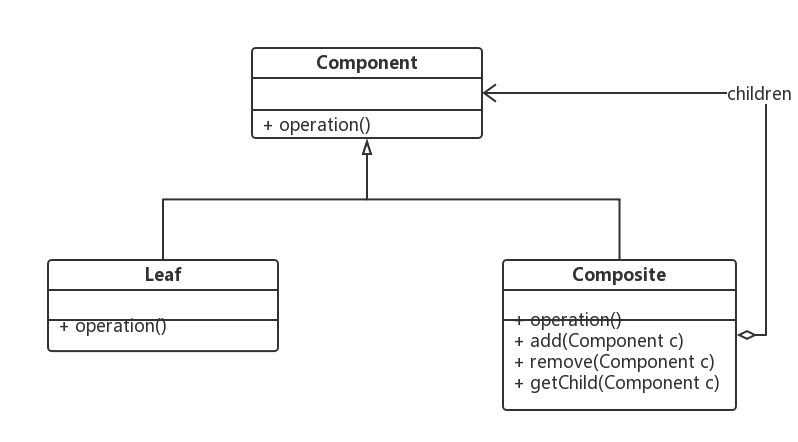

## 组合模式
> 组合多个对象形成树形结构以表示具有 "整体—部分" 关系的层次结构。组合模式对单个对象（即叶子对象）和组合对象（即容器对象）的使用具有一致性，组合模式又可以称为 "整体—部分"(Part-Whole) 模式，它是一种对象结构型模式。

#### 经典使用场景
> Java SE中的AWT和Swing包的设计就基于组合模式；除此以外，在XML解析、组织结构树处理、文件系统设计等领域，组合模式都得到了广泛应用。

#### 使用细节
* Component（抽象构件）
> 它可以是接口或抽象类，为叶子构件和容器构件对象声明接口，在该角色中可以包含所有子类共有行为的声明和实现。在抽象构件中定义了访问及管理它的子构件的方法，如增加子构件、删除子构件、获取子构件等。
* Leaf（叶子构件）
> 它在组合结构中表示叶子节点对象，叶子节点没有子节点，它实现了在抽象构件中定义的行为。对于那些访问及管理子构件的方法，可以通过异常等方式进行处理。
* Composite（容器构件）
> 它在组合结构中表示容器节点对象，容器节点包含子节点，其子节点可以是叶子节点，也可以是容器节点，它提供一个集合用于存储子节点，实现了在抽象构件中定义的行为，包括那些访问及管理子构件的方法，在其业务方法中可以递归调用其子节点的业务方法。

#### 优缺点
> 优点
1. 组合模式使得客户端代码可以一致地处理单个对象和组合对象，无须关心自己处理的是单个对象，还是组合对象，这简化了客户端代码；
2. 更容易在组合体内加入新的对象，客户端不会因为加入了新的对象而更改源代码，满足“开闭原则”；

> 缺点
1. 设计较复杂，客户端需要花更多时间理清类之间的层次关系；
2. 不容易限制容器中的构件；
3. 不容易用继承的方法来增加构件的新功能；

#### 透明与安全
##### 透明
> 在使用组合模式时，根据抽象构件类的定义形式，我们可将组合模式分为透明组合模式和安 全组合模式两种形式
1. 透明组合模式中，抽象构件角色中声明了所有用于管理成员对象的方法，譬如在示例中 Component 声明了 add、remove 方法，这样做的好处是确保所有的构件类都有相同的接口。透明组合模式也是组合模式的标准形式。
2. 透明组合模式的缺点是不够安全，因为叶子对象和容器对象在本质上是有区别的，叶子对象不可能有下一个层次的对象，即不可能包含成员对象，因此为其提供 add()、remove() 等方法是没有意义的，这在编译阶段不会出错，但在运行阶段如果调用这些方法可能会出错（如果没有提供相应的错误处理代码）

##### 安全

1. 在安全组合模式中，在抽象构件角色中没有声明任何用于管理成员对象的方法，而是在容器构件 Composite 类中声明并实现这些方法。
2. 安全组合模式的缺点是不够透明，因为叶子构件和容器构件具有不同的方法，且容器构件中那些用于管理成员对象的方法没有在抽象构件类中定义，因此客户端不能完全针对抽象编程，必须有区别地对待叶子构件和容器构件。
3. 在实际应用中 java.awt 和 swing 中的组合模式即为安全组合模式。

### Component（抽象构件）
```java
/**
 * 抽象节点
 * Author : GuDao
 * 2020-10-21
 */
public abstract class Node {
    abstract void process();
}
```

### Composite（容器构件）
```java
/**
 * 注意：这里的name只是个人测试使用的，方便查看节点是哪一个
 * 树干节点
 * Author : GuDao
 * 2020-10-21
 */
public class BranchNode extends Node {
    List<Node> nodes = new ArrayList<>();
    String name;

    //业务处理
    @Override
    void process() {
        System.out.println(name);
    }
    /**
     * 调用有参构造为节点赋值
     *
     * @param name 的名字
     */
    public BranchNode(String name) {
        this.name = name;
    }
    /**
     * 在枝干上添加叶子
     *
     * @param node 节点
     * @return {@link Node}
     */
    public Node add(Node node){
        nodes.add(node);
        return this;
    }
}
```

### Leaf（叶子构件）
```java
/**
 * 叶子节点
 * Author : GuDao
 * 2020-10-21
 */
public class LeafNode extends Node {
    String name;

    @Override
    void process() {
        System.out.println(name);
    }

    public LeafNode(String name) {
        this.name = name;
    }
}
```

###测试
```java
/**
 * Author : GuDao
 * 2020-10-21
 */
public class Main {
    public static void main(String[] args) {
        Node leaf001 = new LeafNode("叶子001");
        Node leaf002 = new LeafNode("叶子002");
        Node leaf003 = new LeafNode("叶子003");
        Node leaf004 = new LeafNode("叶子004");

        Node branch001 = new BranchNode("root");
        Node branch002 = new BranchNode("枝干001");
        Node branch003 = new BranchNode("枝干002");

        ((BranchNode) branch001).add(branch002);
        ((BranchNode) branch001).add(branch003);

        ((BranchNode) branch002).add(leaf001);
        ((BranchNode) branch002).add(leaf002);
        ((BranchNode) branch002).add(leaf003);
        ((BranchNode) branch003).add(leaf004);

        tree(branch001,0);
    }

    public static void tree(Node node,int num){
        for(int i=0;i<num;i++) System.out.print("-");
        node.process();
        if(node instanceof BranchNode){
            for(Node n : ((BranchNode)node).nodes){
                tree(n,num+1);
            }
        }
    }
}

```