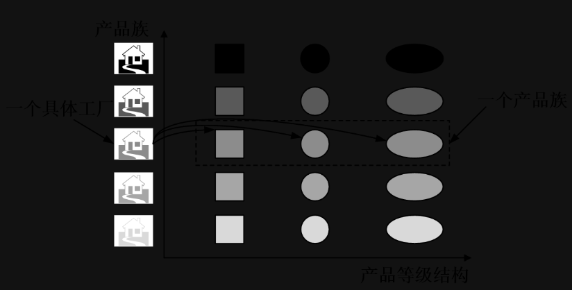
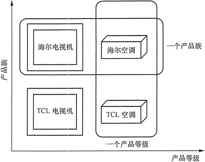
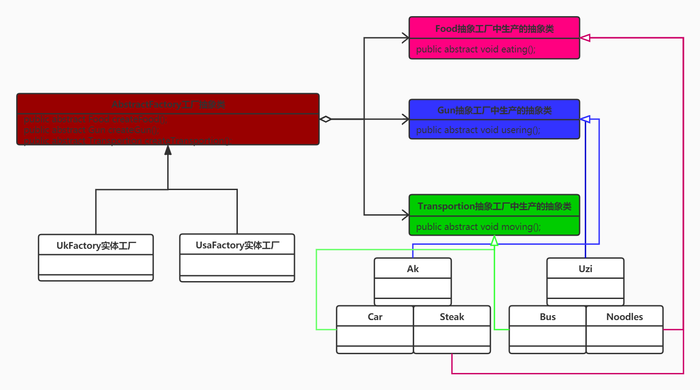

## 工厂模式介绍
> 工厂模式：一般情况下，工厂模式分为三种更加细分的类型：简单工厂、工厂方法和抽象工厂。不过，在 GoF 的《设计模式》一书中，它将简单工厂模式看作是工厂方法模式的一种特例，所以工厂模式只被分成了工厂方法和抽象工厂两类。

### 简单工厂一（Simple Factory）【可扩展性不好】
> 简单工厂模式并不是23种常用的设计模式之一，它只算工厂模式的一个特殊实现。简单工厂模式在实际中的应用相对于其他2个工厂模式用的还是相对少得多，因为它只适应很多简单的情况。最重要的是它违背了我们在概述中说的 开放-封闭原则 （虽然可以通过反射的机制来避免，后面我们会介绍到） 。因为每次你要新添加一个功能，都需要在生switch-case 语句（或者if-else 语句）中去修改代码，添加分支条件。

#### 使用细节
* 简单工厂（SimpleFactory）
> 是简单工厂模式的核心，负责实现创建所有实例的内部逻辑。工厂类的创建产品类的方法可以被外界直接调用，创建所需的产品对象。
* 抽象产品（Product）
> 是简单工厂创建的所有对象的父类，负责描述所有实例共有的公共接口。
* 具体产品（ConcreteProduct）
> 是简单工厂模式的创建目标。

#### 优缺点：
> 优点：
1. 工厂类包含必要的逻辑判断，可以决定在什么时候创建哪一个产品的实例。客户端可以免除直接创建产品对象的职责，很方便的创建出相应的产品。工厂和产品的职责区分明确。
2. 客户端无需知道所创建具体产品的类名，只需知道参数即可。
3. 也可以引入配置文件，在不修改客户端代码的情况下更换和添加新的具体产品类。

> 缺点：
1. 简单工厂模式的工厂类单一，负责所有产品的创建，职责过重，一旦异常，整个系统将受影响。且工厂类代码会非常臃肿，违背高聚合原则。
2. 使用简单工厂模式会增加系统中类的个数（引入新的工厂类），增加系统的复杂度和理解难度
3. 系统扩展困难，一旦增加新产品不得不修改工厂逻辑，在产品类型较多时，可能造成逻辑过于复杂
4. 简单工厂模式使用了 static 工厂方法，造成工厂角色无法形成基于继承的等级结构。

#### 应用场景
> 对于产品种类相对较少的情况，考虑使用简单工厂模式。使用简单工厂模式的客户端只需要传入工厂类的参数，不需要关心如何创建对象的逻辑，可以很方便地创建所需产品。

> 示例：根据配置文件的后缀（json、xml、yaml、properties），选择不同的解析器（JsonRuleConfigParser、XmlRuleConfigParser……），将存储在文件中的配置解析成内存对象 RuleConfig。
```java
public class RuleConfigSource {
    public RuleConfig load(String ruleConfigFilePath) {
        String ruleConfigFileExtension = getFileExtension(ruleConfigFilePath);
        //调用RuleConfigParserFactory中的方法创建对象实体
        IRuleConfigParser parser = RuleConfigParserFactory.createParser(ruleConfigFileExtension);
    if(parser == null) {
        throw new InvalidRuleConfigException("Rule config file format is not supported: " + ruleConfigFilePath);
    }
    String configText = "";
        //从ruleConfigFilePath文件中读取配置文本到configText中
        RuleConfig ruleConfig = parser.parse(configText);
        return ruleConfig;
    }
    private String getFileExtension(String filePath) {
        //...解析文件名获取扩展名，比如rule.json，返回json
        return "json";
    }
}
public class RuleConfigParserFactory {
    public static IRuleConfigParser createParser(String configFormat) {
        IRuleConfigParser parser = null;
        if ("json".equalsIgnoreCase(configFormat)) {
            parser = new JsonRuleConfigParser();
        } else if ("xml".equalsIgnoreCase(configFormat)) {
            parser = new XmlRuleConfigParser();
        } else if ("yaml".equalsIgnoreCase(configFormat)) {
            parser = new YamlRuleConfigParser();
        } else if ("properties".equalsIgnoreCase(configFormat)) {
            parser = new PropertiesRuleConfigParser();
        }
        return parser;
    }
}
```

### 简单工厂二（Simple Factory）
> 使用接口实现
```java
/*接口类*/
/**
 * 公共功能接口
 * Author : GuDao
 * 2020-10-09
 */
public interface MoveAble {
    void go();
}

/*Car实体类类*/
/**
 * Author : GuDao
 * 2020-10-09
 */
public class Car implements MoveAble {
    @Override
    public void go() {
        System.out.println("car moving faster");
    }
}

/*Bus实体类*/
/**
 * Author : GuDao
 * 2020-10-09
 */
public class Bus implements MoveAble {
    @Override
    public void go() {
        System.out.println("bus moving slower");
    }
}

/*简单工厂类*/
/**
 * 通过反射创建出实体类
 * Author : GuDao
 * 2020-10-09
 */
public class EasyFactory {
    /**
     * 直接获取实体类
     *
     * @param clazz clazz
     * @return {@link Object}
     */
    public static Object getBean(Class<? extends Shape> clazz){
        Object obj = null;
        try {
            obj = Class.forName(clazz.getName()).newInstance();
        } catch (InstantiationException e) {
            e.printStackTrace();
        } catch (IllegalAccessException e) {
            e.printStackTrace();
        } catch (ClassNotFoundException e) {
            e.printStackTrace();
        }
        return obj;
    }
    /**
     * 获取实体前可以进行前置操作
     *
     * @return {@link Car}
     */
    public static Car getCar(){
        //前置操作：如打印日志等信息
        return new Car();
    }
    /**
     * 获取实体前可以进行前置操作
     *
     * @return {@link Car}
     */
    public static Bus getBus(){
        //前置操作：如打印日志等信息
        return new Bus();
    }
}

/*测试方法*/
/**
 * Author : GuDao
 * 2020-10-09
 */
public class Main {
    public static void main(String[] args) {
        EasyFactory factory = new EasyFactory();
        //两者二选一；网上推荐使用第一种，将类的路径写在配置文件中，但我测试第二种也能使用，所以此处就不将第一种详细使用方法过多说明了
        //MoveAble car = (Car) factory.getBean(desgindemo.factory.easy.Car.class);
        MoveAble car = (Car) factory.getBean(Car.class);//多态
        car.go();
    }
}
```

### 工厂方法（Factory Method）【一个实体一个工厂】
> 工厂方法模式比起简单工厂模式更加符合开闭原则<br>
> 开闭原则规定“软件中的对象（类，模块，函数等等）应该对于扩展是开放的，但是对于修改是封闭的”，这意味着一个实体是允许在不改变它的源代码的前提下变更它的行为。

#### 使用细节
* 抽象工厂（Abstract Factory）
> 提供了创建产品的接口，调用者通过它访问具体工厂的工厂方法 newProduct() 来创建产品。
* 具体工厂（ConcreteFactory）
> 主要是实现抽象工厂中的抽象方法，完成具体产品的创建。
* 抽象产品（Product）
> 定义了产品的规范，描述了产品的主要特性和功能。
* 具体产品（ConcreteProduct）
> 实现了抽象产品角色所定义的接口，由具体工厂来创建，它同具体工厂之间一一对应。

#### 优缺点
> 优点
1. 用户只需要知道具体工厂的名称就可得到所要的产品，无须知道产品的具体创建过程。
2. 灵活性增强，对于新产品的创建，只需多写一个相应的工厂类。
3. 典型的解耦框架。高层模块只需要知道产品的抽象类，无须关心其他实现类，满足迪米特法则、依赖倒置原则和里氏替换原则。

>缺点
1. 类的个数容易过多，增加复杂度
2. 增加了系统的抽象性和理解难度
3. 抽象产品只能生产一种产品，此弊端可使用抽象工厂模式解决。

#### 应用场景
> 客户只知道创建产品的工厂名，而不知道具体的产品名。如 TCL 电视工厂、海信电视工厂等。创建对象的任务由多个具体子工厂中的某一个完成，而抽象工厂只提供创建产品的接口。客户不关心创建产品的细节，只关心产品的品牌
```java
/*接口类*/
/**
 * 公共功能接口
 * Author : GuDao
 * 2020-10-09
 */
public interface MoveAble {
    void go();
}

/*Car实体类类*/
/**
 * Author : GuDao
 * 2020-10-09
 */
public class Car implements MoveAble {
    @Override
    public void go() {
        System.out.println("car moving faster");
    }
}

/*Bus实体类*/
/**
 * Author : GuDao
 * 2020-10-09
 */
public class Bus implements MoveAble {
    @Override
    public void go() {
        System.out.println("bus moving slower");
    }
}

/*Bus工厂类*/
/**
 * Author : GuDao
 * 2020-10-09
 */
public class BusFactory {
    public static Bus getBus(){
        //可以针对业务进行些前置操作
        System.out.println("Bus is Creating");
        return new Bus();
    }
}

/*Car工厂类*/
/**
 * Author : GuDao
 * 2020-10-09
 */
public class CarFactory {
    public static Car getCar(){
        //可以针对业务进行些前置操作
        System.out.println("Car is Creating");
        return new Car();
    }
}

/*测试方法*/
/**
 * Author : GuDao
 * 2020-10-09
 */
public class Main {
    public static void main(String[] args) {
        MoveAble car = new CarFactory().getCar();
        car.go();
    }
}
```

### 抽象工厂（Abstract Factory）


#### 说明
**Transportion、Food、Gun为抽象工厂AbstractFactory中生产的抽象产品【可以看成一个抽象族】；而ak、car、strack这三个是USA族中的三个实体产品【他们分别继承自自己的抽象产品，由USA的实体工厂产出】，uzi、bus、noodles则是UK族中的实体产品【他们分别继承自自己的抽象产品，由Uk的实体工厂产出】，后期如果想要添加新的族，只需要新增实体工厂和工厂中产出的对象即可；main方法的测试也只需要修new出的具体工厂则能实现族中方法的替换**

#### 使用细节
* 抽象工厂（Abstract Factory）
> 提供了创建产品的接口，它包含多个创建产品的方法 newProduct()，可以创建多个不同等级的产品。
* 具体工厂（Concrete Factory）
> 主要是实现抽象工厂中的多个抽象方法，完成具体产品的创建。
* 抽象产品（Product）
> 定义了产品的规范，描述了产品的主要特性和功能，抽象工厂模式有多个抽象产品。
* 具体产品（ConcreteProduct）
> 实现了抽象产品角色所定义的接口，由具体工厂来创建，它同具体工厂之间是多对一的关系。

#### 优缺点
> 优点
* 可以在类的内部对产品族中相关联的多等级产品共同管理，而不必专门引入多个新的类来进行管理。
* 当需要产品族时，抽象工厂可以保证客户端始终只使用同一个产品的产品组。
* 抽象工厂增强了程序的可扩展性，当增加一个新的产品族时，不需要修改原代码，满足开闭原则。

> 缺点
* 当产品族中需要增加一个新的产品时，所有的工厂类都需要进行修改。增加了系统的抽象性和理解难度。

#### UML类图

```java
//抽象工厂与工厂中的抽象产品定义
/**
 * 抽象工厂类
 * 抽象工厂中生产抽象产品
 * Author : GuDao
 * 2020-10-11
 */
public abstract class AbstractFactory {
    public abstract Food createFood();
    public abstract Gun createGun();
    public abstract Transportion createTransportion();
}

/**
 * 食物抽象类
 * 抽象工厂中的抽象产品
 * Author : GuDao
 * 2020-10-11
 */
public abstract class Food {
    public abstract void eating();
}

/**
 * 枪的抽象类
 * 抽象工厂中的抽象产品
 * @author trail
 * @date 2020/10/11
 */
public abstract class Gun {
    public abstract void usering();
}

/**
 * 交通工具抽象类
 * 抽象工厂中的抽象产品
 * Author : GuDao
 * 2020-10-11
 */
public abstract class Transportion {
    public abstract void moving();
}

//具体的工厂实现与产品实现[uk族]
/**
 * UK使用的交通工具实体类
 * Author : GuDao
 * 2020-10-11
 */
public class Bus extends Transportion {
    @Override
    public void moving() {
        System.out.println("Bus moving slower");
    }
}
/**
 * UK食物实体类
 * Author : GuDao
 * 2020-10-11
 */
public class Noodles extends Food {
    @Override
    public void eating() {
        System.out.println("UK吃面条");
    }
}
/**
 * UK使用的武器实体类
 * Author : GuDao
 * 2020-10-11
 */
public class Uzi extends Gun {
    @Override
    public void usering() {
        System.out.println("UZI使用9mm子弹");
    }
}
/**
 * uk的同族工厂实体
 * Author : GuDao
 * 2020-10-11
 */
public class UkFactory extends AbstractFactory {

    @Override
    public Food createFood() {
        return new Noodles();
    }

    @Override
    public Gun createGun() {
        return new Uzi();
    }

    @Override
    public Transportion createTransportion() {
        return new Bus();
    }
}

//具体的工厂实现与产品实现[usa族]
/**
 * USA使用的武器实体类
 * Author : GuDao
 * 2020-10-11
 */
public class Ak extends Gun {
    @Override
    public void usering() {
        System.out.println("AK使用7.62子弹");
    }
}
/**
 * USA使用的交通工具实体类
 * Author : GuDao
 * 2020-10-11
 */
public class Car extends Transportion {
    @Override
    public void moving() {
        System.out.println("Car moving faster");
    }
}
/**
 * USA食物实体类
 * Author : GuDao
 * 2020-10-11
 */
public class Steak extends Food {
    @Override
    public void eating() {
        System.out.println("USA吃牛排");
    }
}
/**
 * usa的同族工厂实体
 * Author : GuDao
 * 2020-10-11
 */
public class UsaFactory extends AbstractFactory {
    @Override
    public Food createFood() {
        return new Steak();
    }

    @Override
    public Gun createGun() {
        return new Ak();
    }

    @Override
    public Transportion createTransportion() {
        return new Car();
    }
}

//测试类
/**
 * Author : GuDao
 * 2020-10-11
 */
public class Main {
    public static void main(String[] args) {
        //当前使用Uas的族类工厂
        AbstractFactory factory = new UsaFactory();
        //想变成Uk的只需要修改工厂实体就行
        //AbstractFactory factory = new UkFactory();

        //下面的代码不会修改
        Food food = factory.createFood();
        food.eating();
        Transportion transportion = factory.createTransportion();
        transportion.moving();
        Gun gun = factory.createGun();
        gun.usering();
    }
}
``` 
#### 注意
**这不使用接口是因为这些东西都是现实中的产品，接口只是一种功能的体现【动词用接口，名词用抽象类】**