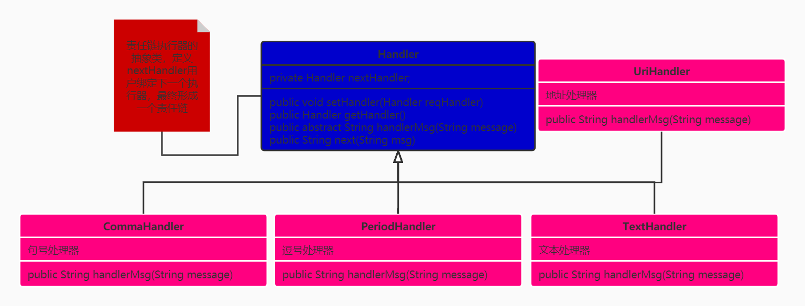
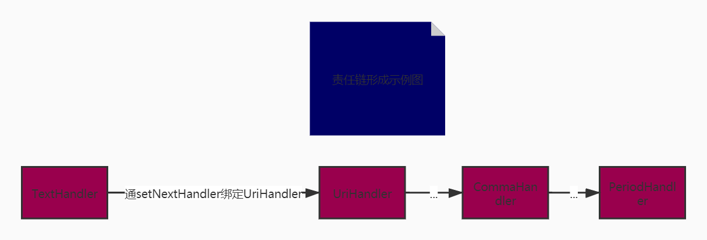

## 责任链模式介绍
> 责任链模式为请求创建一个接收者对象链，每个接收者都包含对另一个接收者的引用，如果一个对象不能处理该请求，那么它会把请求传给下一个接收者，依此类推；责任链模式避免了请求的发送者和接收者耦合在一起，让多个对象都有可能接收请求，将这些对象连成一条链，并且沿着这条链传递请求，直到有对象处理它为止

#### 责任链模式优缺点
> 优点：
降低耦合度。它将请求的发送者和接收者解耦 简化了对象，使得对象不需要知道链的结构 增强给对象指派职责的灵活性，允许动态地新增或者删除责任链 增加新的请求处理类方便

> 缺点：
不能保证请求一定被接收； 系统性能将受到一定影响，调试时不方便，可能会造成循环调用

#### 使用细节
* Handler（抽象处理者）： 定义一个处理请求的接口，提供对后续处理者的引用
* ConcreteHandler（具体处理者）： 抽象处理者的子类，处理用户请求，可选将请求处理掉还是传给下家；在具体处理者中可以访问链中下一个对象，以便请求的转发

#### UML类图：

#### 责任链的生成方式：


### 抽象处理者
```java
/**
 * 执行链抽象类
 * Author : GuDao
 * 2020-10-16
 */
public abstract class Handler {
    private Handler nextHandler;

    /**
     * 绑定下个责任链实体方法
     *
     * @param reqHandler 请求处理程序
     * @return {@link Handler}
     */
    public void setHandler(Handler reqHandler){
        this.nextHandler = reqHandler;
    }


    /**
     * 获取下一个责任链实体方法
     *
     * @return {@link Handler}
     */
    public Handler getHandler(){
        return nextHandler;
    }

    /**
     * 处理消息
     *
     * @param message 消息
     * @return boolean
     */
    public abstract String handlerMsg(String message);

    /**
     * 指派下个责任链实体处理数据
     *
     * @param msg 信息
     */
    public String next(String msg){
        if(null == nextHandler){
            return msg;
        }
        return this.nextHandler.handlerMsg(msg);
    }
}
```
### 具体处理者
```java
/**
 * 责任链中的文本信息替换执行器
 * Author : GuDao
 * 2020-10-16
 */
public class TextHandler extends Handler {
    @Override
    public String handlerMsg(String message) {
        message = message.replaceFirst("gudao", "孤岛");
        if(message.contains("fuck")){
            return "信息存在不雅内容";
        }else if(null == getHandler()){
            //执行链中没有下一个执行实体，处理完成，执行结束
            return message;
        }else {
            return next(message);
        }
    }
}

/**
 * 责任链中的地址替换执行器
 * Author : GuDao
 * 2020-10-16
 */
public class UriHandler extends Handler {
    @Override
    public String handlerMsg(String message) {
        message = message.replace("gudao.ink", "http://gudao.ink");
        if(message.contains("fuck")){
            return "信息存在不雅内容";
        }else if(null == getHandler()){
            //执行链中没有下一个执行实体，处理完成，执行结束
            return message;
        }else {
            return next(message);
        }
    }
}

/**
 * 责任链中的逗号处理执行器
 * Author : GuDao
 * 2020-10-16
 */
public class CommaHandler extends Handler {
    @Override
    public String handlerMsg(String message) {
        message = message.replace(",", ", ");
        if(message.contains("fuck")){
            return "信息存在不雅内容";
        }else if(null == getHandler()){
            //执行链中没有下一个执行实体，处理完成，执行结束
            return message;
        }else {
            return next(message);
        }
    }
}

/**
 * 责任链中的句号执行器
 * Author : GuDao
 * 2020-10-16
 */
public class PeriodHandler extends Handler{
    @Override
    public String handlerMsg(String message) {
        message = String.valueOf(new StringBuffer(message).append("."));
        if(message.contains("fuck")){
            return "信息存在不雅内容";
        }else if(null == getHandler()){
            //执行链中没有下一个执行实体，处理完成，执行结束
            return message;
        }else {
            return next(message);
        }
    }
}
```
### 测试方法
```java
/**
 * Author : GuDao
 * 2020-10-16
 */
public class Main {
    public static void main(String[] args) {
        Handler textHandler = new TextHandler();
        Handler uriHandler = new UriHandler();
        Handler commaHandler = new CommaHandler();
        Handler periodHandler = new PeriodHandler();
        /**
        * 生成责任链
        */
        //将uriHandler设置为textHandler的下一个执行器
        textHandler.setHandler(uriHandler);
        //将commaHandler设置为uriHandler的下一个执行链
        uriHandler.setHandler(commaHandler);
        //将periodHandler设置为commaHandler的下一个执行链
        commaHandler.setHandler(periodHandler);

        String s = textHandler.handlerMsg("Hello,I am gudao,my page is 'gudao.ink'");
        System.out.println(s);
    }
}
```
