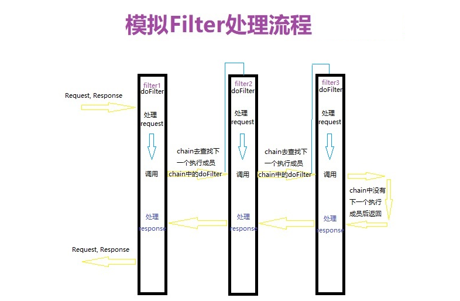

## 责任链模式介绍
> 责任链模式为请求创建一个接收者对象链，每个接收者都包含对另一个接收者的引用，如果一个对象不能处理该请求，那么它会把请求传给下一个接收者，依此类推；责任链模式避免了请求的发送者和接收者耦合在一起，让多个对象都有可能接收请求，将这些对象连成一条链，并且沿着这条链传递请求，直到有对象处理它为止

#### 责任链与观察者的区别【个人理解】
* 责任链是选择哪个执行对象，当责任链走到某个处理对象中执行结束后，这个责任链就结束了
* 观察者是只要被添加后，都会被执行

#### 责任链模式优缺点
> 优点：

1. 降低耦合度。它将请求的发送者和接收者解耦，简化了对象，使得对象不需要知道链的结构 增强给对象指派职责的灵活性，允许动态地新增或者删除责任链 增加新的请求处理类方便

> 缺点：

1. 不能保证请求一定被接收； 
2. 系统性能将受到一定影响，调试时不方便，可能会造成循环调用

#### 使用细节
* Handler（抽象处理者）： 定义一个处理请求的接口，提供对后续处理者的引用
* ConcreteHandler（具体处理者）： 抽象处理者的子类，处理用户请求，可选将请求处理掉还是传给下家；在具体处理者中可以访问链中下一个对象，以便请求的转发

#### UML类图：

#### 责任链的生成方式：


## 普通的责任链模式
> 偏向于递归调用handlerMsg，如果想实现Filter中的逻辑，可以直接改造handler的业务逻辑即可【先处理request，然后再处理response】
### 抽象处理者
```java
/**
 * 执行链抽象类
 * Author : GuDao
 * 2020-10-16
 */
public abstract class Handler {
    private Handler nextHandler;

    /**
     * 绑定下个责任链实体方法
     *
     * @param reqHandler 请求处理程序
     * @return {@link Handler}
     */
    public void setHandler(Handler reqHandler){
        this.nextHandler = reqHandler;
    }


    /**
     * 获取下一个责任链实体方法
     *
     * @return {@link Handler}
     */
    public Handler getHandler(){
        return nextHandler;
    }

    /**
     * 处理消息
     *
     * @param message 消息
     * @return boolean
     */
    public abstract String handlerMsg(String message);

    /**
     * 指派下个责任链实体处理数据
     *
     * @param msg 信息
     */
    public String next(String msg){
        if(null == nextHandler){
            return msg;
        }
        return this.nextHandler.handlerMsg(msg);
    }
}
```
### 具体处理者
```java
/**
 * 责任链中的文本信息替换执行器
 * Author : GuDao
 * 2020-10-16
 */
public class TextHandler extends Handler {
    @Override
    public String handlerMsg(String message) {
        message = message.replaceFirst("gudao", "孤岛");
        if(message.contains("fuck")){
            return "信息存在不雅内容";
        }else if(null == getHandler()){
            //执行链中没有下一个执行实体，处理完成，执行结束
            return message;
        }else {
            return next(message);
        }
    }
}

/**
 * 责任链中的地址替换执行器
 * Author : GuDao
 * 2020-10-16
 */
public class UriHandler extends Handler {
    @Override
    public String handlerMsg(String message) {
        message = message.replace("gudao.ink", "http://gudao.ink");
        if(message.contains("fuck")){
            return "信息存在不雅内容";
        }else if(null == getHandler()){
            //执行链中没有下一个执行实体，处理完成，执行结束
            return message;
        }else {
            return next(message);
        }
    }
}

/**
 * 责任链中的逗号处理执行器
 * Author : GuDao
 * 2020-10-16
 */
public class CommaHandler extends Handler {
    @Override
    public String handlerMsg(String message) {
        message = message.replace(",", ", ");
        if(message.contains("fuck")){
            return "信息存在不雅内容";
        }else if(null == getHandler()){
            //执行链中没有下一个执行实体，处理完成，执行结束
            return message;
        }else {
            return next(message);
        }
    }
}

/**
 * 责任链中的句号执行器
 * Author : GuDao
 * 2020-10-16
 */
public class PeriodHandler extends Handler{
    @Override
    public String handlerMsg(String message) {
        message = String.valueOf(new StringBuffer(message).append("."));
        if(message.contains("fuck")){
            return "信息存在不雅内容";
        }else if(null == getHandler()){
            //执行链中没有下一个执行实体，处理完成，执行结束
            return message;
        }else {
            return next(message);
        }
    }
}
```
### 测试方法
```java
/**
 * Author : GuDao
 * 2020-10-16
 */
public class Main {
    public static void main(String[] args) {
        Handler textHandler = new TextHandler();
        Handler uriHandler = new UriHandler();
        Handler commaHandler = new CommaHandler();
        Handler periodHandler = new PeriodHandler();
        /**
        * 生成责任链
        */
        //将uriHandler设置为textHandler的下一个责任链成员
        textHandler.setHandler(uriHandler);
        //将commaHandler设置为uriHandler的下一个责任链成员
        uriHandler.setHandler(commaHandler);
        //将periodHandler设置为commaHandler的下一个责任链成员
        commaHandler.setHandler(periodHandler);
        String s = textHandler.handlerMsg("Hello,I am gudao,my page is 'gudao.ink'");
        System.out.println(s);
    }
}
```
### 执行结果
```shell
Hello, I am 孤岛, my page is 'http://gudao.ink'.
```

## java.servlet.Filter实现责任链模拟

> 实现了执行request顺序为：filter1->filter2->filter；执行response顺序为：filter3->filter2->filter1

### 定义Filter接口【处理接口】
```java
/**
 * 责任执行接口
 * Author : GuDao
 * 2020-10-16
 */
public interface Filter {
    boolean doFilter(StringBuffer request, StringBuffer response, FilterChain chain);
}
```
### 定义责任链条
```java
import java.util.ArrayList;
import java.util.List;
/**
 * 责任链中的链条
 * Author : GuDao
 * 2020-10-16
 */
public class FilterChain implements Filter{
    //Filter存储容器
    private List<Filter> filters = new ArrayList<>();
    //Filter执行标识，辨别当前的chain执行到了第几个Filter
    int index = 0;
    /**
     * 向执行链中添加Filter
     *
     * @param filter 过滤器
     * @return {@link FilterChain}
     */
    public FilterChain add(Filter filter){
        this.filters.add(filter);
        return this;
    }
    /**
     * 做的过滤器
     * 执行request顺序为：filter1->filter2->filter；执行response顺序为：filter3->filter2->filter1
     *
     * @param request  请求
     * @param response 响应
     * @param chain    链
     * @return boolean
     */
    @Override
    public boolean doFilter(StringBuffer request, StringBuffer response, FilterChain chain) {
        //判断当前责任链中是否执行到了责任链末尾【后面没有执行的Filter就返回false】
        if(index == filters.size()) return false;
        //获取当前的执行器
        Filter filter = filters.get(index);
        //标识加一，告诉chain执行到哪儿了
        index++;
        //执行Filter中的逻辑
        return filter.doFilter(request, response, chain);
    }
//    /**
//     * 实现某个Filter校验为false这执行结束
//     *
//     * @param request  请求
//     * @param response 响应
//     * @param chain    链
//     * @return boolean
//     */
//    @Override
//    public boolean doFilter(StringBuffer request, StringBuffer response, FilterChain chain) {
//        for (Filter filter:filters) {
//            if(!filter.doFilter(request, response, chain))return false;
//        }
//        return true;
//    }
}
```
### 处理实体
```java
/**
 * Author : GuDao
 * 2020-10-16
 */
public class FirstFilter implements Filter {
    @Override
    public boolean doFilter(StringBuffer request, StringBuffer response, FilterChain chain) {
        //处理request业务
        request.append("FirstFilter ");
        //调用chain，通过chain来执行下一个Filter中的request业务
        //TODO 执行“实现某个Filter校验为false这执行结束”是要将下面一行注释
        chain.doFilter(request, response, chain);
        //处理Response
        response.append("FirstFilter ");
        return true;
    }
}

/**
 * Author : GuDao
 * 2020-10-16
 */
public class TwiceFilter implements Filter {
    @Override
    public boolean doFilter(StringBuffer request, StringBuffer response, FilterChain chain) {
        //处理request业务
        request.append("TwiceFilter ");
        //调用chain，通过chain来执行下一个Filter中的request业务
        //TODO 执行“实现某个Filter校验为false这执行结束”是要将下面一行注释
        chain.doFilter(request, response, chain);
        //处理Response
        response.append("TwiceFilter ");
        return true;
    }
}

/**
 * Author : GuDao
 * 2020-10-16
 */
public class ThreeFilter implements Filter {
    @Override
    public boolean doFilter(StringBuffer request, StringBuffer response, FilterChain chain) {
        //处理request业务
        request.append("ThreeFilter ");
        //调用chain，通过chain来执行下一个Filter中的request业务
        //TODO 执行“实现某个Filter校验为false这执行结束”是要将下面一行注释
        chain.doFilter(request, response, chain);
        //处理Response
        response.append("ThreeFilter ");
        return true;
    }
}
```
###测试类
```java
/**
 * Author : GuDao
 * 2020-10-16
 */
public class Main {
    public static void main(String[] args) {
        FilterChain chain = new FilterChain();
        StringBuffer request = new StringBuffer();
        StringBuffer response = new StringBuffer();
        //向责任链中添加Filter
        chain.add(new FirstFilter()).add(new TwiceFilter()).add(new ThreeFilter());
        chain.doFilter(request, response, chain);
        System.out.println(request);
        System.out.println(response);
    }
}
```
### 执行结果
> 实现某个Filter校验为false这执行结束
```shell
FirstFilter TwiceFilter
FirstFilter TwiceFilter
```
### 执行结果
> 执行request顺序为：filter1->filter2->filter；执行response顺序为：filter3->filter2->filter1
```shell
FirstFilter TwiceFilter ThreeFilter 
ThreeFilter TwiceFilter FirstFilter  
```