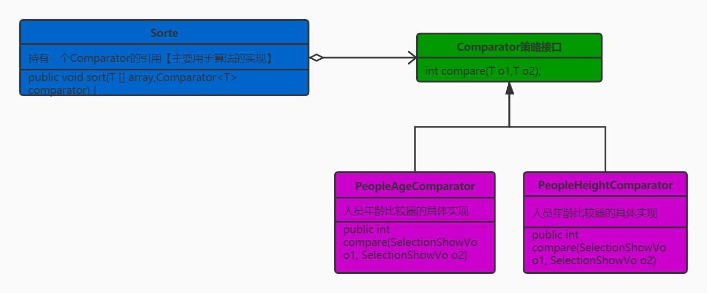

## 策略模式介绍
> 策略模式：定义一族算法类,将每个算法分别封装起来,让它们可以互相替换。策略模式可以使算法的变化独立于使用它们的客户端(这里的客户端代指使用算法的代码)

#### 使用细节
* 策略的定义
* 策略的创建
* 策略的使用

#### UML类图


#### 优缺点
> 优点
1. 多重条件语句不易维护，而使用策略模式可以避免使用多重条件语句。
2. 策略模式提供了一系列的可供重用的算法族，恰当使用继承可以把算法族的公共代码转移到父类里面，从而避免重复的代码。
3. 策略模式可以提供相同行为的不同实现，客户可以根据不同时间或空间要求选择不同的。
4. 策略模式提供了对开闭原则的完美支持，可以在不修改原代码的情况下，灵活增加新算法。
5. 策略模式把算法的使用放到环境类中，而算法的实现移到具体策略类中，实现了二者的分离。

> 缺点
1. 客户端必须理解所有策略算法的区别，以便适时选择恰当的算法类。
2. 策略模式造成很多的策略类。

> 此处的策略定义可以直接使用java.util下的Comparable接口；示例中使用的是自定义比较策略接口
### 需要比较的实体
```java
/**
 * 需要进行比较的实体
 * Author : GuDao
 * 2020-10-14
 */
public class People {
    private String name;
    private Integer age;
    private Integer height;

    public String getName() {
        return name;
    }

    public People setName(String name) {
        this.name = name;
        return this;
    }

    public Integer getAge() {
        return age;
    }

    public People setAge(Integer age) {
        this.age = age;
        return this;
    }

    public Integer getHeight() {
        return height;
    }

    public People setHeight(Integer height) {
        this.height = height;
        return this;
    }

    public People() {
    }

    public People(String name, Integer age, Integer height) {
        this.name = name;
        this.age = age;
        this.height = height;
    }

    @Override
    public String toString() {
        return "People{" +
                "name='" + name + '\'' +
                ", age=" + age +
                ", height=" + height +
                '}';
    }
}
```
### 定义比较策略接口
```java
/**
 * 比较策略接口
 * Author : GuDao
 * 2020-10-14
 */
public interface Comparator<T> {
    public int comparable(T o1, T o2);
}
```
### 策略的创建
```java
/**
 * 用户年龄比较策略实体
 * Author : GuDao
 * 2020-10-14
 */
public class PeopleAgeComparator implements Comparator<People> {
    @Override
    public int comparable(People o1, People o2) {
        if(o1.getAge()>o2.getAge())return 1;
        else if(o1.getAge()<o2.getAge())return -1;
        return 0;
    }
}

/**
 * 用户身高比较策略实体
 * Author : GuDao
 * 2020-10-15
 */
public class PeopleHeightComparator implements Comparator<People> {
    @Override
    public int comparable(People o1, People o2) {
        if (o1.getHeight() > o2.getHeight()) return 1;
        else if (o1.getHeight() < o2.getHeight()) return -1;
        return 0;
    }
}
```
### 策略算法
```java
/**
 * 比较策略算法
 * Author : GuDao
 * 2020-10-14
 */
public class Sorter<T> {
    //使用选择排序进行比较
    public void sort(T[] objs, Comparator<T> comparator){
        for (int i = 0; i < objs.length-1; i++) {
            int minPos=i;
            for (int j = i+1; j < objs.length; j++) {
                minPos = comparator.comparable(objs[j],objs[minPos]) < 0 ? j : minPos;
            }
            //minPos大的话，此时选用j索引；如果比较结果<0，那么minPos还是i；所以下列方法中传输objs,i,minPos
            swap(objs,i,minPos);
        }
    }

    //位置互换
    private void swap(T[] objs, int i, int minPos) {
        T temp = objs[i];
        objs[i] = objs[minPos];
        objs[minPos] = temp;
    }
}
```
### 测试方法
```java
import java.util.ResourceBundle;

/**
 * Author : GuDao
 * 2020-10-14
 */
public class Main {
    public static void main(String[] args) throws ClassNotFoundException, IllegalAccessException, InstantiationException {
        People[] peoples = new People[]{new People("001", 10, 180),new People("002",12,190),new People("003",5,190), new People("004", 70, 165)};
        Sorter<People>sorter = new Sorter<>();
        /**
         * 使用new方法新建对象
         */
        sorter.sort(peoples, new PeopleAgeComparator());
        //sorter.sort(peoples, new PeopleHeightComparator());

        /**
         * 使用配置文件【更容易扩展】
         */
        //ResourceBundle config = ResourceBundle.getBundle("strategyconfig");
        //String beanName = config.getString("peopleHeightComparator");
        //Comparator comparator = (Comparator) Class.forName(beanName).newInstance();
        
        sorter.sort(peoples, comparator);
        for (People p:peoples) {
            System.out.println(p);
        }
    }
}
```