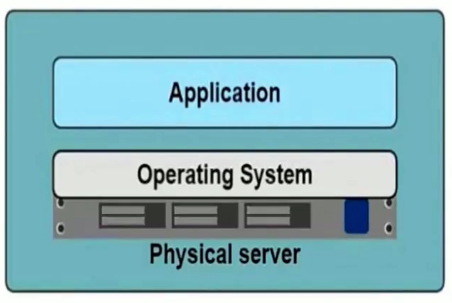
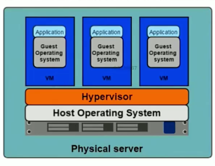
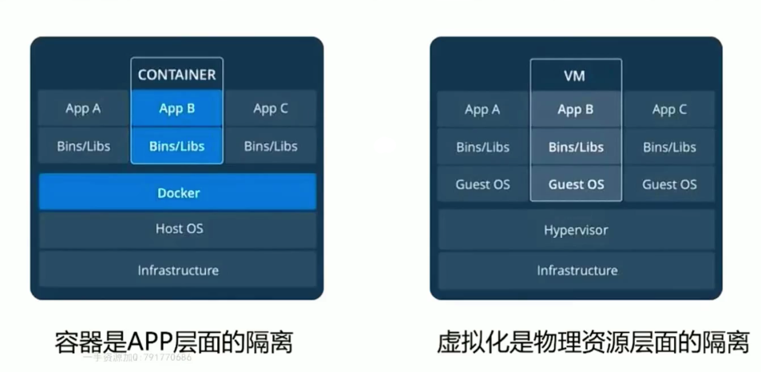

## 容器化技术的演变
> 参数说明：
> Infrastructure：基础设施
> Opreation System：操作系统
> Hypervisor：虚拟机监控程序（将基础设施资源分成固定的多份：windows安装VMware，安装ContOS之后就会根据你对ContOS配置将电脑的资源分配出固定的部分）
> Application：项目配置和项目代码等信息
> Image：docker中的image模版
> Container：docker中通过image模版创建出来的一个个实例

### 物理机时代

* 部署非常慢
* 成本很高
* 资源浪费
* 难于扩展与迁移
* 受制于硬件

### 虚拟化时代

> 此时的Hypervisor就相当于VMWare虚拟机，通过虚拟机来实现物理资源的分配使用
* 多部署资源池
* 资源隔离
* 很容易扩展
* VM需要安装操作系统

### 容器化时代

* 有助于Microservices的落地和部署
* 充分利用物理机资源，同时能够整合服务器资源
* 提高开发效率，测试效率，部署效率，有利于DevOps的落地，CICD
* 云原生落地，应用更好地迁移

