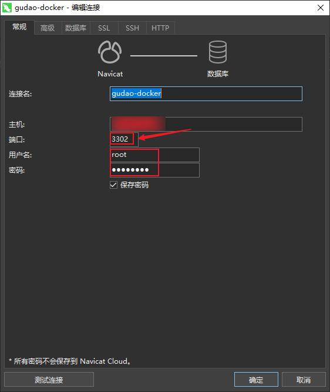

## Mysql配置

### 去docker远程仓库下载image模版
#### 在 [Docker仓库](https://hub.docker.com/_/mysql?tab=tags&page=1&ordering=last_updated) 找指定的mysql版本拉去命令

```shell
# 本次使用的事mysql5.7
docker pull mysql:5.7.33
```

### 创建mysql对应的Container
```shell
docker run -d --name my-mysql -p 3301:3306 -e MYSQL_ROOT_PASSWORD=密码 --privileged mysql:版本号
```

### 进入mysql的Container
```shell
docker exec -it my-mysql /bin/bash
```

### 连接mysql，设置远程访问（说白了就是针对mysql的基础数据库mysql中的表user进行操作）
```shell
# 连接mysql
mysql -u root -p

# 输入密码
***

# 配置远程访问（这种创建的用户只能访问基础表）
create user '用户名root'@'%' identified by '密码';

# 开启所有权限
GRANT ALL PRIVILEGES ON *.* TO '用户名称'@'%' IDENTIFIED BY '密码' WITH GRANT OPTION;
# 参数说明
## 用户名称：自己创建的远程连接用户名（可以是root，也可以是其它名字，用户自定义）
## %：%是允许所有ip进行连接；这边也写特定的ip，那就可以指定ip进行连接
## 密码：自定义密码，针对自己创建的用户，使用此密码才能访问

# 立即启用修改
flush privileges;
```


### 测试连接


### 测试使用

