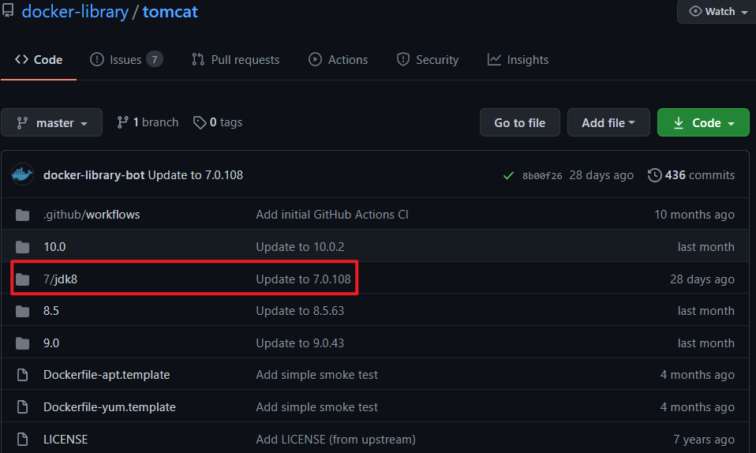

## Image

### Docker的官方镜像存储地址
[官方镜像](https://github.com/docker-library)

### Tomcat中的DockerFile说明
[Tomcat镜像地址](https://github.com/docker-library/tomcat) 选择指定的版本进入选择adoptopenjdk-openj9，然后打开dockerfile文件<br>

```shell
FROM debian:buster-slim

# add our user and group first to make sure their IDs get assigned consistently, regardless of whatever dependencies get added
RUN groupadd -r mysql && useradd -r -g mysql mysql

RUN apt-get update && apt-get install -y --no-install-recommends gnupg dirmngr && rm -rf /var/lib/apt/lists/*

# add gosu for easy step-down from root
# https://github.com/tianon/gosu/releases
ENV GOSU_VERSION 1.12
RUN set -eux; \
	savedAptMark="$(apt-mark showmanual)"; \
	apt-get update; \
	apt-get install -y --no-install-recommends ca-certificates wget; \
	rm -rf /var/lib/apt/lists/*; \
	dpkgArch="$(dpkg --print-architecture | awk -F- '{ print $NF }')"; \
	wget -O /usr/local/bin/gosu "https://github.com/tianon/gosu/releases/download/$GOSU_VERSION/gosu-$dpkgArch"; \
	wget -O /usr/local/bin/gosu.asc "https://github.com/tianon/gosu/releases/download/$GOSU_VERSION/gosu-$dpkgArch.asc"; \
	export GNUPGHOME="$(mktemp -d)"; \
	gpg --batch --keyserver hkps://keys.openpgp.org --recv-keys B42F6819007F00F88E364FD4036A9C25BF357DD4; \
	gpg --batch --verify /usr/local/bin/gosu.asc /usr/local/bin/gosu; \
	gpgconf --kill all; \
	rm -rf "$GNUPGHOME" /usr/local/bin/gosu.asc; \
	apt-mark auto '.*' > /dev/null; \
	[ -z "$savedAptMark" ] || apt-mark manual $savedAptMark > /dev/null; \
	apt-get purge -y --auto-remove -o APT::AutoRemove::RecommendsImportant=false; \
	chmod +x /usr/local/bin/gosu; \
	gosu --version; \
	gosu nobody true

RUN mkdir /docker-entrypoint-initdb.d

RUN apt-get update && apt-get install -y --no-install-recommends \
# for MYSQL_RANDOM_ROOT_PASSWORD
		pwgen \
# for mysql_ssl_rsa_setup
		openssl \
# FATAL ERROR: please install the following Perl modules before executing /usr/local/mysql/scripts/mysql_install_db:
# File::Basename
# File::Copy
# Sys::Hostname
# Data::Dumper
		perl \
# install "xz-utils" for .sql.xz docker-entrypoint-initdb.d files
		xz-utils \
	&& rm -rf /var/lib/apt/lists/*

RUN set -ex; \
# gpg: key 5072E1F5: public key "MySQL Release Engineering <mysql-build@oss.oracle.com>" imported
	key='A4A9406876FCBD3C456770C88C718D3B5072E1F5'; \
	export GNUPGHOME="$(mktemp -d)"; \
	gpg --batch --keyserver ha.pool.sks-keyservers.net --recv-keys "$key"; \
	gpg --batch --export "$key" > /etc/apt/trusted.gpg.d/mysql.gpg; \
	gpgconf --kill all; \
	rm -rf "$GNUPGHOME"; \
	apt-key list > /dev/null

ENV MYSQL_MAJOR 5.7
ENV MYSQL_VERSION 5.7.33-1debian10

RUN echo 'deb http://repo.mysql.com/apt/debian/ buster mysql-5.7' > /etc/apt/sources.list.d/mysql.list

# the "/var/lib/mysql" stuff here is because the mysql-server postinst doesn't have an explicit way to disable the mysql_install_db codepath besides having a database already "configured" (ie, stuff in /var/lib/mysql/mysql)
# also, we set debconf keys to make APT a little quieter
RUN { \
		echo mysql-community-server mysql-community-server/data-dir select ''; \
		echo mysql-community-server mysql-community-server/root-pass password ''; \
		echo mysql-community-server mysql-community-server/re-root-pass password ''; \
		echo mysql-community-server mysql-community-server/remove-test-db select false; \
	} | debconf-set-selections \
	&& apt-get update \
	&& apt-get install -y \
		mysql-server="${MYSQL_VERSION}" \
# comment out a few problematic configuration values
	&& find /etc/mysql/ -name '*.cnf' -print0 \
		| xargs -0 grep -lZE '^(bind-address|log)' \
		| xargs -rt -0 sed -Ei 's/^(bind-address|log)/#&/' \
# don't reverse lookup hostnames, they are usually another container
	&& echo '[mysqld]\nskip-host-cache\nskip-name-resolve' > /etc/mysql/conf.d/docker.cnf \
	&& rm -rf /var/lib/apt/lists/* \
	&& rm -rf /var/lib/mysql && mkdir -p /var/lib/mysql /var/run/mysqld \
	&& chown -R mysql:mysql /var/lib/mysql /var/run/mysqld \
# ensure that /var/run/mysqld (used for socket and lock files) is writable regardless of the UID our mysqld instance ends up having at runtime
	&& chmod 1777 /var/run/mysqld /var/lib/mysql

VOLUME /var/lib/mysql

COPY docker-entrypoint.sh /usr/local/bin/
RUN ln -s usr/local/bin/docker-entrypoint.sh /entrypoint.sh # backwards compat
ENTRYPOINT ["docker-entrypoint.sh"]

EXPOSE 3306 33060
CMD ["mysqld"]
```

### Dockerfile语法说明
#### FROM
> 指定基础镜像，比如FROM ubuntu:14.04
```shell
# 使用Ubuntu系统作为基础
FROM ubuntu:14.04
```

#### RUN
> 在镜像内部执行一些命令，比如安装软件，配置环境等，换行可以使用
```shell
# RUN后面即为mysql中的配置命令
RUN groupadd -r mysql && useradd -r -g mysql mysql
```

#### ENV
> 设置变量的值，ENV MYSQL_MA JOR 5.7，可以通过docker run --e key=value修改，后面可以直接使 用${MYSQL_MA JOR}
```shell
ENV MYSQL_MAJOR 5.7
```

#### LABEL
> 设置镜像标签
```shell
LABEL email="gudao@163.com" 
LABEL name="gudao"
```

#### VOLUME
> 指定数据的挂在目录
```shell
VOLUME /var/lib/mysql
```

#### COPY
> 将主机的文件复制到镜像内，如果目录不存在，会自动创建所需要的目录，注意只是复制，不会提取和解压
```shell
# 将服务器的bin目录下的xxx文件拷贝到容器中
COPY docker-entrypoint.sh /usr/local/bin/
```

#### ADD
> 将主机的文件复制到镜像内，和COPY类似，只是ADD会对压缩文件提取和解压
```shell
ADD application.yml /etc/itcrazy2016/
```

#### WORKDIR
> 指定镜像的工作目录，之后的命令都是基于此目录工作，若不存在则创建
```shell
# 会在/usr/local/tomcat下创建test.txt文件
WORKDIR /usr/local 
WORKDIR tomcat 
RUN touch test.txt

# 会在/root/test下多出一个app.yml文件
WORKDIR /root 
ADD app.yml test/
```

#### CMD
> 容器启动的时候默认会执行的命令，若有多个CMD命令，则最后一个生效
```shell
CMD ["mysqld"] 
或 
CMD mysqld
```

#### ENTRYPOINT
> 和CMD命令类似，和CMD的不同docker run执行时，会覆盖CMD的命令，而ENTRYPOINT不会
```shell
ENTRYPOINT ["docker-entrypoint.sh"]
```

#### EXPOSE
> 指定镜像要暴露的端口，启动镜像时，可以使用-p将该端口映射给宿主机
```shell
EXPOSE 3306
```

### 自己实现一个项目镜像的基本流程
#### 创建SpringBoot项目

#### 写一个controller，能保证能通过浏览器访问你的接口
```java
@RestController
public class DockerController {
    @GetMapping("/dockerfile")
    @ResponseBody
    String dockerfile() {
        return "hello docker" ;
    }
}
```

#### mvn clean package打成一个jar包
> 在target下找到"dockerfile-demo-0.0.1-SNAPSHOT.jar"

#### 在docker环境中新建一个目录"first-dockerfile"

#### 上传"dockerfile-demo-0.0.1-SNAPSHOT.jar"到该目录下，并且在此目录创建Dockerfile；创建Dockerfile文件，编写内容

```shell
# 安装jdk8到镜像中
FROM openjdk:8
# 创建人
MAINTAINER gudao
# 镜像的版本信息
LABEL name="镜像名称" version="1.0" author="gudao"
# 将指定位置的jar包拷贝到镜像中来 copy jar包名 镜像中的jar包名
COPY dockerfile-demo-0.0.1-SNAPSHOT.jar dockerfile-image.jar
# 启动容器后运行指定的命令
CMD ["java","-jar","dockerfile-image.jar"]
```

#### 基于Dockerfile构建镜像
```shell
# docker build -t 自己的容器名 /Dokcerfile位置
docker build -t gudao-image /docker
```

#### 基于image创建container
```shell
docker run -d --name gudao -p 8090:8080 gudao-image
```

#### 查看启动日志
```shell
docker logs gudao
```

#### 宿主机上访问
```shell
curl localhost:8090/docker
```
hello docker

#### 还可以再次启动一个
```shell
docker run -d --name gudaodemo -p 8081:8080 gudao-image
```