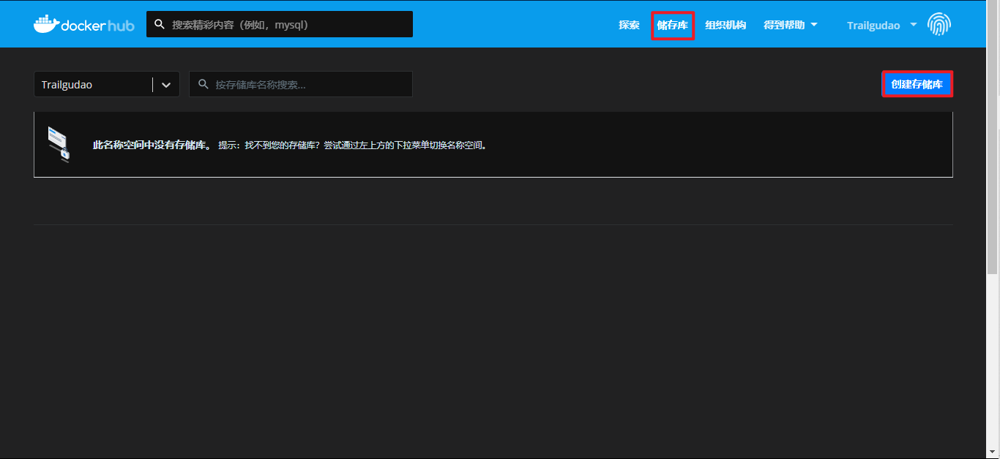
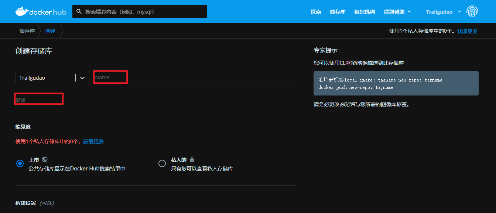
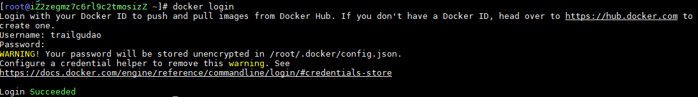
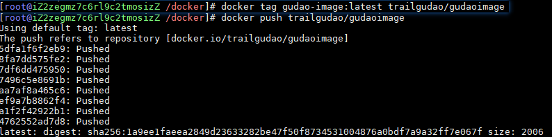
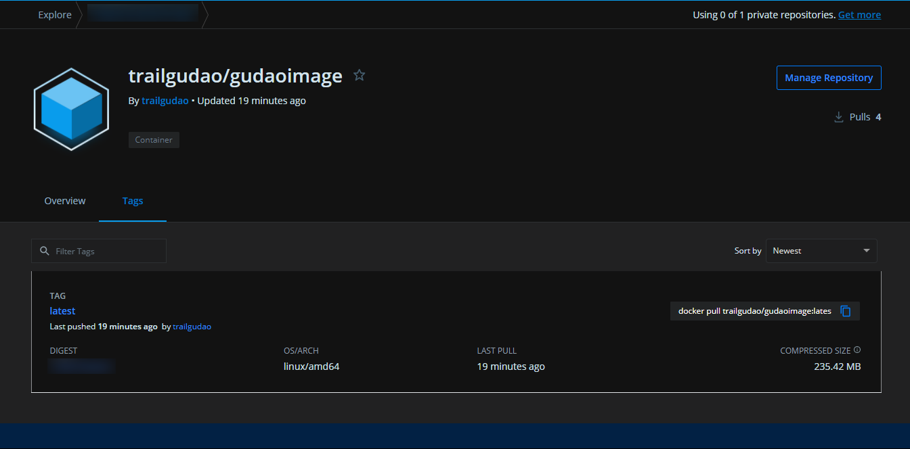
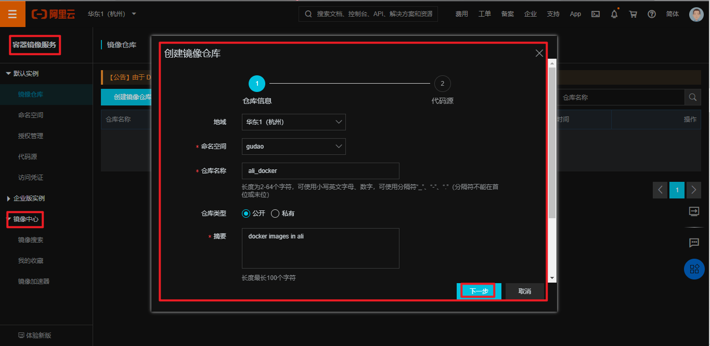
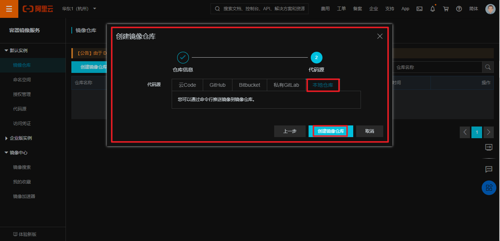

## 镜像仓库配置

### hub.docker.com官网创建仓库
#### 进入官网，创建账号

#### 点击Repostories，创建仓库


#### 配置仓库信息


### 直接通过命令，将本地的image镜像push到hub中去
```shell
# 本地登陆hub.docker.com账号
docker login

# 创建提交tag：docker tag 本地镜像:版本号 hub账号名/远程仓库名
docker tag gudao-image:latest trailgudao/gudaoimage

# 将本地的image镜像push到远程：docker push hub账号名/远程仓库名
docker push trailgudao/gudaoimage
```

#### 登陆


#### 提交


#### hub中查看信息


### 阿里docker仓库创建
#### 仓库创建


#### 镜像源选取


#### 上传命令
[阿里官方地址](https://cr.console.aliyun.com/repository/cn-hangzhou/gudao/ali_docker/details)
```shell
# 登录阿里云Docker Registry
$ sudo docker login --username=gudaofq registry.cn-hangzhou.aliyuncs.com
# 用于登录的用户名为阿里云账号全名，密码为开通服务时设置的密码。

# 从Registry中拉取镜像
$ sudo docker pull registry.cn-hangzhou.aliyuncs.com/gudao/ali_docker:[镜像版本号]

# 将镜像推送到Registry
$ sudo docker login --username=阿里云账号 registry.cn-hangzhou.aliyuncs.com
$ sudo docker tag [ImageId] registry.cn-hangzhou.aliyuncs.com/gudao/ali_docker:[镜像版本号]
$ sudo docker push registry.cn-hangzhou.aliyuncs.com/gudao/ali_docker:[镜像版本号]
请根据实际镜像信息替换示例中的[ImageId]和[镜像版本号]参数。

# 选择合适的镜像仓库地址
## 从ECS推送镜像时，可以选择使用镜像仓库内网地址。推送速度将得到提升并且将不会损耗您的公网流量。
## 如果您使用的机器位于VPC网络，请使用 registry-vpc.cn-hangzhou.aliyuncs.com 作为Registry的域名登录。

# 示例
## 使用"docker tag"命令重命名镜像，并将它通过专有网络地址推送至Registry。
$ sudo docker images
  REPOSITORY                                                         TAG                 IMAGE ID            CREATED             VIRTUAL SIZE
  registry.aliyuncs.com/acs/agent                                    0.7-dfb6816         37bb9c63c8b2        7 days ago          37.89 MB
$ sudo docker tag 37bb9c63c8b2 registry-vpc.cn-hangzhou.aliyuncs.com/acs/agent:0.7-dfb6816

# 使用 "docker push" 命令将该镜像推送至远程。
$ sudo docker push registry-vpc.cn-hangzhou.aliyuncs.com/acs/agent:0.7-dfb6816
```