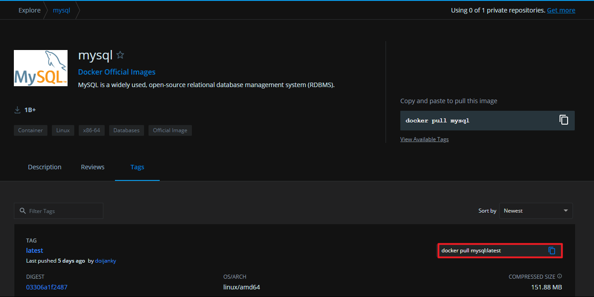
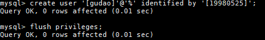
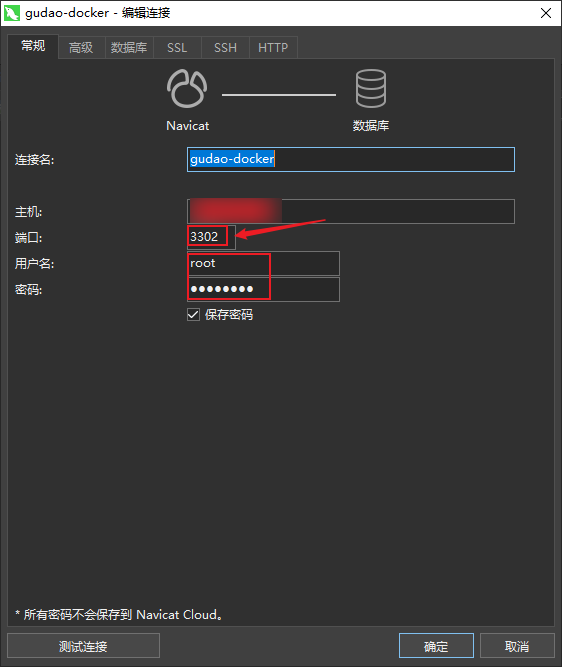

## Mysql配置

### 去docker远程仓库下载image模版
#### 去 [Docker仓库](https://hub.docker.com/_/mysql?tab=tags&page=1&ordering=last_updated) 找指定的mysql版本拉去命令

```shell
# 本次使用的事mysql5.7
docker pull mysql:5.7.33
```

### 创建mysql对应的Container
```shell
docker run -d --name my-mysql -p 3301:3306 -e MYSQL_ROOT_PASSWORD=密码 --privileged mysql
```

### 进入mysql的Container
```shell
docker exec -it my-mysql /bin/bash
```

### 连接mysql，设置远程访问
```shell
# 连接mysql
mysql -u root -p

# 输入密码
***

# 配置远程访问
create user '[用户名root]'@'%' identified by '[密码]';

# 立即启用修改
flush privileges;
```


### 测试连接

