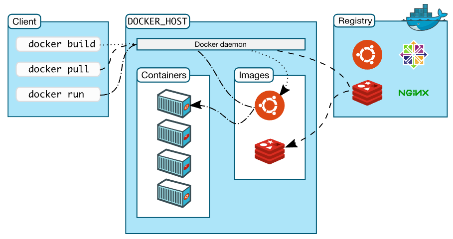

## Docker基本应用及说明

### Docker架构图

* docker pull在哪拉取的镜像？
    > 默认是在hub.docker.com
* docker pull tomcat拉取的版本是？
    > 默认是最新的版本，可以在后面指定版本":"

### Docker命令
```shell
docker pull        拉取镜像到本地
docker run         根据某个镜像创建容器
-d                 让容器在后台运行，其实就是一个进程
--name             给容器指定一个名字
-p                 将容器的端口映射到宿主机的端口
docker exec -it    进入到某个容器中并交互式运行
```

### 基本应用
```shell
# docker开机启动
sudo systemctl enable docker

# 创建tomcat容器
docker pull tomcat
docker run -d --name my-tomcat -p 9090:8080 tomcat

# 创建mysql容器
docker run -d --name my-mysql -p 3301:3306 -e MYSQL_ROOT_PASSWORD=jack123 --privileged mysql
	
# 进入到容器里面
docker exec -it containerid /bin/bash

# 列出所有容器 ID
docker ps -aq

# 查看运行的容器，并获得names
docker ps 

# 停止所有容器
docker stop $(docker ps -aq)

# 停止单个容器
docker stop 要停止的容器名

# 删除所有容器
docker rm $(docker ps -aq)

# 删除单个容器
docker rm 要删除的容器名

# 删除所有的镜像
docker rmi $(docker images -q)

# 删除单个容器镜像
docker rmi 要删除的镜像名
```