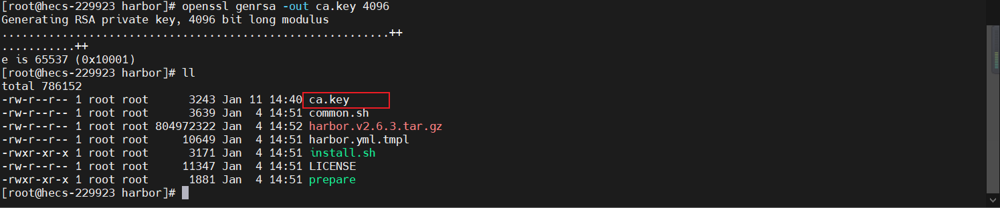

## CentOS 7部署Harbor（离线安装版本）
[官方文档](https://goharbor.io/docs/2.3.0/install-config/)

[toc]

### 环境说明
* 系统：Linux version 3.10.0-1160.80.1.el7.x86_64
* Harbor版本：v2.6.3离线安装版 [Github下载地址](https://github.com/goharbor/harbor/releases)
* docker版本：20.10.22
* 硬件：8c 16g SSD50G

### 安装
#### docker安装
##### 本次使用的是`https://get.docker.com`提供的脚本安装docker，如果想指定docker版本，可以看`【YC】docker安装.md`文档，记得要17以上
> 下面的脚本是https://github.com/docker/docker-install/blob/master/install.sh中提供的，也可以使用wget下载github中的脚本执行
```shell
curl -fsSL https://get.docker.com/ | sh
```


##### 不推荐使用，yum源中版本较低的话，可能会出现问题：Need to upgrade docker package to 17.06.0+.
```shell
yum install docker -y
```

#### 下载Harbor安装包
```shell
# 创建harbor下载存储文件夹
mkdir /myHarbor && cd /myHarbor

# 下在对应安装的harbor（如果不能连接github，需要先将文件下载到本地，再上传到刚刚创建的myHarbor）
wget https://github.com/goharbor/harbor/releases/download/v2.6.3/harbor-offline-installer-v2.6.3.tgz
```

#### 将部署文件解压到`/usr/local/`
> 如果不是按照上面步骤操作，需要将tgz包名称修改，并且进入tgz包所在路径执行下面的命令
```shell
tar zxvf harbor-offline-installer-v2.6.3.tgz -C /usr/local/
```


#### harbor配置https访问
> 默认情况下，Harbor不附带证书。可以在没有安全性的情况下部署Harbor，以便您可以通过HTTP连接到它。但是，只有在没有外部网络连接的空白测试或开发环境中，才可以使用HTTP。在没有空隙的环境中使用HTTP会使您遭受中间人攻击。在生产环境中，请始终使用HTTPS。如果启用Content Trust with Notary来正确签名所有图像，则必须使用HTTPS。 
> 要配置HTTPS，必须创建SSL证书。您可以使用由受信任的第三方CA签名的证书，也可以使用自签名证书

##### 生成证书颁发机构证书
> 在生产环境中，您应该从CA获得证书。在测试或开发环境中，您可以生成自己的CA。要生成CA证书，请运行以下命令

##### 生成CA证书私钥
```shell
cd /usr/local/harbor
openssl genrsa -out ca.key 4096
```


##### 生成CA证书
> 调整`-subj`选项中的值以反映您的组织。如果使用FQDN连接Harbor主机，则必须将其指定为通用名称（`CN`）属性
```shell
# 域名方式：将下面命令中的harbor.od.com修改为自己的域名
# ip方式：将下面命令中的harbor.od.com修改为自己的ip
openssl req -x509 -new -nodes -sha512 -days 3650 \
 -subj "/C=CN/ST=Beijing/L=Beijing/O=example/OU=Personal/CN=harbor.od.com" \
 -key ca.key \
 -out ca.crt

# 例子：
openssl req -x509 -new -nodes -sha512 -days 3650 \
 -subj "/C=CN/ST=Beijing/L=Beijing/O=example/OU=Personal/CN=12x.xx.xxx.x4" \
 -key ca.key \
 -out ca.crt
```


##### 生成私钥
```shell
# 这边的harbor.od.com.key需要自己定义，但是一定要记住，后面会使用到
# 如果使用域名方式，这边直接把harbor.od.com改为自己的域名
# 如果使用ip方式，这边直接把harbor.od.com改为自己的ip
openssl genrsa -out harbor.od.com.key 4096

# 例子：
openssl genrsa -out 12x.xx.xxx.x4.key 4096
```


##### 生成证书签名请求（CSR）
```shell
# 这边的harbor.od.com.csr需要自己定义，但是一定要记住，后面会使用到
# 这边的harbor.od.com.key使用上面`生成私钥`生成的key名称
# 如果使用域名方式，这边直接把harbor.od.com.csr改为自己的域名.csr
# 如果使用ip方式，这边直接把harbor.od.com.csr改为自己的ip.csr
openssl req -sha512 -new \
    -subj "/C=CN/ST=Beijing/L=Beijing/O=example/OU=Personal/CN=harbor.od.com" \
    -key harbor.od.com.key \
    -out harbor.od.com.csr

# 例子
openssl req -sha512 -new \
    -subj "/C=CN/ST=Beijing/L=Beijing/O=example/OU=Personal/CN=12x.xx.xxx.x4" \
    -key 12x.xx.xxx.x4.key \
    -out 12x.xx.xxx.x4.csr
```


##### 生成一个x509 v3扩展文件
> 无论您使用FQDN还是IP地址连接到Harbor主机，都必须创建此文件，以便可以为您的Harbor主机生成符合主题备用名称（SAN）和x509 v3的证书扩展要求。替换`DNS`条目以反映您的域
```shell
# 域名方式：将下面命令中的harbor.od.com修改为自己的域名
cat > v3.ext <<-EOF
authorityKeyIdentifier=keyid,issuer
basicConstraints=CA:FALSE
keyUsage = digitalSignature, nonRepudiation, keyEncipherment, dataEncipherment
extendedKeyUsage = serverAuth
subjectAltName = @alt_names

[alt_names]
DNS.1=harbor.od.com
DNS.2=harbor.od.com
DNS.3=harbor.od.com
EOF

# ip方式：将下面命令中的192.168.0.1修改为自己的域名
cat > v3.ext <<-EOF
authorityKeyIdentifier=keyid,issuer
basicConstraints=CA:FALSE
keyUsage = digitalSignature, nonRepudiation, keyEncipherment, dataEncipherment
extendedKeyUsage = serverAuth
subjectAltName = IP:192.168.0.1
EOF

# 例子
cat > v3.ext <<-EOF
authorityKeyIdentifier=keyid,issuer
basicConstraints=CA:FALSE
keyUsage = digitalSignature, nonRepudiation, keyEncipherment, dataEncipherment
extendedKeyUsage = serverAuth
subjectAltName = IP:12x.xx.xxx.x4
EOF
```


##### 使用上面命令生成的`v3.ext`文件为Harbor主机生成证书
```shell
# 这边的harbor.od.com.crt需要自己定义，但是一定要记住，后面会使用到
# 这边的harbor.od.com.csr使用上面'生成证书签名请求（CSR）'生成的xxx.csr名称
# 如果使用域名方式，这边直接把harbor.od.com.crt改为自己的域名.crt
# 如果使用ip方式，这边直接把harbor.od.com.crt改为自己的ip.crt
openssl x509 -req -sha512 -days 3650 \
    -extfile v3.ext \
    -CA ca.crt -CAkey ca.key -CAcreateserial \
    -in harbor.od.com.csr \
    -out harbor.od.com.crt

# 例子
openssl x509 -req -sha512 -days 3650 \
    -extfile v3.ext \
    -CA ca.crt -CAkey ca.key -CAcreateserial \
    -in 12x.xx.xxx.x4.csr \
    -out 12x.xx.xxx.x4.crt
```


#### 提供证书给Harbor和Docker
> 生成后`ca.crt`，`harbor.od.com.crt`和`harbor.od.com.key`文件，必须将它们提供给`Harbor`和`docker`，重新配置它们

##### 将服务器证书和密钥复制到Harbor主机上的`/data/cert/`文件夹中
```shell
# 此处使用到的harbor.od.com.crt和harbor.od.com.key都是在`harbor配置https访问`中生成的key和crt，需要改成生成的key和crt
mkdir -p /data/cert/
cp harbor.od.com.crt /data/cert/
cp harbor.od.com.key /data/cert/

# 例子
mkdir -p /data/cert/
cp 12x.xx.xxx.x4.crt /data/cert/
cp 12x.xx.xxx.x4.key /data/cert/
```


##### 转换`harbor.od.com.crt`为`harbor.od.com.cert`，供Docker使用
```shell
# 此处使用到的harbor.od.com.crt和harbor.od.com.key都是在`harbor配置https访问`中生成的key和crt，需要改成生成的key和crt
openssl x509 -inform PEM -in harbor.od.com.crt -out harbor.od.com.cert

# 例子
openssl x509 -inform PEM -in 12x.xx.xxx.x4.crt -out 12x.xx.xxx.x4.cert
```


##### 将服务器证书，密钥和CA文件复制到Harbor主机上的Docker证书文件夹中；您必须首先创建适当的文件夹
```shell
mkdir -p /etc/docker/certs.d/harbor.od.com/
cp harbor.od.com.cert /etc/docker/certs.d/harbor.od.com/
cp harbor.od.com.key /etc/docker/certs.d/harbor.od.com/
cp ca.crt /etc/docker/certs.d/harbor.od.com/

# 例子
mkdir -p /etc/docker/certs.d/12x.xx.xxx.x4/

cp 12x.xx.xxx.x4.cert /etc/docker/certs.d/12x.xx.xxx.x4/
cp 12x.xx.xxx.x4.key /etc/docker/certs.d/12x.xx.xxx.x4/
cp ca.crt /etc/docker/certs.d/12x.xx.xxx.x4/
```


##### 如果将默认`nginx`端口443 映射到其他端口
> 如果将默认`nginx`端口443 映射到其他端口，请创建文件夹`/etc/docker/certs.d/yourdomain.com:port`或`/etc/docker/certs.d/harbor_IP:port`
```shell
mkdir -p /etc/docker/certs.d/12x.xx.xxx.x4:1228/

cp 12x.xx.xxx.x4.cert /etc/docker/certs.d/12x.xx.xxx.x4:1228/
cp 12x.xx.xxx.x4.key /etc/docker/certs.d/12x.xx.xxx.x4:1228/
cp ca.crt /etc/docker/certs.d/12x.xx.xxx.x4:1228/
```

#### 修改配置文件
> 把`harbor.yml.tmpl`修改为`harbor.yml`文件
> 文件中的内容不需要全部复制下面的，只需要进入文件修改`hostname`、`certificate`、`private_key`
> 自行修改（可改可不改）`external_url`、`data_volume`
```shell
# 创建harbor映射文件路径
mkdir -p /data/harbor
# 修改文件
cd /usr/local/harbor
# 修改文件名称
mv harbor.yml.tmpl harbor.yml

# 复制配置
# 改为自己主机名
hostname: 12x.xx.xxx.x4
http:
 port: 80
https:
  port: 443
  # 授权证书位置
  certificate: /data/cert/12x.xx.xxx.x4.crt
  # 授权证书密钥
  private_key: /data/cert/12x.xx.xxx.x4.key
external_url: https://12x.xx.xxx.x4
# harbor帐号密码
harbor_admin_password: Harbor12345
# harbor数据库密码
database:
  password: root123
  max_idle_conns: 50
  max_open_conns: 100
  # harbor映射文件目录
data_volume: /data/harbor
clair:
  updaters_interval: 12
jobservice:
  max_job_workers: 10
notification:
  webhook_job_max_retry: 10
chart:
  absolute_url: disabled
log:
  level: info
  local:
    rotate_count: 50
    rotate_size: 200M
    location: /data/harbor/logs
_version: 1.10.0
proxy:
  http_proxy:
  https_proxy:
  no_proxy:
  components:
    - core
    - jobservice
    - clair
```

#### 重新启动Docker Engine
```shell
systemctl restart docker
```

#### Harbor将`nginx`实例用作所有服务的反向代理。您可以使用`prepare`脚本来配置`nginx`为使用HTTPS
```shell
./prepare
```


#### 执行部署脚本
```shell
sh install.sh
```


#### 登录
> 帐号密码：admin/Harbor12345


### 问题
#### Need to upgrade docker package to 17.06.0+.
##### docker版本过低，需要升级到17以上

##### 解决
```shell
# 查找主机上关于Docker的软件包
rpm -qa | grep docker

# 删除查找到的软件包
yum remove 

# docker进行升级
curl -fsSL https://get.docker.com/ | sh

# 重启docker
systemctl restart docker

# 设置开启自启动
systemctl enable docker
```
##### 执行效果


#### initdb: error: could not access directory "/var/lib/postgresql/data/pg13": Permission denied
##### `docker ps`发现harbor-db一直重启

##### `docker logs harbor-db`发现该容器日志全是报错信息

##### 解决1：安装docker-compose，删除harbor的docker-compose.yml中的db数据库映射配置（会把以前数据丢掉，也没做持久化）
```shell
# compse安装看【MSB】docker安装compose.md

# 修改tar解压目录下的docker-compose.yml（这个文件只有执行过`install.sh`文件后才会生成，而且每次重新执行./install.sh都会从新生成）
vi docker-compose.yml
# 删除harbor-db中的volumes挂盘映射，如下图，删除红框中的内容

# 删除后通过docker-compose启动（记住一定要在docker-compose.yml同级目录下执行）,不放心可以先删除原来容器
    docker-compose down
docker-compose up -d
```

##### 执行效果


