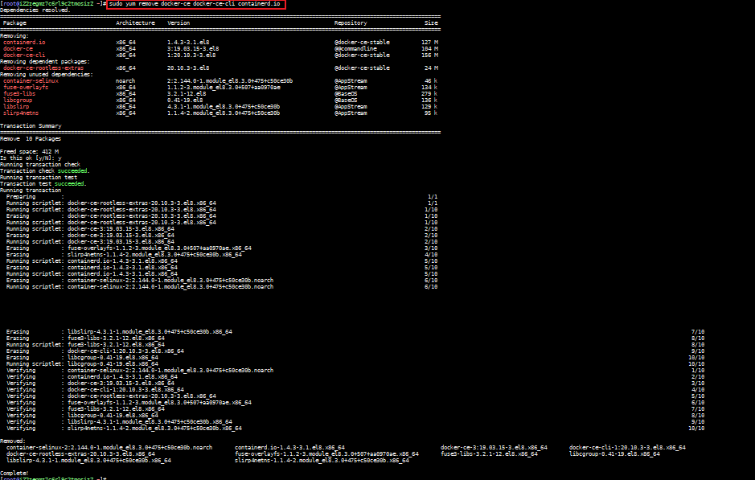

## 卸载

### 操作命令

#### 卸载Docker Engine，CLI和Containerd软件包
```shell
sudo yum remove docker-ce docker-ce-cli containerd.io
```


#### 主机上的映像，容器，卷或自定义配置文件不会自动删除。要删除所有图像，容器和卷：
```shell
sudo rm -rf /var/lib/docker
sudo rm -rf /var/lib/containerd
```