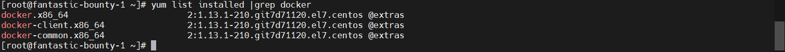
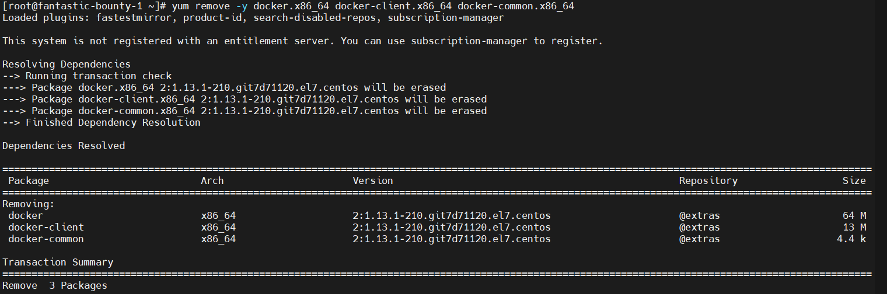
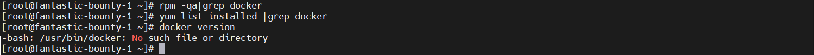

## 卸载

### 方式1

#### 查看yum安装的docker软件包
```shell
yum list installed |grep docker
```


#### 卸载Docker Engine，CLI和Containerd软件包
> 根据安装软件包的列表信息，卸载具体的docker软件包版本
```shell
# 通过yum remove -y xxx xxx ... 将通过yum list installed |grep docker查出来的工具信息全部卸载
## 需要将yum remove -y后面的信息改为自己服务器上的对应信息
yum remove -y docker.x86_64 docker-client.x86_64 docker-common.x86_64
```


#### 卸载后，查看rpm源文件和docker软件包是否卸载干净
```shell
# 查看工具包列表是否清理干净
yum list installed |grep docker
# 查看rpm源文件列表是否清理干净
rpm -qa | grep docker
# 查看docker命令是否存在
docker version
```


#### 主机上的映像，容器，卷或自定义配置文件不会自动删除。要删除所有图像，容器和卷：
```shell
rm -rf /var/lib/docker
rm -rf /var/lib/containerd
```

### 方式2

#### 卸载Docker Engine，CLI和Containerd软件包
```shell
sudo yum remove docker-ce docker-ce-cli containerd.io
```


#### 主机上的映像，容器，卷或自定义配置文件不会自动删除。要删除所有图像，容器和卷：
```shell
sudo rm -rf /var/lib/docker
sudo rm -rf /var/lib/containerd
```