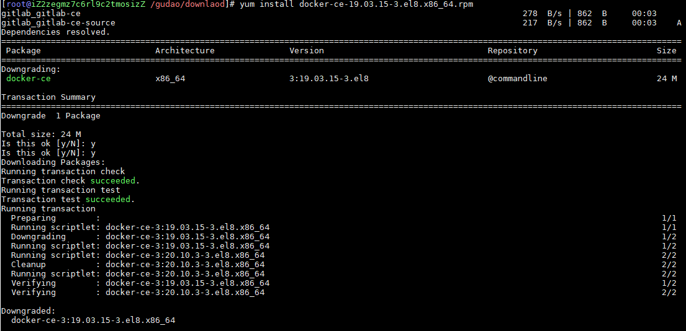
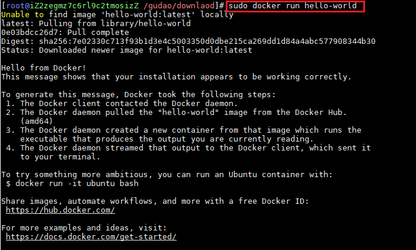
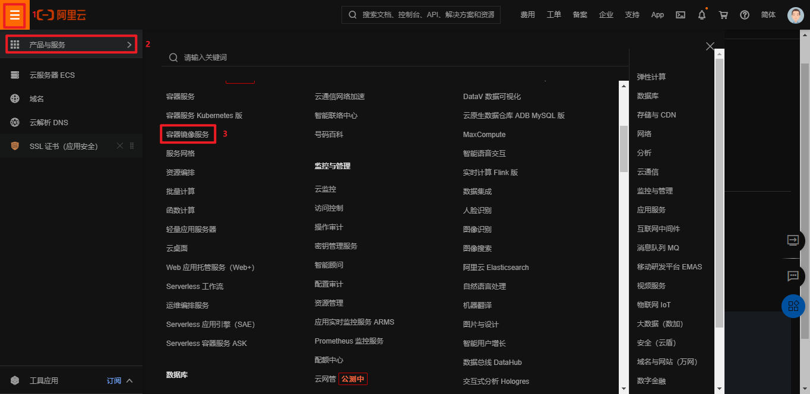
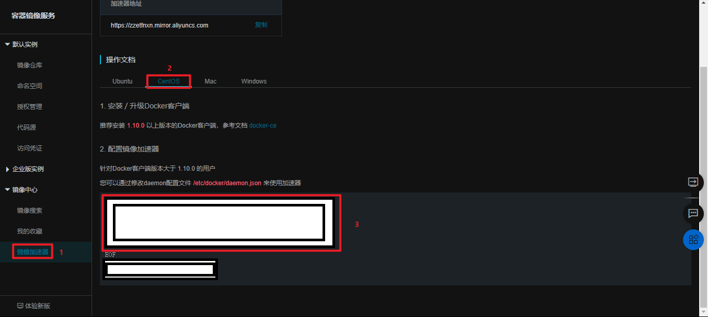

## Docker安装-CentOS-8
[Docker官方安装地址](https://docs.docker.com/engine/install/centos/)

### 官网rpm包下载安装

#### 进入官方网址下载对应CentOS版本的Docker安装包
> `https://download.docker.com/linux/centos/` 并选择您的CentOS版本。然后浏览`x86_64/stable/Packages/` 并下载`.rpm`要安装的Docker版本的文件。

#### 查看对应的CentOS版本信息
```shell
cat /etc/redhat-release
```

#### 卸载旧版本
```shell
sudo yum remove docker \
                  docker-client \
                  docker-client-latest \
                  docker-common \
                  docker-latest \
                  docker-latest-logrotate \
                  docker-logrotate \
                  docker-engine
```

#### 下载对应的安装包
```shell
wget https://download.docker.com/linux/centos/8/x86_64/stable/Packages/docker-ce-19.03.15-3.el8.x86_64.rpm
```

#### 安装Docker容器
```shell
# 安装之前需要转到下载的rpm包的目录下面，然后安装
yum install docker-ce-19.03.15-3.el8.x86_64.rpm
```


#### 启动容器
```shell
sudo systemctl start docker
```

#### 测试容器是否能正常运行
```shell
sudo docker run hello-world
```


### 使用存储库安装

#### 卸载旧版本
```shell
sudo yum remove docker \
                  docker-client \
                  docker-client-latest \
                  docker-common \
                  docker-latest \
                  docker-latest-logrotate \
                  docker-logrotate \
                  docker-engine
```

#### 安装必要的依赖
```shell
sudo yum install -y yum-utils \
    device-mapper-persistent-data \
    lvm2
```

#### 设置docker仓库
```shell
sudo yum-config-manager \
      --add-repo \
      https://download.docker.com/linux/centos/docker-ce.repo
```

#### 配置阿里云加速器



#### 安装docker
```shell
sudo yum install -y docker-ce docker-ce-cli containerd.io
```

#### 启动docker
```shell
sudo systemctl start docker
```

#### 测试docker安装是否成功
```shell
sudo docker run hello-world
```