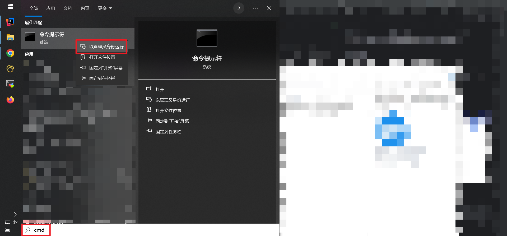
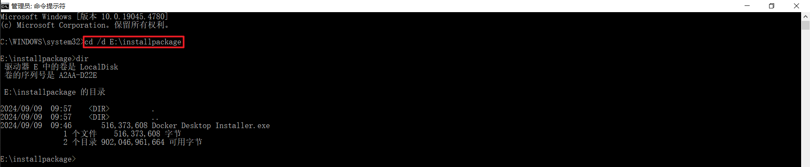
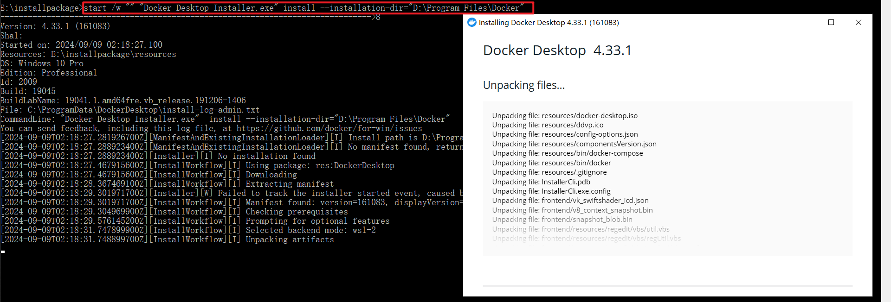
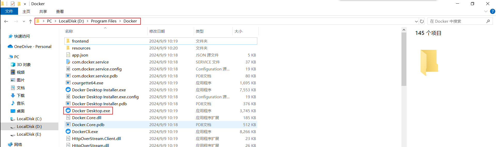
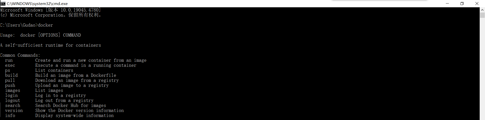
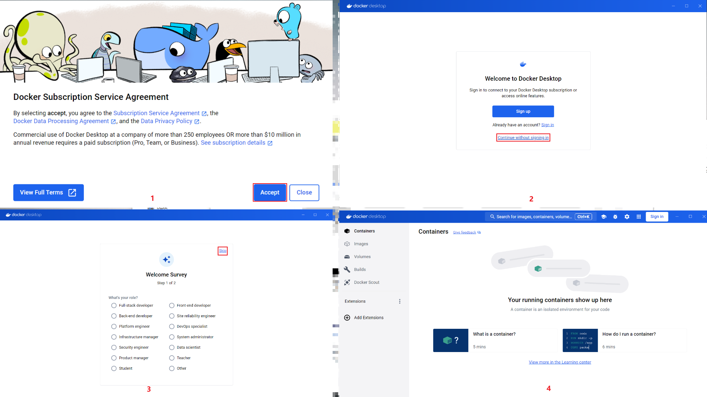

## Windows系统安装Docker Desktop

### 配置说明
* 系统：Win 10
* 安装位置：D:\Program Files\Docker（修改后，Docker默认安装位置：C:\Program Files\Docker\Docker）

### 下载Docker Desktop部署包
[官网地址](https://www.docker.com/products/docker-desktop)


### 通过CMD命令窗口安装Docker Desktop
#### 管理员启动cmd
> 输入`cmd`，右键点击`以管理员身份运行`



#### 执行安装命令
```shell
# 进入安装包所在目录，E:\installpackage为安装包所在路径
cd /d E:\installpackage

# 执行安装命令，--installation-dir后添加安装路径
start /w "" "Docker Desktop Installer.exe" install --installation-dir="D:\Program Files\Docker"

# 重启电脑
```
##### 命令说明
* start：Windows 命令，用于启动一个新进程。
* /w：指定当前窗口等待新进程完成后再继续。这意味着命令窗口会等待 Docker 安装完成后再返回控制权。
* ""：双引号之间的内容是窗口标题，留空意味着没有标题。
* "Docker Desktop Installer.exe"：这是要运行的 Docker Desktop 安装程序的可执行文件。
* install：告诉安装程序执行安装操作。
* --installation-dir="D:\Program Files\Docker"：指定 Docker Desktop 的安装路径为 D:\Program Files\Docker。


##### 注意
* cmd管理员窗口，进入某文件夹需要使用`cd /d 文件夹路径`命令


##### 注意
* 如果路径中存在空格，需要通过`" "`双引号包裹路径

### 部署验证（需要重启电脑后验证）




### 启动Docker Desktop（需要重启电脑后再启动）

#### 注意
1. 同意docker的协议
2. 匿名访问
3. 跳过调查选择
4. 成功部署
