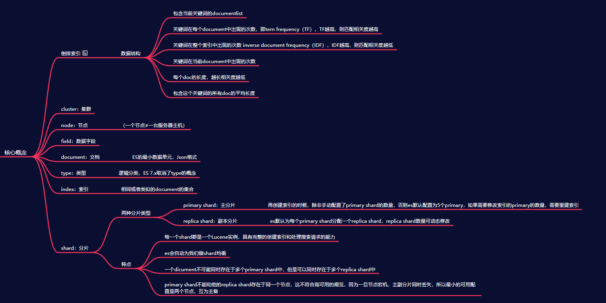
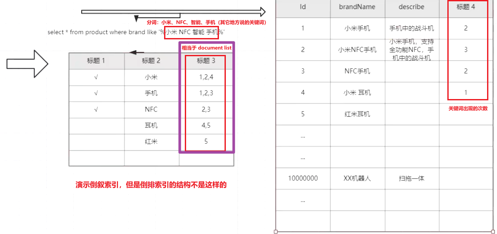
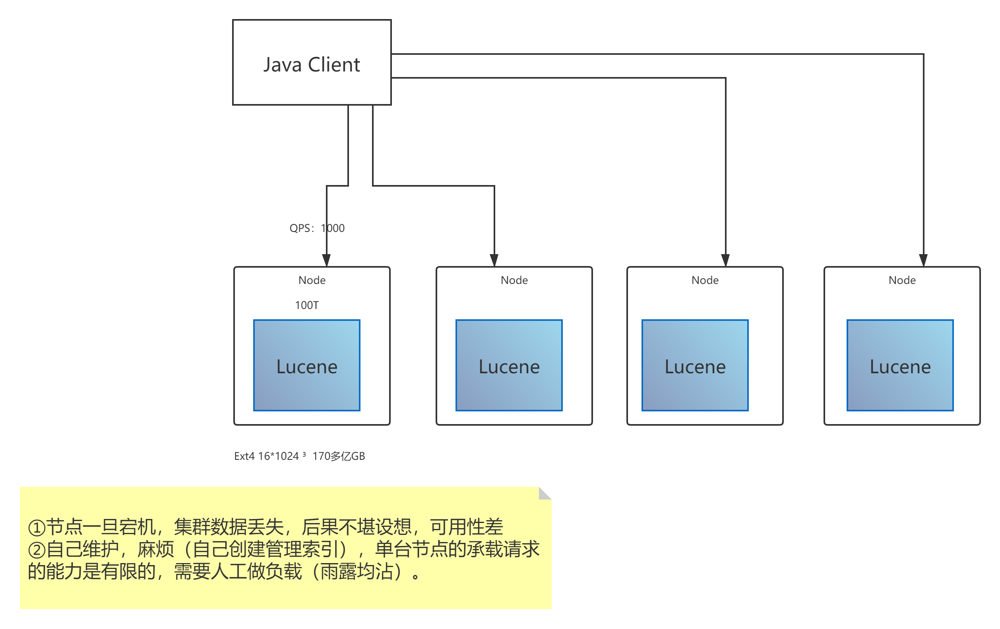
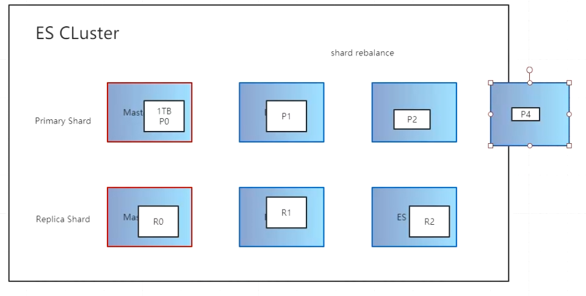

## ES核心概念及原理


### 关系型数据库进行模糊搜索
* 通过like语句执行模糊匹配
  ```mysql
  SELECT info FROM table WHERE search_field like "%查询条件%"
  ```
  * 索引不生效：查询中即使`search_field`是索引字段，也不会生效（因为开头匹配的%）
  * 时间复杂度：O(n)
* 使用缺陷
  * 不可靠
  * 性能差
  * 结果不准确（相关度低）

### 倒排索引（Elasticsearch技术）
> 由要搜索的关键词反推查询Key的过程，又叫反向索引。倒排索引适用于对文档进行全文检索，倒排索引包含了目标文档所有的不重复的分词

* 数据结构：
  * 包含这个关键词的document list（如图）
  * TF（term frequency）：关键词在每个document中出现的次数（TF越高，则匹配相关度越高）
  * IDF（inverse document frequency）：关键词在整个索引中出现的次数（该值越大，说明相关度越低：某个关键词和索引文件中的每个词都匹配，说明这个词的相关度就越低（相当于手机在brandName的每条信息中都出现过，所以这个词对于查询出来的结果相关度很低））
  * 关键词在当前document中出现的次数
  * 每个document的长度越长，相关度越低
  * 包含这个关键词的所有document的平均长度 

### Lucene(本身不是分布式的)
* jar包
* 帮忙创建倒排索引
* 提供复杂的API

### 通过Lucene自己搭建集群实现搜索，存在的问题

* 节点一宕机，节点数据丢失，可用性差（实现持久化还得自己出方案）
* 维护麻烦（需要自己创建和管理索引）
* 单台节点的承受能力有限，需要人工做负载均衡

### Elasticsearch(可以理解为基于Lucene开发的)
> 分布式的搜索、存储、数据分析引擎
#### 优点：高性能、高科用、分布式、可伸缩、易维护 ES != 搜索引擎
* 面向开发者友好，屏蔽了Lucene的复杂特性，集群自动发现（cluster discovery）
* 自动维护数据在多个节点上的建立
* 内部实现搜索请求的负载均衡
* 自动维护冗余的副本，保证了部分节点宕机的情况下仍然不会有任何的数据丢失
* Elasticsearch基于Lucene提供了很多高级的功能：
  * 复合查询
  * 聚合分析
  * 基于地理位置等
* 对于大公司，可以构建几百台服务器的大型分布式集群，处理PB级别的数据
* 对于小公司，开箱即用，门槛低，上手简单
* 相对于传统的数据库，Elasticsearch提供了全文检索，同义词处理（美丽的cluster -> 漂亮的cluster），相关度排名，聚合分析一级海量的近实时（NTR）处理，这些传统数据库完全做不到

#### 应用领域
* 百度（全文检索、高亮、搜索推荐）
* 各大网站的用户行为日志（用户点击、浏览、收藏、评论）
* BI（Business Intelligence商业智能），数据分析：数据挖掘统计
* Github：代码托管平台，千亿行代码搜索
* ELK：Elasticsearch（数据存储）、Logstash（日志采集）、Kibana（可视化）

### Elasticsearch核心概念
> 名词对比：document = row | type = table | index = db
* Cluster（集群）：每个集群至少包含两个节点
* Node（节点）：集群中的每个节点（一台服务器可以创建多个节点）
* Field（数据字段）：一个数据字段，与index和type一起，可以定位一个document
* Document（文档）：（Elasticsearch最小的数据单元），json格式（可以理解为行）
  ```json
  {
    "id": "1",
    "name": "小米",
    "price": {
      "标准版": "1200",
      "高配版": "3500"
    } 
  }
  ``` 
* Type（类型）：逻辑上的数据分类（Elasticsearch7.x中删除了type概念）
* Index（索引）：一类相同或者类似的document，比如一个员工索引、一个商品索引
* Shard（分片）：
  
  * 一个Index包含多个Shard，默认5P（Primary Shard），默认每个P分配一个R（Replica Shard），p的数量在创建索引的时候设置，如果想修改，需要重创索引（但如果想修改R，就不需要重新创建索引）
  * 每个Shard都是一个Lucene实例，有完整的创建索引的处理请求能力
  * Elasticsearch会自动在nodes上为我们做Shard均衡
  * 一个document是不可能同时存在多个P中的，但是可以存在于多个RShard
  * P和对应的R不能同时存在于同一个节点，所以最低的可用配置是两个节点，互为主备