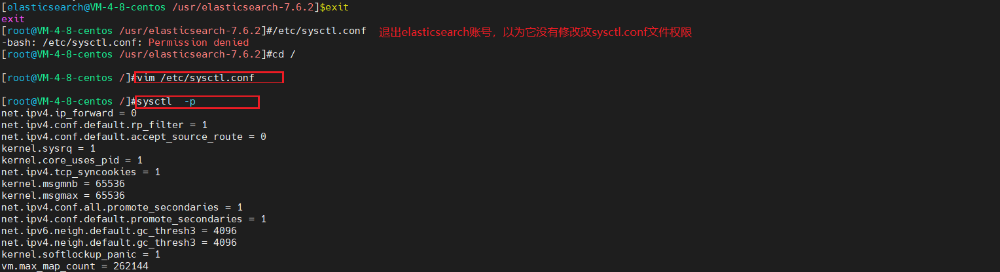

## Elasticsearch 安装

### 安装环境
* CentOS 8
* JDK 8
* Elasticsearch 7.15.1

### 下载安装包
[官网地址](https://www.elastic.co/cn/start) <br/>

[官网历史版本下载地址](https://www.elastic.co/cn/downloads/past-releases) <br/>

### 文件上传到服务器 -> 解压
```shell
# 安装命令插件
yum -y install lrzsz
# 按下回车键，选择自己windows中要上传的文件
rz

# 解压elasticsearch并拷贝到/usr目录下
tar -zxvf elasticsearch-7.15.1-linux-x86_64.tar.gz -C /usr/
```


### 目录结构说明（7.15.1）
```text
bin ：      脚本文件，包括 ES 启动 & 安装插件等等
config ：   elasticsearch.yml（ES 配置文件）、jvm.options（JVM 配置文件）、日志配置文件等等
JDK ：      内置的 JDK，JAVA_VERSION="17"
lib ：      类库
logs ：     日志文件
modules ：  ES 所有模块，包括 X-pack 等
plugins ：  ES 已经安装的插件。默认没有插件
data ：     ES 启动的时候，会有该目录，用来存储文档数据。该目录可以设置
```


### 进入conf查看修改的文件`elasticsearch.yml、jvm.options`


### elasticsearch基于Lucene的，而Lucene底层是java实现，因此我们需要配置jvm参数（编辑jvm.options）
```shell
vi jvm.options
```


### 编辑elasticsearch.yml修改数据和日志目录
| 属性名                             | 说明                                                         |
| ---------------------------------- | ------------------------------------------------------------ |
| cluster.name                       | 配置elasticsearch的集群名称，默认是elasticsearch。建议修改成一个有意义的名称。 |
| node.name                          | 节点名，es会默认随机指定一个名字，建议指定一个有意义的名称，方便管理 |
| path.conf                          | 设置配置文件的存储路径，tar或zip包安装默认在es根目录下的config文件夹，rpm安装默认在/etc/ elasticsearch |
| path.data                          | 设置索引数据的存储路径，默认是es根目录下的data文件夹，可以设置多个存储路径，用逗号隔开 |
| path.logs                          | 设置日志文件的存储路径，默认是es根目录下的logs文件夹         |
| path.plugins                       | 设置插件的存放路径，默认是es根目录下的plugins文件夹          |
| bootstrap.memory_lock              | 设置为true可以锁住ES使用的内存，避免内存进行swap             |
| network.host                       | 设置bind_host和publish_host，设置为0.0.0.0允许外网访问       |
| http.port                          | 设置对外服务的http端口，默认为9200。                         |
| transport.tcp.port                 | 集群结点之间通信端口                                         |
| discovery.zen.ping.timeout         | 设置ES自动发现节点连接超时的时间，默认为3秒，如果网络延迟高可设置大些 |
| discovery.zen.minimum_master_nodes | 主结点数量的最少值 ,此值的公式为：(master_eligible_nodes / 2) + 1 ，比如：有3个符合要求的主结点，那么这里要设置为2 |
```shell
# 编辑elasticscarch.yml命令
vi elasticsearch.yml

# 配置说明
# 配置当前es节点名称（默认是被注释的，并且默认有一个节点名）
node.name: node-1 
# 默认是被注释的，并且默认有一个集群名
cluster.name: my-application 
# 数据目录位置
path.data: /usr/elasticsearch-7.15.1/data 
# 日志目录位置
path.logs: /usr/elasticsearch-7.15.1/logs 
# 绑定的ip：默认只允许本机访问，修改为0.0.0.0后则可以远程访问
network.host: 0.0.0.0   
# 默认是被注释的 设置master节点列表 用逗号分隔 
cluster.initial_master_nodes: ["node-1", "node-2"] 
```


### 进入es的根目录，然后创建 logs data 文件夹（本人配置的是es默认会创建路径文件夹，所以不需要创建logs，只要创建data文件夹）
```shell
# 进入配置的路径下，执行命令
mkdir data
mkdir logs
```


### 在/etc/sysctl.conf文件最后添加一行 `vm.max_map_count=262144`：配置最大虚拟内存
```shell
# 修改sysctl.conf配置文件（如果，启动报错virtual memory areas vm.max_map_count [xxxxx] is too low...）
vi /etc/sysctl.conf

# 执行
sysctl -p
```


### 创建用户，es不能使用root用户启动
```shell
## 创建用户：elasticsearch
adduser elasticsearch
## 为用户创建密码，需要输入两次
passwd elasticsearch
## 将对应的文件夹权限赋给该用户
chown -R elasticsearch es的安装路径(/usr/elasticsearch-7.15.1)
## 切换至elasticsearch用户
su elasticsearch
```

### 启动
```shell
# 进入安装包下的bin目录，执行启动命令（测试阶段最后不用后台启动，方便看日志；等启动没问题了，再后台启动）
./elasticsearch

# 成功启动日志，供参加（成功启动不一定能访问，没有配置远程访问的话）
[elasticsearch@VM-4-8-centos /usr/elasticsearch-7.6.2]$./bin/elasticsearch
future versions of Elasticsearch will require Java 11; your Java version from [/usr/jdk1.8.0_301/jre] does not meet this requirement
[2021-10-22T20:45:16,738][INFO ][o.e.e.NodeEnvironment    ] [node-1] using [1] data paths, mounts [[/ (/dev/vda1)]], net usable_space [62.9gb], net tota                 l_space [78.6gb], types [ext4]
[2021-10-22T20:45:16,739][INFO ][o.e.e.NodeEnvironment    ] [node-1] heap size [1007.3mb], compressed ordinary object pointers [true]
[2021-10-22T20:45:16,881][INFO ][o.e.n.Node               ] [node-1] node name [node-1], node ID [tCMCikFgREC2PPDIOEnYPw], cluster name [elasticsearch]
[2021-10-22T20:45:16,882][INFO ][o.e.n.Node               ] [node-1] version[7.6.2], pid[75910], build[default/tar/ef48eb35cf30adf4db14086e8aabd07ef6fb1                 13f/2020-03-26T06:34:37.794943Z], OS[Linux/4.18.0-305.10.2.el8_4.x86_64/amd64], JVM[Oracle Corporation/Java HotSpot(TM) 64-Bit Server VM/1.8.0_301/25.30                 1-b09]
[2021-10-22T20:45:16,883][INFO ][o.e.n.Node               ] [node-1] JVM home [/usr/jdk1.8.0_301/jre]
[2021-10-22T20:45:16,883][INFO ][o.e.n.Node               ] [node-1] JVM arguments [-Des.networkaddress.cache.ttl=60, -Des.networkaddress.cache.negative                 .ttl=10, -XX:+AlwaysPreTouch, -Xss1m, -Djava.awt.headless=true, -Dfile.encoding=UTF-8, -Djna.nosys=true, -XX:-OmitStackTraceInFastThrow, -Dio.netty.noUn                 safe=true, -Dio.netty.noKeySetOptimization=true, -Dio.netty.recycler.maxCapacityPerThread=0, -Dio.netty.allocator.numDirectArenas=0, -Dlog4j.shutdownHoo                 kEnabled=false, -Dlog4j2.disable.jmx=true, -Djava.locale.providers=COMPAT, -Xms1g, -Xmx1g, -XX:+UseConcMarkSweepGC, -XX:CMSInitiatingOccupancyFraction=7                 5, -XX:+UseCMSInitiatingOccupancyOnly, -Djava.io.tmpdir=/tmp/elasticsearch-1620024173773433822, -XX:+HeapDumpOnOutOfMemoryError, -XX:HeapDumpPath=data,                  -XX:ErrorFile=logs/hs_err_pid%p.log, -XX:+PrintGCDetails, -XX:+PrintGCDateStamps, -XX:+PrintTenuringDistribution, -XX:+PrintGCApplicationStoppedTime, -X                 loggc:logs/gc.log, -XX:+UseGCLogFileRotation, -XX:NumberOfGCLogFiles=32, -XX:GCLogFileSize=64m, -XX:MaxDirectMemorySize=536870912, -Des.path.home=/usr/e                 lasticsearch-7.6.2, -Des.path.conf=/usr/elasticsearch-7.6.2/config, -Des.distribution.flavor=default, -Des.distribution.type=tar, -Des.bundled_jdk=true]
[2021-10-22T20:45:19,801][INFO ][o.e.p.PluginsService     ] [node-1] loaded module [aggs-matrix-stats]
[2021-10-22T20:45:19,802][INFO ][o.e.p.PluginsService     ] [node-1] loaded module [analysis-common]
[2021-10-22T20:45:19,802][INFO ][o.e.p.PluginsService     ] [node-1] loaded module [flattened]
[2021-10-22T20:45:19,802][INFO ][o.e.p.PluginsService     ] [node-1] loaded module [frozen-indices]
[2021-10-22T20:45:19,802][INFO ][o.e.p.PluginsService     ] [node-1] loaded module [ingest-common]
[2021-10-22T20:45:19,803][INFO ][o.e.p.PluginsService     ] [node-1] loaded module [ingest-geoip]
[2021-10-22T20:45:19,803][INFO ][o.e.p.PluginsService     ] [node-1] loaded module [ingest-user-agent]
[2021-10-22T20:45:19,803][INFO ][o.e.p.PluginsService     ] [node-1] loaded module [lang-expression]
[2021-10-22T20:45:19,803][INFO ][o.e.p.PluginsService     ] [node-1] loaded module [lang-mustache]
[2021-10-22T20:45:19,803][INFO ][o.e.p.PluginsService     ] [node-1] loaded module [lang-painless]
[2021-10-22T20:45:19,804][INFO ][o.e.p.PluginsService     ] [node-1] loaded module [mapper-extras]
[2021-10-22T20:45:19,804][INFO ][o.e.p.PluginsService     ] [node-1] loaded module [parent-join]
[2021-10-22T20:45:19,804][INFO ][o.e.p.PluginsService     ] [node-1] loaded module [percolator]
[2021-10-22T20:45:19,804][INFO ][o.e.p.PluginsService     ] [node-1] loaded module [rank-eval]
[2021-10-22T20:45:19,805][INFO ][o.e.p.PluginsService     ] [node-1] loaded module [reindex]
[2021-10-22T20:45:19,805][INFO ][o.e.p.PluginsService     ] [node-1] loaded module [repository-url]
[2021-10-22T20:45:19,805][INFO ][o.e.p.PluginsService     ] [node-1] loaded module [search-business-rules]
[2021-10-22T20:45:19,805][INFO ][o.e.p.PluginsService     ] [node-1] loaded module [spatial]
[2021-10-22T20:45:19,806][INFO ][o.e.p.PluginsService     ] [node-1] loaded module [transform]
[2021-10-22T20:45:19,806][INFO ][o.e.p.PluginsService     ] [node-1] loaded module [transport-netty4]
[2021-10-22T20:45:19,806][INFO ][o.e.p.PluginsService     ] [node-1] loaded module [vectors]
[2021-10-22T20:45:19,806][INFO ][o.e.p.PluginsService     ] [node-1] loaded module [x-pack-analytics]
[2021-10-22T20:45:19,807][INFO ][o.e.p.PluginsService     ] [node-1] loaded module [x-pack-ccr]
[2021-10-22T20:45:19,807][INFO ][o.e.p.PluginsService     ] [node-1] loaded module [x-pack-core]
[2021-10-22T20:45:19,807][INFO ][o.e.p.PluginsService     ] [node-1] loaded module [x-pack-deprecation]
[2021-10-22T20:45:19,807][INFO ][o.e.p.PluginsService     ] [node-1] loaded module [x-pack-enrich]
[2021-10-22T20:45:19,808][INFO ][o.e.p.PluginsService     ] [node-1] loaded module [x-pack-graph]
[2021-10-22T20:45:19,808][INFO ][o.e.p.PluginsService     ] [node-1] loaded module [x-pack-ilm]
[2021-10-22T20:45:19,808][INFO ][o.e.p.PluginsService     ] [node-1] loaded module [x-pack-logstash]
[2021-10-22T20:45:19,808][INFO ][o.e.p.PluginsService     ] [node-1] loaded module [x-pack-ml]
[2021-10-22T20:45:19,809][INFO ][o.e.p.PluginsService     ] [node-1] loaded module [x-pack-monitoring]
[2021-10-22T20:45:19,809][INFO ][o.e.p.PluginsService     ] [node-1] loaded module [x-pack-rollup]
[2021-10-22T20:45:19,809][INFO ][o.e.p.PluginsService     ] [node-1] loaded module [x-pack-security]
[2021-10-22T20:45:19,809][INFO ][o.e.p.PluginsService     ] [node-1] loaded module [x-pack-sql]
[2021-10-22T20:45:19,809][INFO ][o.e.p.PluginsService     ] [node-1] loaded module [x-pack-voting-only-node]
[2021-10-22T20:45:19,810][INFO ][o.e.p.PluginsService     ] [node-1] loaded module [x-pack-watcher]
[2021-10-22T20:45:19,810][INFO ][o.e.p.PluginsService     ] [node-1] no plugins loaded
[2021-10-22T20:45:25,900][INFO ][o.e.x.s.a.s.FileRolesStore] [node-1] parsed [0] roles from file [/usr/elasticsearch-7.6.2/config/roles.yml]
[2021-10-22T20:45:26,720][INFO ][o.e.x.m.p.l.CppLogMessageHandler] [node-1] [controller/75988] [Main.cc@110] controller (64 bit): Version 7.6.2 (Build e                 06ef9d86d5332) Copyright (c) 2020 Elasticsearch BV
[2021-10-22T20:45:27,380][DEBUG][o.e.a.ActionModule       ] [node-1] Using REST wrapper from plugin org.elasticsearch.xpack.security.Security
[2021-10-22T20:45:27,537][INFO ][o.e.d.DiscoveryModule    ] [node-1] using discovery type [zen] and seed hosts providers [settings]
[2021-10-22T20:45:28,561][INFO ][o.e.n.Node               ] [node-1] initialized
[2021-10-22T20:45:28,562][INFO ][o.e.n.Node               ] [node-1] starting ...
[2021-10-22T20:45:28,759][INFO ][o.e.t.TransportService   ] [node-1] publish_address {10.0.4.8:9300}, bound_addresses {[::]:9300}
[2021-10-22T20:45:29,138][INFO ][o.e.b.BootstrapChecks    ] [node-1] bound or publishing to a non-loopback address, enforcing bootstrap checks
[2021-10-22T20:45:29,193][INFO ][o.e.c.c.Coordinator      ] [node-1] cluster UUID [Ote-9th0Rr6l5H0n9faX0A]
[2021-10-22T20:45:29,423][INFO ][o.e.c.s.MasterService    ] [node-1] elected-as-master ([1] nodes joined)[{node-1}{tCMCikFgREC2PPDIOEnYPw}{HRtf0HvlR-iMq                 yt3Pza1KQ}{10.0.4.8}{10.0.4.8:9300}{dilm}{ml.machine_memory=3918163968, xpack.installed=true, ml.max_open_jobs=20} elect leader, _BECOME_MASTER_TASK_, _                 FINISH_ELECTION_], term: 3, version: 23, delta: master node changed {previous [], current [{node-1}{tCMCikFgREC2PPDIOEnYPw}{HRtf0HvlR-iMqyt3Pza1KQ}{10.0                 .4.8}{10.0.4.8:9300}{dilm}{ml.machine_memory=3918163968, xpack.installed=true, ml.max_open_jobs=20}]}
[2021-10-22T20:45:29,495][INFO ][o.e.c.s.ClusterApplierService] [node-1] master node changed {previous [], current [{node-1}{tCMCikFgREC2PPDIOEnYPw}{HRt                 f0HvlR-iMqyt3Pza1KQ}{10.0.4.8}{10.0.4.8:9300}{dilm}{ml.machine_memory=3918163968, xpack.installed=true, ml.max_open_jobs=20}]}, term: 3, version: 23, re                 ason: Publication{term=3, version=23}
[2021-10-22T20:45:29,573][INFO ][o.e.h.AbstractHttpServerTransport] [node-1] publish_address {10.0.4.8:9200}, bound_addresses {[::]:9200}
[2021-10-22T20:45:29,574][INFO ][o.e.n.Node               ] [node-1] started
[2021-10-22T20:45:29,794][INFO ][o.e.l.LicenseService     ] [node-1] license [630020a5-61fa-437a-833f-2b4347d09ab4] mode [basic] - valid
[2021-10-22T20:45:29,795][INFO ][o.e.x.s.s.SecurityStatusChangeListener] [node-1] Active license is now [BASIC]; Security is disabled
[2021-10-22T20:45:29,804][INFO ][o.e.g.GatewayService     ] [node-1] recovered [0] indices into cluster_state
```
### 后台启动
```shell
./elasticsearch -d
```


### 访问


### 问题（解压后直接启动会出现的问题）
#### root用户不能启动elasticsearch
```shell
# 问题：
java.lang.RuntimeException: can not run elasticsearch as root
        at org.elasticsearch.bootstrap.Bootstrap.initializeNatives(Bootstrap.java:103) ~[elasticsearch-7.15.1.jar:7.15.1]
        at org.elasticsearch.bootstrap.Bootstrap.setup(Bootstrap.java:170) ~[elasticsearch-7.15.1.jar:7.15.1]
        at org.elasticsearch.bootstrap.Bootstrap.init(Bootstrap.java:399) [elasticsearch-7.15.1.jar:7.15.1]
        at org.elasticsearch.bootstrap.Elasticsearch.init(Elasticsearch.java:167) [elasticsearch-7.15.1.jar:7.15.1]
        at org.elasticsearch.bootstrap.Elasticsearch.execute(Elasticsearch.java:158) [elasticsearch-7.15.1.jar:7.15.1]
        at org.elasticsearch.cli.EnvironmentAwareCommand.execute(EnvironmentAwareCommand.java:75) [elasticsearch-7.15.1.jar:7.15.1]
        at org.elasticsearch.cli.Command.mainWithoutErrorHandling(Command.java:114) [elasticsearch-cli-7.15.1.jar:7.15.1]
        at org.elasticsearch.cli.Command.main(Command.java:79) [elasticsearch-cli-7.15.1.jar:7.15.1]
        at org.elasticsearch.bootstrap.Elasticsearch.main(Elasticsearch.java:123) [elasticsearch-7.15.1.jar:7.15.1]
        at org.elasticsearch.bootstrap.Elasticsearch.main(Elasticsearch.java:81) [elasticsearch-7.15.1.jar:7.15.1]
[2021-10-20T21:52:56,863][ERROR][o.e.b.ElasticsearchUncaughtExceptionHandler] [VM-4-8-centos] uncaught exception in thread [main]
org.elasticsearch.bootstrap.StartupException: java.lang.RuntimeException: can not run elasticsearch as root
        at org.elasticsearch.bootstrap.Elasticsearch.init(Elasticsearch.java:171) ~[elasticsearch-7.15.1.jar:7.15.1]
        at org.elasticsearch.bootstrap.Elasticsearch.execute(Elasticsearch.java:158) ~[elasticsearch-7.15.1.jar:7.15.1]
        at org.elasticsearch.cli.EnvironmentAwareCommand.execute(EnvironmentAwareCommand.java:75) ~[elasticsearch-7.15.1.jar:7.15.1]
        at org.elasticsearch.cli.Command.mainWithoutErrorHandling(Command.java:114) ~[elasticsearch-cli-7.15.1.jar:7.15.1]
        at org.elasticsearch.cli.Command.main(Command.java:79) ~[elasticsearch-cli-7.15.1.jar:7.15.1]
        at org.elasticsearch.bootstrap.Elasticsearch.main(Elasticsearch.java:123) ~[elasticsearch-7.15.1.jar:7.15.1]
        at org.elasticsearch.bootstrap.Elasticsearch.main(Elasticsearch.java:81) ~[elasticsearch-7.15.1.jar:7.15.1]
Caused by: java.lang.RuntimeException: can not run elasticsearch as root
        at org.elasticsearch.bootstrap.Bootstrap.initializeNatives(Bootstrap.java:103) ~[elasticsearch-7.15.1.jar:7.15.1]
        at org.elasticsearch.bootstrap.Bootstrap.setup(Bootstrap.java:170) ~[elasticsearch-7.15.1.jar:7.15.1]
        at org.elasticsearch.bootstrap.Bootstrap.init(Bootstrap.java:399) ~[elasticsearch-7.15.1.jar:7.15.1]

# 解决：
es5之后的都不能使用添加启动参数或者修改配置文件等方法启动了，必须要创建用户

## 创建用户：elasticsearch
adduser elasticsearch
## 为用户创建密码，需要输入两次
passwd elasticsearch
## 将对应的文件夹权限赋给该用户
chown -R elasticsearch /usr/elasticsearch-7.15.1（es的安装路径）
## 切换至elasticsearch用户
su elasticsearch
## 进入启动目录启动 /usr/local/elasticsearch-6.0.0/bin  使用后台启动方式：./elasticsearch -d
./elasticsearch -d

# 引伸：
## 删除用户user1
userdel user1
## 删除用户 user1，同时删除他的工作目录
userdel –r user3 
```

#### 配置elasticsearch远程访问（如果是安装在云服务器必须配置）
```shell
# 问题：
云服务器上部署了elasticsearch，启动日志也没有问题，本地通过curl http://localhost:9200 也正常，但是通过浏览器访问就是500
```
 <br/>

```shell
# 解决：
修改elasticsearch安装包中的`/config/elasticsearch.yml`文件中的配置信息：
修改network.host: 0.0.0.0 （原先可能是192.168.0.1，直接修改为0.0.0.0）
修改cluster.initial_master_nodes: ["node-1"]
其它配置可以不修改

# ======================== Elasticsearch Configuration =========================
#
# NOTE: Elasticsearch comes with reasonable defaults for most settings.
#       Before you set out to tweak and tune the configuration, make sure you
#       understand what are you trying to accomplish and the consequences.
#
# The primary way of configuring a node is via this file. This template lists
# the most important settings you may want to configure for a production cluster.
#
# Please consult the documentation for further information on configuration options:
# https://www.elastic.co/guide/en/elasticsearch/reference/index.html
#
# ---------------------------------- Cluster -----------------------------------
#
# Use a descriptive name for your cluster:
#
#cluster.name: my-application
#
# ------------------------------------ Node ------------------------------------
#
# Use a descriptive name for the node:
#
#node.name: node-1

# Add custom attributes to the node:
#
#node.attr.rack: r1
#
# ----------------------------------- Paths ------------------------------------
#
# Path to directory where to store the data (separate multiple locations by comma):
#
#path.data: /path/to/data
#
# Path to log files:
#
#path.logs: /path/to/logs
#
# ----------------------------------- Memory -----------------------------------
#
# Lock the memory on startup:
#
#bootstrap.memory_lock: true
#
# Make sure that the heap size is set to about half the memory available
# on the system and that the owner of the process is allowed to use this
# limit.
#
# Elasticsearch performs poorly when the system is swapping the memory.
#
# ---------------------------------- Network -----------------------------------
#
# By default Elasticsearch is only accessible on localhost. Set a different
# address here to expose this node on the network:
#
network.host: 0.0.0.0
#
# By default Elasticsearch listens for HTTP traffic on the first free port it
# finds starting at 9200. Set a specific HTTP port here:
#
#http.port: 9200
#
# For more information, consult the network module documentation.
#
# --------------------------------- Discovery ----------------------------------
#
# Pass an initial list of hosts to perform discovery when this node is started:
# The default list of hosts is ["127.0.0.1", "[::1]"]
#
#discovery.seed_hosts: ["host1", "host2"]
#
# Bootstrap the cluster using an initial set of master-eligible nodes:
#
#cluster.initial_master_nodes: ["node-1", "node-2"]
cluster.initial_master_nodes: ["node-1"]
#
# For more information, consult the discovery and cluster formation module documentation.
#
# ---------------------------------- Various -----------------------------------
#
# Require explicit names when deleting indices:
#
#action.destructive_requires_name: true
```


##### 注意（属于引伸内容，按照上面的配置就不会出现这个问题）
> 配置文件中如果只配置network.host，并且host地址乱写就会出现下面的问题
```shell
org.elasticsearch.bootstrap.StartupException: BindTransportException[Failed to bind to [9300-9400]]; nested: BindException[Cannot assign requested address];
        at org.elasticsearch.bootstrap.Elasticsearch.init(Elasticsearch.java:174) ~[elasticsearch-7.6.2.jar:7.6.2]
        at org.elasticsearch.bootstrap.Elasticsearch.execute(Elasticsearch.java:161) ~[elasticsearch-7.6.2.jar:7.6.2]
        at org.elasticsearch.cli.EnvironmentAwareCommand.execute(EnvironmentAwareCommand.java:86) ~[elasticsearch-7.6.2.jar:7.6.2]
        at org.elasticsearch.cli.Command.mainWithoutErrorHandling(Command.java:125) ~[elasticsearch-cli-7.6.2.jar:7.6.2]
        at org.elasticsearch.cli.Command.main(Command.java:90) ~[elasticsearch-cli-7.6.2.jar:7.6.2]
        at org.elasticsearch.bootstrap.Elasticsearch.main(Elasticsearch.java:126) ~[elasticsearch-7.6.2.jar:7.6.2]
        at org.elasticsearch.bootstrap.Elasticsearch.main(Elasticsearch.java:92) ~[elasticsearch-7.6.2.jar:7.6.2]
Caused by: org.elasticsearch.transport.BindTransportException: Failed to bind to [9300-9400]
        at org.elasticsearch.transport.TcpTransport.bindToPort(TcpTransport.java:389) ~[elasticsearch-7.6.2.jar:7.6.2]
        at org.elasticsearch.transport.TcpTransport.bindServer(TcpTransport.java:355) ~[elasticsearch-7.6.2.jar:7.6.2]
        at org.elasticsearch.transport.netty4.Netty4Transport.doStart(Netty4Transport.java:135) ~[?:?]
        at org.elasticsearch.xpack.core.security.transport.netty4.SecurityNetty4Transport.doStart(SecurityNetty4Transport.java:81) ~[?:?]
        at org.elasticsearch.xpack.security.transport.netty4.SecurityNetty4ServerTransport.doStart(SecurityNetty4ServerTransport.java:43) ~[?:?]
        at org.elasticsearch.common.component.AbstractLifecycleComponent.start(AbstractLifecycleComponent.java:59) ~[elasticsearch-7.6.2.jar:7.6.2]
        at org.elasticsearch.transport.TransportService.doStart(TransportService.java:230) ~[elasticsearch-7.6.2.jar:7.6.2]
        at org.elasticsearch.common.component.AbstractLifecycleComponent.start(AbstractLifecycleComponent.java:59) ~[elasticsearch-7.6.2.jar:7.6.2]
        at org.elasticsearch.node.Node.start(Node.java:697) ~[elasticsearch-7.6.2.jar:7.6.2]
        at org.elasticsearch.bootstrap.Bootstrap.start(Bootstrap.java:273) ~[elasticsearch-7.6.2.jar:7.6.2]
        at org.elasticsearch.bootstrap.Bootstrap.init(Bootstrap.java:358) ~[elasticsearch-7.6.2.jar:7.6.2]
        at org.elasticsearch.bootstrap.Elasticsearch.init(Elasticsearch.java:170) ~[elasticsearch-7.6.2.jar:7.6.2]
        ... 6 more
Caused by: java.net.BindException: Cannot assign requested address
        at sun.nio.ch.Net.bind0(Native Method) ~[?:?]
        at sun.nio.ch.Net.bind(Net.java:438) ~[?:?]
        at sun.nio.ch.Net.bind(Net.java:430) ~[?:?]
        at sun.nio.ch.ServerSocketChannelImpl.bind(ServerSocketChannelImpl.java:225) ~[?:?]
        at io.netty.channel.socket.nio.NioServerSocketChannel.doBind(NioServerSocketChannel.java:134) ~[?:?]
        at io.netty.channel.AbstractChannel$AbstractUnsafe.bind(AbstractChannel.java:551) ~[?:?]
        at io.netty.channel.DefaultChannelPipeline$HeadContext.bind(DefaultChannelPipeline.java:1346) ~[?:?]
        at io.netty.channel.AbstractChannelHandlerContext.invokeBind(AbstractChannelHandlerContext.java:503) ~[?:?]
        at io.netty.channel.AbstractChannelHandlerContext.bind(AbstractChannelHandlerContext.java:488) ~[?:?]
        at io.netty.channel.DefaultChannelPipeline.bind(DefaultChannelPipeline.java:985) ~[?:?]
        at io.netty.channel.AbstractChannel.bind(AbstractChannel.java:247) ~[?:?]
        at io.netty.bootstrap.AbstractBootstrap$2.run(AbstractBootstrap.java:344) ~[?:?]
        at io.netty.util.concurrent.AbstractEventExecutor.safeExecute(AbstractEventExecutor.java:163) ~[?:?]
        at io.netty.util.concurrent.SingleThreadEventExecutor.runAllTasks(SingleThreadEventExecutor.java:510) ~[?:?]
        at io.netty.channel.nio.NioEventLoop.run(NioEventLoop.java:518) ~[?:?]
        at io.netty.util.concurrent.SingleThreadEventExecutor$6.run(SingleThreadEventExecutor.java:1050) ~[?:?]
        at io.netty.util.internal.ThreadExecutorMap$2.run(ThreadExecutorMap.java:74) ~[?:?]
        at java.lang.Thread.run(Thread.java:748) [?:1.8.0_301]
uncaught exception in thread [main]
BindTransportException[Failed to bind to [9300-9400]]; nested: BindException[Cannot assign requested address];
```

* 此时将elasticsearcj中的network.host改为：network.host: 0.0.0.0
* 如果没有配置节点，又会出现问题：the default discovery settings are unsuitable for production use; at least one of [discovery.seed_hosts, discovery.seed_providers, cluster.initial_master_nodes] must be configured
  
> 此时只需要添加上修改cluster.initial_master_nodes: ["node-1"]就能解决这个问题

#### Elasticsearch：最大虚拟内存区域 vm.max_map_count [65530] 太低
```shell
# 问题：
启动elasticsearch，出现max virtual memory areas vm.max_map_count [65530] is too low, increase to at least [262144]
```

```shell
# 解决
#编辑 /etc/sysctl.conf
vim /etc/sysctl.conf
# 追加下面内容
vm.max_map_count=262144
# 保存后，执行文件
ysctl  -p
```

