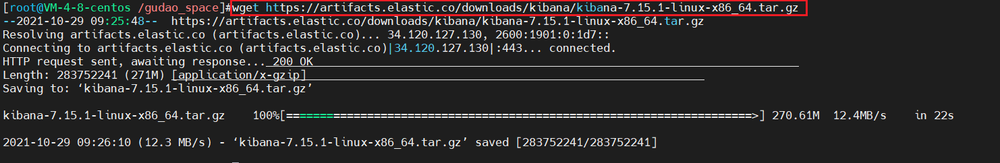
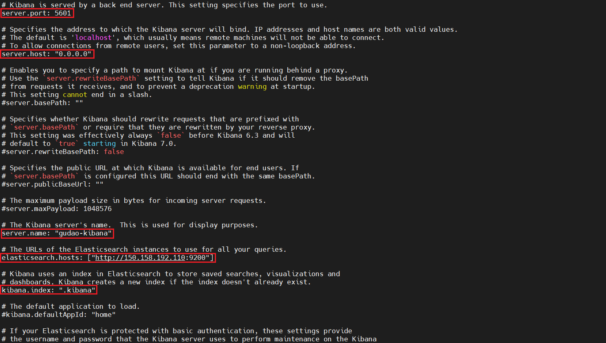
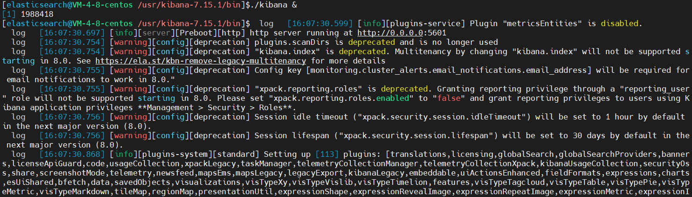

## Kibana安装

```shell
# 通过weget赋值官网对应的下载地址进行下载
wget https://artifacts.elastic.co/downloads/kibana/kibana-7.15.1-linux-x86_64.tar.gz
```


### 解压
```shell
# 解压到usr文件夹下
tar -zxvf kibana-7.15.1-linux-x86_64.tar.gz -C /usr/
# 重命名
mv kibana-7.15.1-linux-x86_64 kibana-7.15.1
```


### 目录结构说明（7.15.1）
```text
bin ：           二进制脚本，包括 kibana 启动 Kibana 服务和 kibana-plugin 安装插件
config ：        配置文件，包括 kibana.yml
data ：          Kibana 和其插件写入磁盘的数据文件位置
node ：      
node_modules ：
optimize ：      编译过的源码。某些管理操作(如，插件安装)导致运行时重新编译源码
plugins ：       插件文件位置。每一个插件都有一个单独的二级目录
src ：           存放着kibana 前端源码资源
x-pack ：
```

### 修改config中文件配置


### 进入kibana安装目录下的config文件，修改kibana.yml配置文件
| 配置项目                                                | 默认值                             | 描述                                                         |
| ------------------------------------------------------- | ---------------------------------- | ------------------------------------------------------------ |
| server.port                                             | 5601                               | Kibana 由后端服务器提供服务，该配置指定使用的端口号          |
| server.host                                             | localhost                          | 此设置指定后端服务器的主机。要允许远程用户连接，请将值设置为Kibana服务器的IP地址或DNS名称 |
| server.basePath                                         |                                    | 如果启用了代理，则可以指定安装Kibana的路径。使用该server.rewriteBasePath设置告诉Kibana是否应从收到的请求中删除basePath，并在启动时防止弃用警告。此设置不能以斜杠（/）结尾 |
| server.rewriteBasePath                                  | 在Kibana 7.x中，该设置已被弃用         | 指定Kibana收到的请求中删除前缀server.basePath，或由反向代理重写请求 |
| server.maxPayloadBytes                                  | 1048576                            | 传入服务器请求的最大有效负载大小（以字节为单位）             |
| server.name                                             | your-hostname                      | 用于标识此Kibana实例，Kibana 实例对外展示的名称              |
| elasticsearch.hosts                                     | [ “http://localhost:9200” ]        | 用于查询的Elasticsearch全部实例的URL。此处列出的所有节点必须位于同一群集上 |
| elasticsearch.preserveHost                              | true                               | true:Kibana使用server.host设置中指定的主机名， false:Kibana使用连接到该Kibana实例的主机的主机名 |
| kibana.index                                            | .kibana                            | Kibana在Elasticsearch中使用索引来存储保存的搜索，可视化和仪表板。如果索引不存在，则Kibana会创建一个新索引。如果配置定制索引，则名称必须为小写，并符合Elasticsearch索引名称的限制 |
| kibana.defaultAppId                                     | home                               | 要加载的默认应用程序                                         |
| elasticsearch.username<br/>elasticsearch.password       |                                    | 如果您的Elasticsearch受基本身份验证保护，那么这些设置将提供Kibana服务器在启动时用于对Kibana索引执行维护的用户名和密码。Kibana用户仍然需要通过Elasticsearch进行身份验证，该令牌通过Kibana服务器代理 |
| server.ssl                                              | false                              | 该配置为从Kibana服务器向浏览器发出请求的SSL启用配置。设置true时，为Kibana的入站连接启用SSL/TLS，必须提供证书及其对应的私钥。这些可以通过 server.ssl.certificate和server.ssl.key来指定 |
| server.ssl.certificate                                  |                                    | 配合server.ssl.enabled配置项使用，证书位置                   |
| server.ssl.key                                          |                                    | 配合server.ssl.enabled配置项使用，私钥位置                   |
| elasticsearch.ssl.certificate<br/>elasticsearch.ssl.key |                                    | 提供通往PEM格式SSL证书和密钥文件的路径的可选设置。这些文件用于向Elasticsearch验证Kibana的身份，并且xpack.ssl.verification_mode在Elasticsearch中设置为certificate或时需要这些文件 |
| elasticsearch.ssl.certificateAuthorities                |                                    | 指定用于 Elasticsearch 实例的 PEM 证书文件路径列表           |
| elasticsearch.ssl.verificationMode                      | full                               | 控制Elasticsearch提供的证书的验证。有效值是"full"、“certificate"和"none”。<br/>"full"执行主机名验证<br/>"certificate"跳过主机名验证<br/>"none"完全使用跳过验证 |
| elasticsearch.pingTimeout                               | elasticsearch.requestTimeout设置值  | 等待Elasticsearch响应ping的时间（以毫秒为单位）              |
| elasticsearch.requestTimeout                            | 30000                              | 等待后端或Elasticsearch响应的时间（以毫秒为单位）。该值必须是正整数 |
| elasticsearch.requestHeadersWhitelist                   | [ authorization ]                  | Kibana 客户端发送到 Elasticsearch 头体，发送 no 头体，设置该值为[] ,authorization 从白名单中删除标头意味着您不能在Kibana中使用 基本身份验证 |
| elasticsearch.customHeaders                             | {}                                 | 发往 Elasticsearch的头体和值， 不管 elasticsearch.requestHeadersWhitelist 如何配置，任何自定义的头体不会被客户端头体覆盖 |
| elasticsearch.shardTimeout                              | 30000                              | Elasticsearch等待分片响应的时间（以毫秒为单位）。设置为0禁用 |
| elasticsearch.startupTimeout                            | 5000                               | Kibana 启动时等待 Elasticsearch 的时间，单位微秒             |
| elasticsearch.logQueries                                | false                              | 配置查询日志是否发送到Elasticsearch。需要logging.verbose是设置为true，这对于查看由当前没有检查器的应用程序（例如，Timelion和Monitoring）生成的查询DSL很有用 |
| pid.file                                                | /var/run/kibana.pid                | 指定 Kibana 的进程 ID 文件的路径                             |
| logging.dest                                            | stdout                             | 指定 Kibana 日志输出的文件                                   |
| logging.silent                                          | false                              | 该值设为 true 时，禁止所有日志输出                           |
| logging.quiet                                           | false                              | 该值设为 true 时，禁止除错误信息除外的所有日志输出           |
| logging.verbose                                         | false                              | 设置为true记录所有事件，包括系统使用情况信息和所有请求。在Elastic Cloud Enterprise上受支持 |
| ops.interval                                            | 5000                               | 设置系统和进程取样间隔，单位微妙，最小值100                  |
| i18n.locale                                             | en                                 | 设置此值可以更改Kibana界面语言。有效的语言环境是：en，zh-CN，ja-JP |
```shell
# 修改kibana配置文件
vim kibana.yml

# 设置kibana端口号
server.port: 5601
# 设置kibana允许远程用户连接
server.host: "0.0.0.0"
# 用于标识此Kibana实例，Kibana 实例对外展示的名称
server.name: "gudao-kibana"
# 配置kibana访问es的URL
elasticsearch.url: "http://150.158.*.*:9200"
# 默认值：.kibana，Kibana使用Elasticsearch中的索引来存储已保存的搜索，可视化和仪表板。如果索引尚不存在，Kibana会创建一个新索引
kibana.index: ".kibana"
```


### 创建用户，kibana不能使用root用户启动
```shell
## 创建用户：elasticsearch
adduser elasticsearch
## 为用户创建密码，需要输入两次
passwd elasticsearch
## 将对应的文件夹权限赋给该用户
chown -R elasticsearch kibana的安装路径(/usr/kibana-7.15.1)
## 切换至elasticsearch用户
su elasticsearch
```
### 启动
```shell
# 进入bin目录，执行启动命令(& 表示后台启动)
./kibana &
```


### 访问（云服务器的需要开放下端口才能访问）
