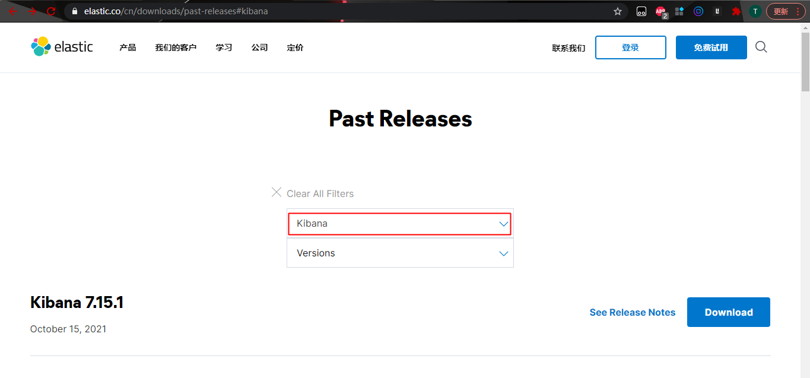

## Kibana 安装（单机）

### 安装环境
* CentOS 8
* JDK 8
* Kibana 7.15.1

### 下载安装包
[7.15.1下载地址](https://www.elastic.co/cn/downloads/past-releases/kibana-7-15-1) <br/>
[官网历史版本下载地址](https://www.elastic.co/cn/downloads/past-releases#kibana) <br/>

### 文件上传到服务器 -> 解压
```shell
# 安装命令插件
yum -y install lrzsz
# 按下回车键，选择自己windows中要上传的文件
rz

# 解压kibana并拷贝到/usr目录下

```
