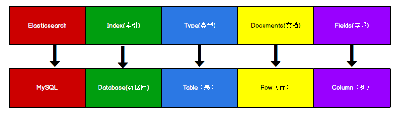

## Elasticsearch数据结构
> Elasticsearch 是面向文档型数据库，一条数据在这里就是一个文档

### ES与Mysql数据概念对比

* ES 里的 Index 可以看做一个库，而 Types 相当于表，Documents 则相当于表的行数据
* 这里 Types 的概念已经被逐渐弱化，Elasticsearch 6.X 中，一个 index 下已经只能包含一个 type，**Elasticsearch 7.X 中, Type 的概念已经被删除了**

### 正排索引
> 由key查询实体的过程，使用正排索引

### 倒排索引
