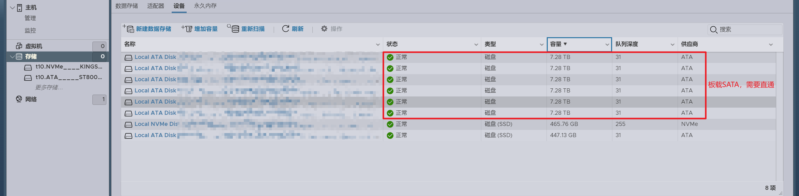
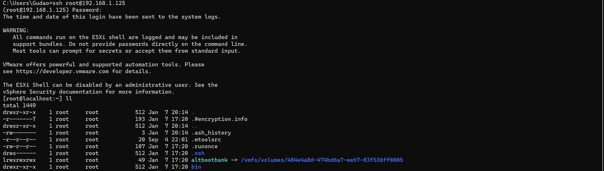

## ESXI 8.0.2U部署后直通

### 配置说明

* 主板：技嘉B365M小雕
  * 6主板SATA
  * M.2转5SATA（主板使用2个NAS机箱自带+1个SSD固态SATA）
* 机箱：万由 810A 2023款（8盘位SATA+3扩展位SATA）
* 处理器：I7 8700es（省电）
* 网卡：Intel i350 T4

### 硬盘直通

> 这块主板有2Controller，其中一个管外接的SATA（M.2的控制器）；一个管板载的SATA；主板的需要配置ESXI配置文件来实现直通，外接的就不需要

#### 直通前的硬盘在`存储 -> 设备`中都是能看见的

> 但是直通了之后，存储中就看不到了

##### 直通前



##### 直通后


#### 查找SATA控制器

#### 

#### 开启EXSI的SSH访问

> 在部署机上，可以先通过F2中将SSH开启，然后通过Alt+F1就能访问ESXI的后台


#### CMD通过SSH访问ESXI后台管理端



#### 修改ESXI硬件配置文件`passthru.map`

```shell
# 进入/etc/vmware
cd /etc/vmware
# 修改passthru.map文件
vi passthru.map

# 添加需要直通的硬件信息（将某个供应商下的某个设备切换到d3d0模式，我的配置如下）
# 供应商ID   设备ID   d3d0    default
8086    a282    d3d0    default
# 保存
:wq
# 重启使配置生效
```


#### 重启后，直通板载SATA控制器


#### 8.0.2U不知道说明原因，每次点击都是Fail，但是主机提示重启引导，进来就直通成功了

> 网上资料说把磁盘都拔掉，或者把bios中的热插拔打开，就不会出现这种问题（直通前不要把硬盘都插在nas主机上）


### 网卡直通

> 这款主板只有一个板载网口，买了一块I350 T4的网卡，为其增加了4个网口

#### 直通前的网口在`网络 -> 物理网卡`都能看到

> 但是直通之后，在物理网卡中就看不到I350的网卡信息了

##### 直通前


##### 直通后


#### 查找网卡信息


#### 重启后，直通成功

