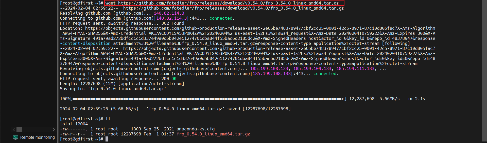

## VMware + CentOS7

### 配置说明
* Github上的项目目录有可能会变化新版配置文件是.toml格式，老版是.ini格式
* 本次是基于有tls证书+域名进行配置的


### FRP地址
[GitHub-FRP](https://github.com/fatedier/frp/releases)

### 说明
> frp压缩包中，都包含c端和s端的配置文件和启动文件


### 安装包选择
> 选择需要下载的包，右击复制链接，通过`wget`命令在linux上下载；


### 安装包下载
```shell
# 下载链接替换成自己想要的版本下载
wget https://github.com/fatedier/frp/releases/download/v0.54.0/frp_0.54.0_linux_amd64.tar.gz
```


### 解压
```shell
tar -zxvf frp_0.54.0_linux_amd64.tar.gz
```
### 目录介绍
> 老版本结构
```shell
├── frpc //客户端
├── frpc_full.ini
├── frpc.ini//客户端配置
├── frps//服务端
├── frps_full.ini
├── frps.ini//服务端配置
└── LICENSE
```
> 新版本结构
```shell
├── frpc //客户端
├── frpc.toml//客户端配置
├── frps//服务端
├── frps.toml//服务端配置
└── LICENSE
```

### 重命名
```shell
# 重命名
mv frp_0.54.0_linux_amd64 frp_tool
# 进入frp
cd frp_tool
```

### 配置server端；server端必须要有公网ip
```shell
# 老版本修改此文件
vi frps.ini

# 新版本，文件名称变化
vi frps.toml
```

### 服务端配置详情
> 老版本配置说明
```shell
[common]
# 服务端口，供client注册
bind_port = 7000
# http服务端口；http穿透访问端口【浏览器通过服务器公网ip+端口访问穿透的网络】
vhost_http_port = 8089
# https服务端口；https穿透访问端口【浏览器通过服务器公网ip+端口访问穿透的网络】
vhost_https_port = 4439
# 认证token
token = test
# 监听地址
dashboard_addr = 0.0.0.0
# 监听端口，查看frp服务状态与信息
dashboard_port = 7500
# 监听界面账号
dashboard_user = test
# 监听界面密码
dashboard_pwd = 123456
# server端运行日志存储位置；需要自己创建该文件夹
log_file = /root/frp/frps.log
# 日志等级
log_level = debug
# 日志最大天数
log_max_days = 3
```
> 新版本配置说明
```shell
# 服务端口，供client注册
bindAddr = "0.0.0.0"
bindPort = 7000
auth.method = "token"
auth.token = "test"

# web端界面配置
webServer.addr = "0.0.0.0"
# web界面访问端口
webServer.port = 7500
# web界面访问帐号和密码（自定）
webServer.user = "admin"
webServer.password = "admin"
# tls证书地址（这个是基于域名绑定后的一个配置）
webServer.tls.certFile = "/xxx/xx/*.crt"
webServer.tls.keyFile = "/xxx/xx/*.key"
# 服务端将只接受 TLS链接
transport.tls.force = true
```

### 创建日志目录
``` shell
mkdir /root/frp
```

### 运行server端
```shell
# 老版启动命令
./frps -c ./frps.ini`或者后台启动`nohup ./frpc -c ./frpc.ini &
# 新版启动命令
./frps -c ./frps.toml
```

### 内网机器，客户端使用，配置frpc.toml（新版本，老版本也差不多配置）
> 老版本配置说明
```shell
[common]
# 公网服务端ip或者域名
server_addr = xxx.xxx.xxx.xxx
serverAddr = "x.x.x.x"
# 公网服务端通信端口，与frps.toml中的bindPort一致
server_port = 7000
# 令牌，与公网服务端的auth.token保持一致（自定）
token = xxxxxxxxxx

[rdp]
type = tcp
local_ip = 127.0.0.1
local_port = 3389
remote_port = 3389

[smb]
type = tcp
local_ip = 127.0.0.1
local_port = 445
remote_port = 7002

[ssh]
type = tcp
local_ip = 127.0.0.1
local_port = 22
remote_port = 6000
```
> 新版本配置说明
```shell
transport.tls.enable = true
# 公网服务端ip或者域名
serverAddr = "x.x.x.x"
# 公网服务端通信端口，与frps.toml中的bindPort一致
serverPort = 7000

# 令牌，与公网服务端的auth.token保持一致（自定）
auth.token = "test"

# 映射端口A
[[proxies]]
name = "remote"
type = "tcp"
# 需要暴露的服务的IP
localIP = "127.0.0.1"
# 将本地3389端口的服务暴露在公网的6060端口（开启远程链接）
localPort = 3389 
remotePort = 6060 # 暴露服务的公网入口

# 映射端口B
[[proxies]]
name = "ssh"
type = "tcp"
localIP = "127.0.0.1"
localPort = 22
remotePort = 6000
```

### 客户端启动（新版本，老版本也差不多配置）
> 测试远程连接，需要使用另一台电脑操作，不然会提示凭据不工作
```shell
# 进入frp下载路径，执行下面命令
./frpc -c ./frpc.toml
```


### FRP配置完成后管理界面


### 如果跟此次配置一样，远程连接，需要关闭防火墙和开启远程访问
##### 防火墙配置

##### 开启远程访问

