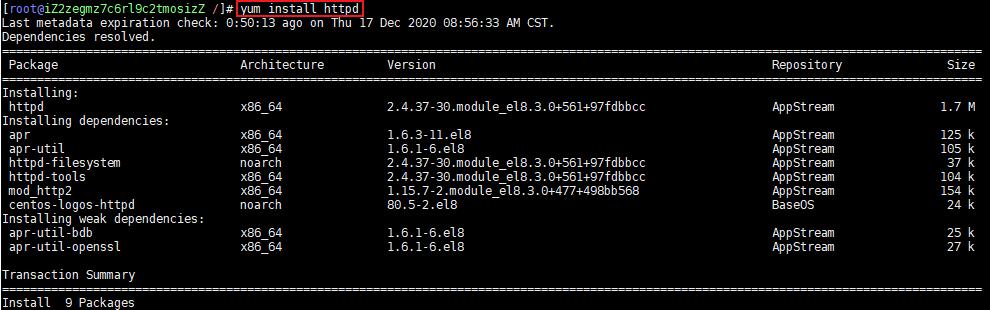
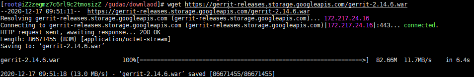
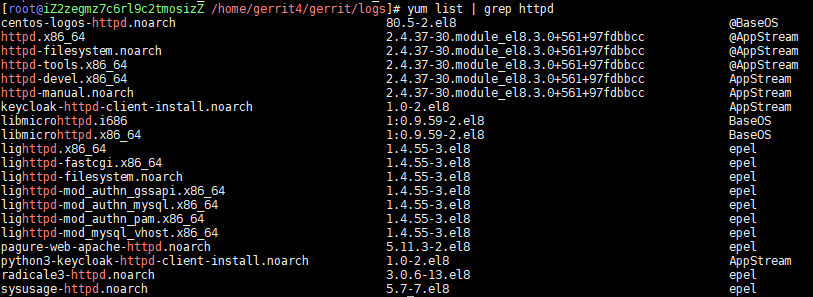
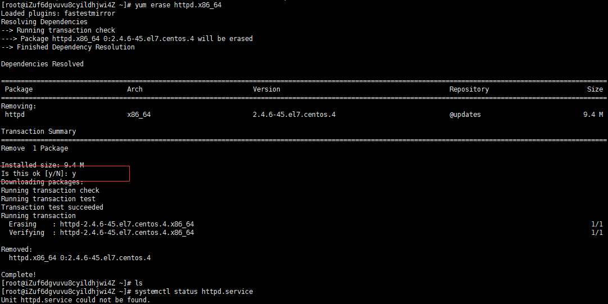

## 安装

#### 安装准备
* CentOS系统
* JDK环境
* git工具
* httpd反向代理工具

#### 安装对应的插件
1. CentOS没有wget安装wget
    ```shell
    yum install wget
    ```

2. CentOS没有git安装git
    ```shell
    yum install git
    ```

3. CentOS没有httpd安装httpd
    ```shell
    yum install httpd
    ```
    
    * 安装成功日志
        ```shell
        Installed:
          httpd-2.4.37-30.module_el8.3.0+561+97fdbbcc.x86_64                 apr-util-bdb-1.6.1-6.el8.x86_64
          apr-util-openssl-1.6.1-6.el8.x86_64                                apr-1.6.3-11.el8.x86_64
          apr-util-1.6.1-6.el8.x86_64                                        httpd-filesystem-2.4.37-30.module_el8.3.0+561+97fdbbcc.noarch
          httpd-tools-2.4.37-30.module_el8.3.0+561+97fdbbcc.x86_64           mod_http2-1.15.7-2.module_el8.3.0+477+498bb568.x86_64
          centos-logos-httpd-80.5-2.el8.noarch
        
        Complete!
        ```

4. JDK安装，具体看【【YC】java环境配置.md】

5. 下载Gerrit安装包
    * 下载Gerrit的war包，通常包名为gerrit-xxx.war，xxx为版本号
    * 地址：http://gerrit-releases.storage.googleapis.com/index.html
        ```shell
        wget https://gerrit-releases.storage.googleapis.com/gerrit-2.14.6.war
        ```
        

6. 安装Gerrit
    1. 进入到gerrit-2.14.6.war文件所在目录，执行以下命令进行交互式安装
        ```shell
        java -jar gerrit-2.14.6.war  init -d /home/gerrit4/gerrit
        ```
        这里省略安装过程，基本上一路回车，保持默认即可。安装过程中的配置都可以通过编辑安装后生成的配置文件来修改。该文件路径为/home/gerrit4/gerrit/etc/gerrit.config
    2. 注意：
        * gerrit可以将数据保存到mysql或其他的数据中，如果你需要使用mysql，则需要安装gerrit之前安装mysql，我这里直接使用默认的数据库类型 H2。如果你需要使用其他类型数据库，可以参考下面这个链接：https://gerrit-documentation.storage.googleapis.com/Documentation/2.12.2/install.html
        * 如果gerrit需要结合jenkins做CI持续构建的话，在交互式安装过程中需要安装Verified label，默认是不安装的：Install Verified label         [y/N]? y   这里选择y，安装Verified label。
    3. 安装步骤说明[此处可以一直默认，后面修改配置文件]
        ```shell
        输入命令后，根据如下的提示一步一步配置gerrit：
        
        *** Gerrit Code Review 2.14.6
        *** 
         
         
        *** Git Repositories
        *** 
         
        Location of Git repositories   [git]: //git放的目录，没有的话自己会创建的
         
        *** SQL Database
        *** 
         
        Database server type           [h2]: //默认H2数据库，如果想使用mysql数据库，输入mysql然后回车
         
        *** Index
        ***
         
        Type                           [lucene/?]:  
         
        *** User Authentication
        *** 
         
        Authentication method          [openid/?]: HTTP //输入HTTP，不然就不是反向代理了
        Get username from custom HTTP header [y/N]? n
        SSO logout URL                 : 
        Enable signed push support     [y/N]? n
         
        *** Review Labels
        *** 
         
        Install Verified label         [y/N]? n
         
        *** Email Delivery
        *** 
         
        SMTP server hostname           [localhost]: smtp.xxx.com //输入自动发送邮件的邮箱smtp
        SMTP server port               [(default)]: 25 // 465/994是SSL协议端口号，25是非SSL协议端口号
        SMTP encryption                [none/?]: //如果上一步输入的是465/994，此处输入SSL，否则直接回车
        SMTP username                  [root]: xxx@xxx.com
        xxx@xxx.com's password   : 
                      confirm password : //此处是你邮箱的授权码，非邮箱密码
         
        *** Container Process
        *** 
         
        Run as                         [root]: //这是用户，可以用默认root
        Java runtime                   [/usr/lib/jvm/java-1.8.0-openjdk-1.8.0.232.b09-0.el7_7.aarch64/jre]: 
        Copy gerrit-2.14.6.war to review_site/bin/gerrit.war [Y/n]? y
        Copying gerrit-2.14.6.war to review_site/bin/gerrit.war
         
        *** SSH Daemon
        *** 
         
        Listen on address              [*]:  
        Listen on port                 [29418]: 
        Generating SSH host key ... rsa... dsa... ed25519... ecdsa 256... ecdsa 384... ecdsa 521... done
         
        *** HTTP Daemon
        ***
         
        Behind reverse proxy           [y/N]? y
        Proxy uses SSL (https://)      [y/N]? n
        Subdirectory on proxy server   [/]: 
        Listen on address              [*]: 
        Listen on port                 [8081]: 8091 //这个端口号一定不要和apache的端口号一样
        Canonical URL                  [http://localhost/]: 
         
        *** Cache
        *** 
         
         
        *** Plugins
        ***
         
        Installing plugins.
        Install plugin commit-message-length-validator version v2.14.6 [y/N]? y
        Installed commit-message-length-validator v2.14.6
        Install plugin download-commands version v2.14.6 [y/N]? y
        Installed download-commands v2.14.6
        Install plugin hooks version v2.14.6 [y/N]? y
        Installed hooks v2.14.6
        Install plugin replication version v2.14.6 [y/N]? y
        Installed replication v2.14.6
        Install plugin reviewnotes version v2.14.6 [y/N]? y
        Installed reviewnotes v2.14.6
        Install plugin singleusergroup version v2.14.6 [y/N]? y
        Installed singleusergroup v2.14.6
        Initializing plugins.
         
        Initialized /home/gerrit4/gerrit
        ```
    4. 修改配置文件
        ```shell
        # 修改命令
        vim  /home/gerrit4/gerrit/etc/gerrit.config
        
        # 修改内容
        [gerrit]
                basePath = git
                canonicalWebUrl = http://182.92.113.41:8091
        [database]
                type = h2
                database = /home/gerrit2/gerrit/db/ReviewDB
        [index]
                type = LUCENE
        [auth]
                type = HTTP
        #       logoutUrl = 172.16.206.133:8080
        [receive]
                enableSignedPush = false
        [sendemail]
                smtpServer = smtp.exmail.qq.com
                smtpServerPort = 465
                smtpEncryption = SSL
                smtpUser = 你的邮箱账号
                smtpPass = 你的邮箱密码
                form = 你的邮箱账号
        [container]
                user = root
                javaHome = /usr/local/java/jdk1.8.0_261/jre
        [sshd]
                listenAddress = *:29418
        [httpd]
                listenUrl = http://*:8091/
        [cache]
                directory = cache
        ```
        
7. 创建密码认证文件,并创建用户admin
    ```shell
    # 转到安装路径
    cd /home/gerrit4/gerrit/etc/ 
    [root@localhost etc]# htpasswd -c -m passwords admin
    New password: 
    Re-type new password: 
    Adding password for user admin
    ```
    
8. 配置httpd方向代理
    ```shell
    vim  /etc/httpd/conf/httpd.conf
    
    # 追加内容
    Listen 8090
    <VirtualHost *:8090>
        ProxyRequests Off
        ProxyVia Off
        ProxyPreserveHost On
        #<Proxy *>
        #      Order deny,allow
        #      Allow from all
        #</Proxy>
        <Location /login/>
          AuthType Basic
          AuthName "Gerrit Code Review"
          AuthBasicProvider file
          AuthUserFile /home/gerrit4/gerrit/etc/passwords
          Require valid-user
        </Location>
         
        AllowEncodedSlashes On
        ProxyPass / http://127.0.0.1:8091/ nocanon
        ###这里端口为8091，与gerrit.config中配置的一样端口一样
        ProxyPassReverse / http://127.0.0.1:8091/
    </VirtualHost>
    ```

9. 启动或者重启gerrit/httpd
    ```shell
    cd /home/gerrit4/gerrit/bin/
    ./gerrit.sh restart
    
    service httpd restart
    ```
    
10. 访问
http://182.92.113.41:8090/

#### 补充：卸载httpd
1. 首先，要确认下是否有安装过，或者是系统自带了httpd服务，通过以下命令
    ```shell
    yum list | grep httpd
    ```     
    
    
2. 停止httpd服务
    ```shell
    systemctl stop httpd.service
    ```

3. 然后通过 rpm -e 或者yum -erase 命令都可以，不过rpm -e命名必须要自己先卸载依赖包，所以我用yum -erase命令卸载，命令如下：
    ```shell
    yum erase httpd.x86_64
    ```
    
