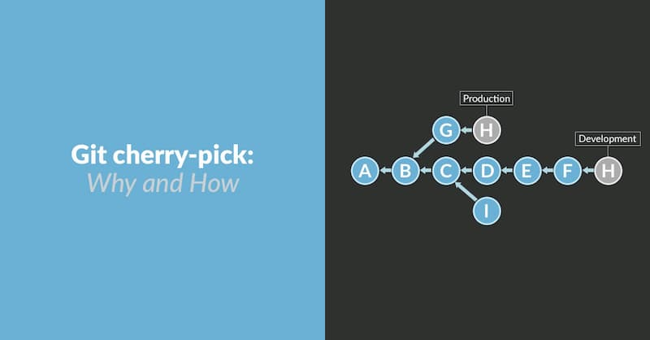
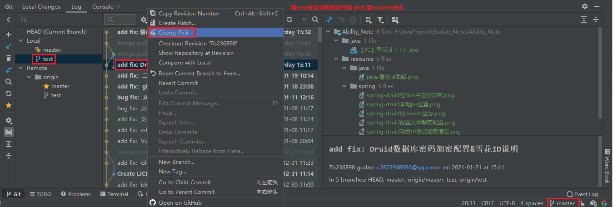

## 项目中用过的Git命令 - git cherry pick

### git cherry pick
> 应用场景：[默认一次性提交的代码比较多]在使用分布式git的时候，需要维护好几个分支；但是当一个分支可dev分支合并[默认dev分支中有其他人的代码，但是这部分代码还不能上test环境]，因为你的分支和dev分支合并过，所以你如果想把你在dev分支测试通过的代码提交到test分支的是时候就会一起吧其他的人代码同事提交<br>
> 解决方案：重新创建一个分支，通过 `git log` 查看哪些是你提交的代码，然后再通过 `git cherry pick` 将你的代码重新筛选到新建的分支中进行提交

### 对于多分支的代码库，将代码从一个分支转移到另一个分支
> 这时分两种情况。一种情况是，你需要另一个分支的所有代码变动，那么就采用合并（git merge）。另一种情况是，你只需要部分代码变动（某几个提交），这时可以采用 Cherry pick



### 基本用法
* git cherry-pick 命令的作用，就是将指定的提交（commit）应用于其他分支
```shell
git cherry-pick <commitHash>
```
* 举例说明
    * 代码仓库有master和feature两个分支
        ```shell
        a - b - c - d   Master
         \
           e - f - g    Feature
        ```
    * 现在将提交f应用到master分支
        ```shell
        # 切换到 master 分支
        git checkout master
        # Cherry pick 操作
        git cherry-pick f
        ```
    * 操作完成后，代码库就变成了下面的样子
        ```shell
        a - b - c - d - f   Master
         \
           e - f - g        Feature
        ```
      
### Idea中使用cherry pick
