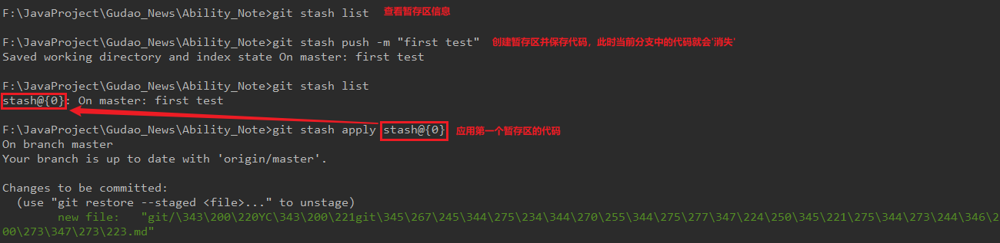
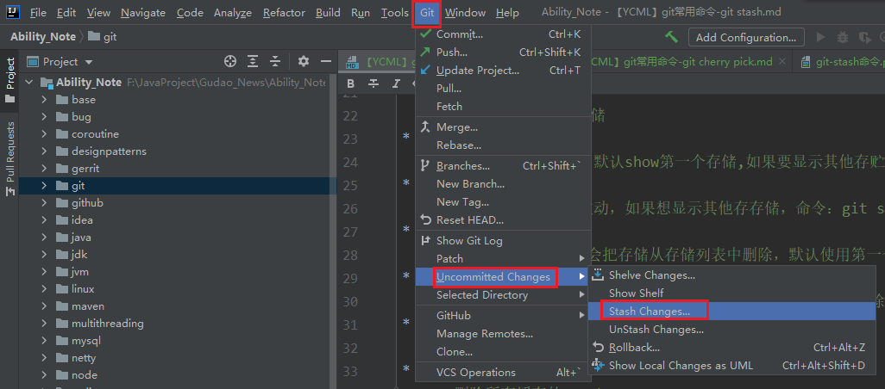
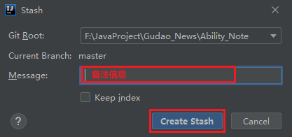
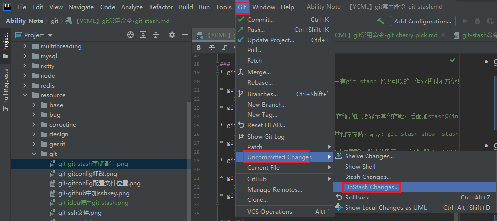

## 项目中用过的Git命令 - git stash

### git stash
> 应用场景：在多分支开发的情况下，发现写的代码在其它分支也能使用时，此时使用临时存储区可是免去cv的操作
* 命令使用
```shell
# 创建暂存区，进行代码存储
git stash push -m "暂存备注[最好使用英文]"
# 展示暂存区信息
git stash list
# 将暂存区的代码拉取下来
git apply
# 将暂存区内容清除
git stash clear
```


### 命令详解
* git stash save "save message"
    > 执行存储时，添加备注，方便查找，只有git stash 也要可以的，但查找时不方便识别。
* git stash list
    > 查看stash了哪些存储
* git stash show
    > 显示做了哪些改动，默认show第一个存储,如果要显示其他存贮，后面加stash@{$num}，比如第二个 git stash show stash@{1}
* git stash show -p
    > 显示第一个存储的改动，如果想显示其他存存储，命令：git stash show  stash@{$num}  -p ，比如第二个：git stash show  stash@{1}  -p
* git stash apply
    > 应用某个存储,但不会把存储从存储列表中删除，默认使用第一个存储,即stash@{0}，如果要使用其他个，git stash apply stash@{$num} ， 比如第二个：git stash apply stash@{1}
* git stash pop
    > 命令恢复之前缓存的工作目录，将缓存堆栈中的对应stash删除，并将对应修改应用到当前的工作目录下,默认为第一个stash,即stash@{0}，如果要应用并删除其他stash，命令：git stash pop stash@{$num} ，比如应用并删除第二个：git stash pop stash@{1}
* git stash drop stash@{$num}
    > 丢弃stash@{$num}存储，从列表中删除这个存储
* git stash clear
    > 删除所有缓存的stash

### 注意
git add 只是把文件加到git 版本控制里，并不等于就被stash起来了，git add和git stash 没有必然的关系，但是执行git stash 能正确存储的前提是文件必须在git 版本控制中才行

### IDEA中使用方法
* git/VCS --> Uncommitted Changes/git --> Stash Changes
  
* 暂存信息说明
  
* 暂存信息拉取
  

  