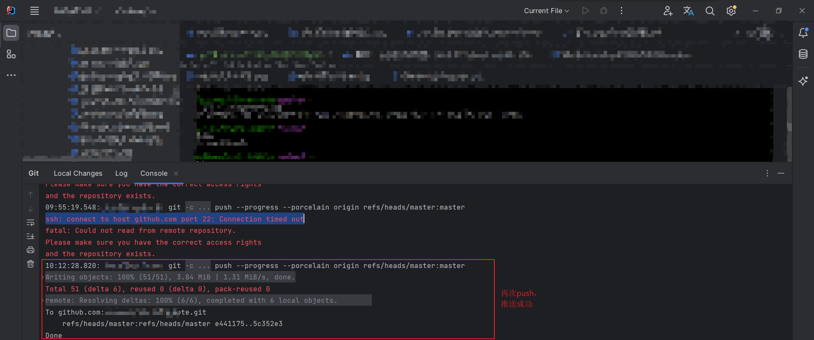

## Github 22端口连接超时问题
> git-ssh: connect to host github.com port 22: Connection timed out

### 问题说明
```shell
# 通过`git push`代码到github仓库，报错如下
ssh: connect to host github.com port 22: Connection timed out
fatal: Could not read from remote repository.
```

### 解决方法1
```shell
# 进入windos或者linux当前用户文件夹（windows在`C盘/用户`下；linux在`/home/用户`下，root用户就在root下）
# 跟.ssh文件夹同级即可；windows右击，点击 `git branch here`;
# 编辑 ~/.ssh/config 文件，如果没有config文件的话就直接 vim ~/.ssh/config加入以下内容
vi ~/.ssh/config

# 加入内容
Host github.com
Hostname ssh.github.com
Port 443

# 测试
ssh -T git@github.com
```



### 解决方法2
```shell
# 原因可能是防火墙修改，因为您位于网络下。（在这种情况下，他们可能会故意阻止某些端口）
# 请求超时，如果是这种情况，请使用 https 协议而不是 ssh，只需将配置文件中的 url 更改为 https 即可
ssh -T git@github.com

# 修改当前项目的配置文件
# 需要与当前项目的.git文件夹同级
git config --local -e
# 修改（后面的地址根据项目自定义配置）
url = git@github.com:username/repo.git
# 到
url = https://github.com/username/repo.git
```

