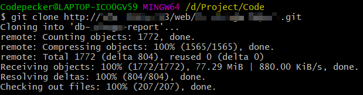

## git中clone过大项目超时解决方案

### 异常信息
> error: RPC failed; curl 18 transfer closed with outstanding read data remaining
```shell
$ git clone http://xxxx.xxx/web/db-xxx-report.git
Cloning into 'db-xxx-report'...
remote: Counting objects: 1772, done.
remote: Compressing objects: 100% (1565/1565), done.
error: RPC failed; curl 18 transfer closed with outstanding read data remaining
fatal: The remote end hung up unexpectedly
fatal: early EOF
fatal: index-pack failed
```


### 解决方案
```shell
# 配置git的最低速度和最低速度时间 
git config --global http.lowSpeedLimit 0
git config --global http.lowSpeedTime 999999

# 如果依旧clone失败，则首先浅层clone，然后更新远程库到本地
git clone --depth=1 http://gitlab.xxx.cn/yyy/zzz.git
git fetch --unshallow
```

