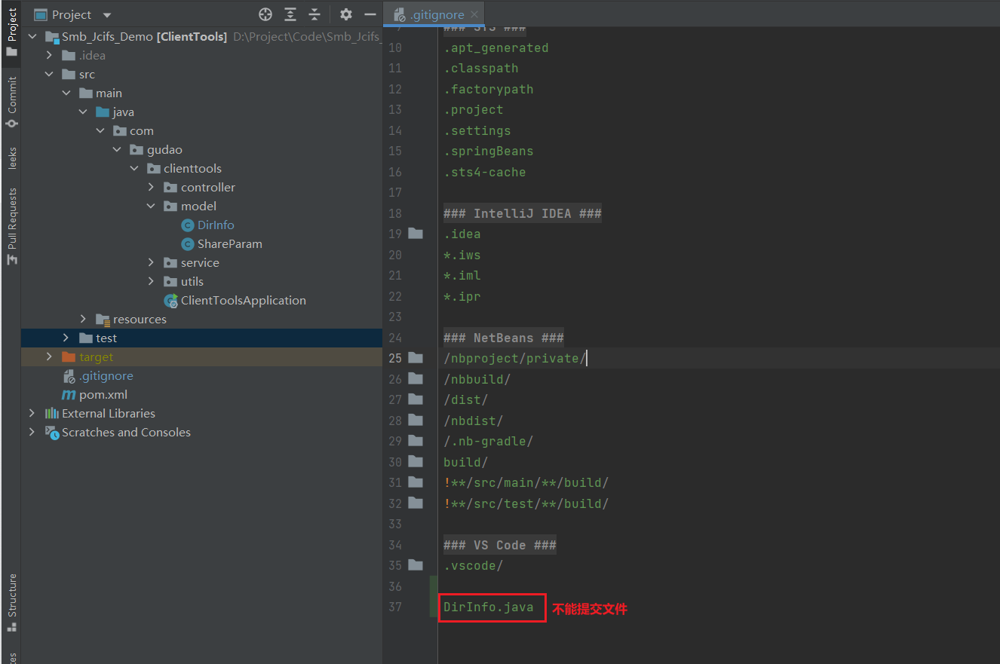
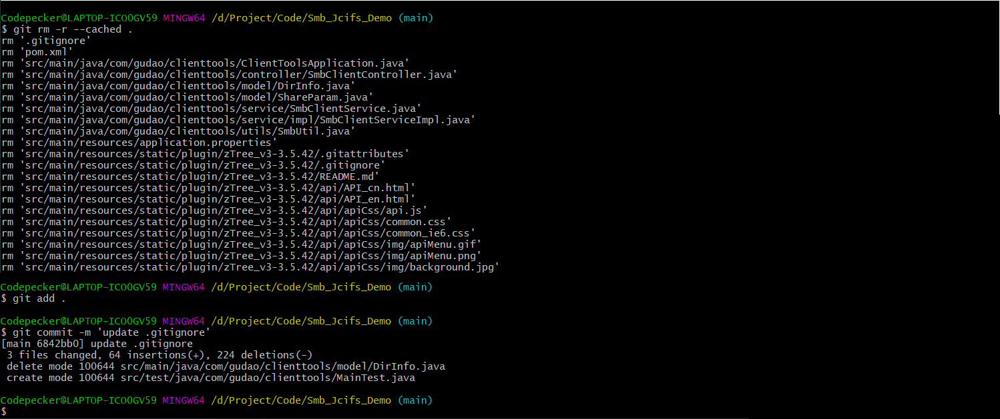
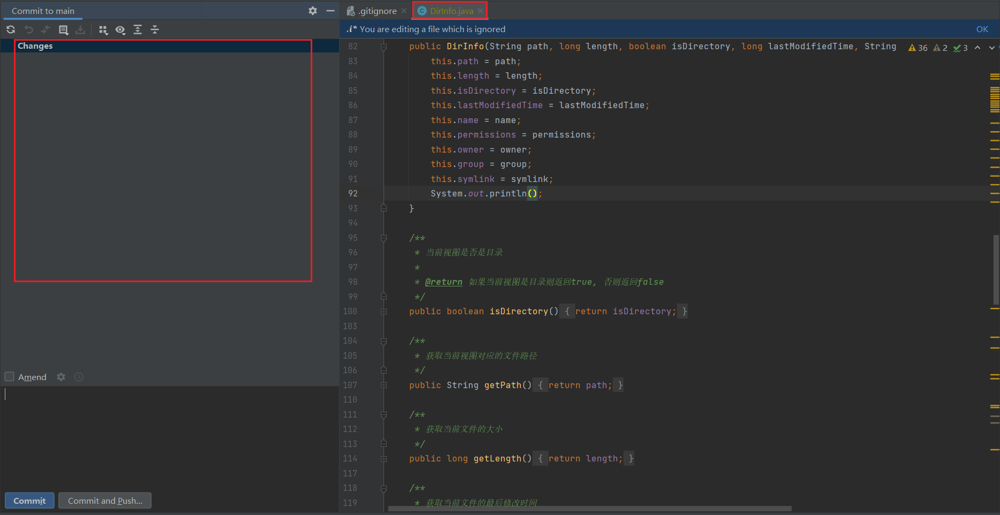

## .gitignore中添加指定过滤文件

### 前提
* 项目中已经使用了.gitignore的过滤规则，现在需要新加一条过滤规则

### 操作
#### .gitignore中添加过滤条件
```.gitignore
# 过滤文件夹
bin/

# 过滤指定文件
文件名称（例：DirInfo.java）
```


#### 清除原先缓存中的过滤规则，重新提交
> `git add .`是添加所有的未添加的文件到本地仓库，注意提交的时候看下commit内容是不是你要提交的
```git
git rm -r --cached .

git add .

git commit -m 'update .gitignore'
```


#### 验证

