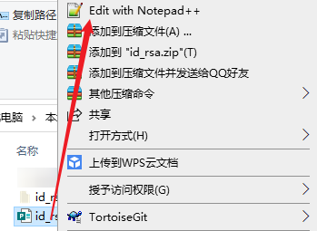

## Git创建生成SSHkey

### 安装Git Bash
<https://git-scm.com/downloads>

### 鼠标右键git bash here


### 移动到生成密钥的文件夹[系统默认在`C盘/用户/.ssh`文件夹中]
```shell
# 查看是否已经有了ssh密钥，如果没有密钥则不会有此文件夹，有则备份删除
cd ~/.ssh/    
# 如果没有对应的文件夹，则执行【最好创建在C盘】 
mkdir ../.ssh
```
 <br>


### 创建密钥
```shell
# 生成密钥：
ssh-keygen -t rsa -C "gudao@gmail.com"
# 按3个回车，密码为空这里一般不使用密钥，最后得到了两个文件：id_rsa和id_rsa.pub
```

### 添加私密钥
```shell
# 添加 私密钥 到ssh
ssh-add id_rsa
# 需要之前输入密码（如果有）
```

### 使用
* 在github上添加ssh密钥，这要添加的是“id_rsa.pub”里面的公钥
    
* 打开 http://github.com,登陆，然后添加ssh。
    
* [演示使用Notepad++]注意在这里由于直接复制粘帖公钥，可能会导致增加一些字符或者减少些字符，最好用系统工具xclip来做这些事情
    ```shell
    xclip -selection c  id_rsa.pub
    ```
  
  
### 注意
* 密匙生成就不要改了，如果已经生成到~/.ssh文件夹下去找。
* id_rsa.pub文件内容全部弄到github上。

#### 命令解释
```shell
# ssh-keygen -t rsa -C "any comment can be here"命令：
# The email is only optional field to identify the key.
# 邮箱仅仅是识别用的key

# When you create the ssh you type (for example):
ssh-keygen -t rsa -C "any comment can be here"
当你创建ssh的时候

# -t = The type of the key to generate
密钥的类型
# -C = comment to identify the key
用于识别这个密钥的注释

# So the Comment is for you only and you can put anything inside.
# Many sites and software are using this comment as the key name.
所以这个注释你可以输入任何内容，很多网站和软件用这个注释作为密钥的名字
```
