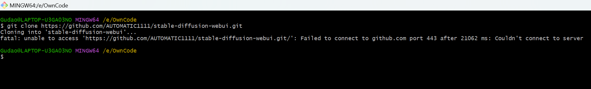
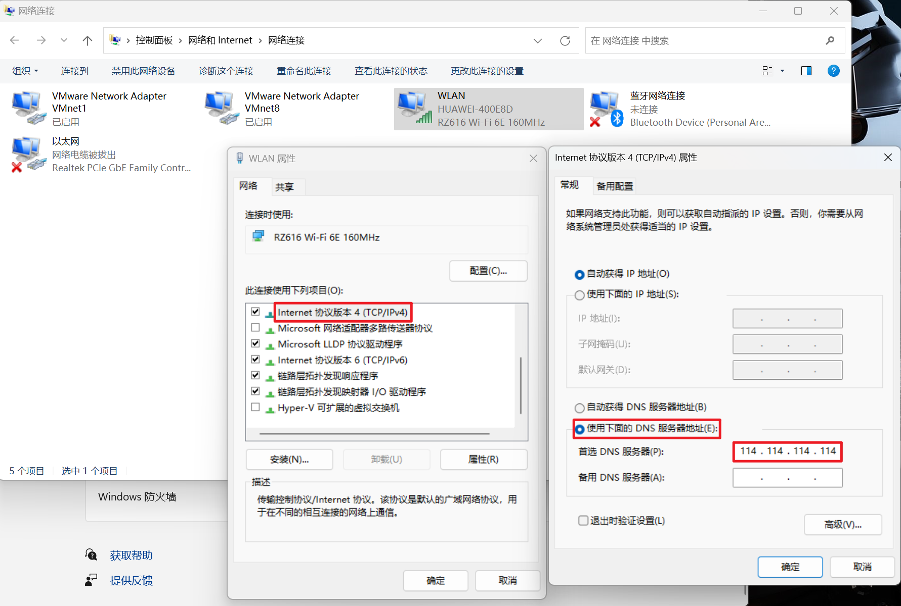

## Git Clone GitHub 代码报错Failed to connect to github.com port 443:connection timed out

### 说明
* 解决日期：2023 06 17
* 截至目前是能使用此方法，但使用的修改DNS服务器，如果目前使用的DNS服务器也被禁，那么此方法可能会不能使用

### 报错截图

### 修改电脑中的DNS服务器

### 也可以把8.8.8.8的DNS添加到备用