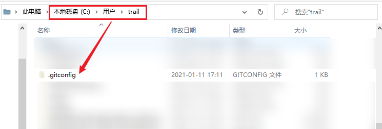
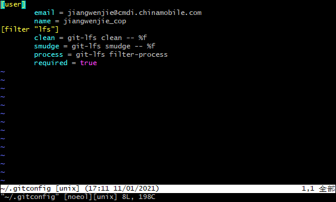
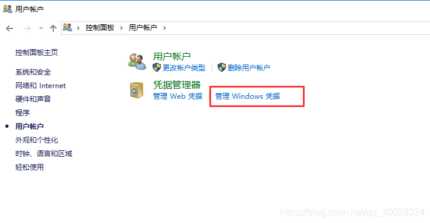
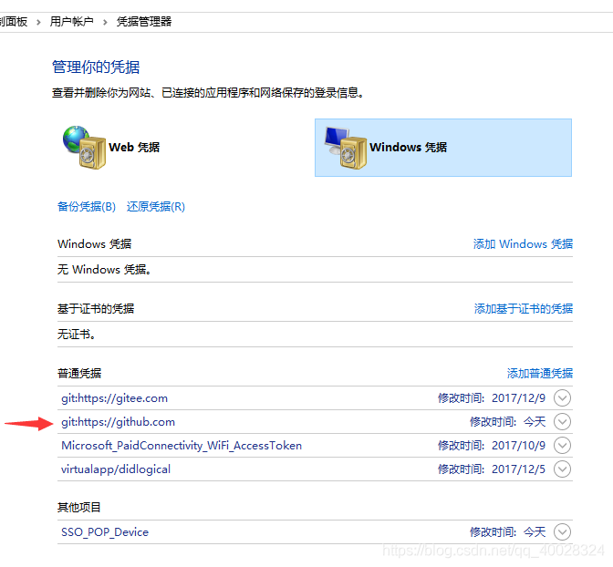

## Git用户邮箱配置

### git全局用户邮箱配置
#### 初次配置
* 在未配置过git用户名与邮箱的情况下
    ```shell
    # 配置用户名
    git config --global user.name "gudao"
    # 配置用户邮箱
    git config --global user.email "xxx@qq.com"
    # 查看全局配置信息
    git config --global --list
    # 查看全局邮箱
    git config --global user.email
    # 查看全局用户名
    git config --global user.name
    ```

#### 修改配置
* 在已配置过git用户名与邮箱的情况下
    ```shell
    git config --global --replace-all user.email "输入你的邮箱"
    git config --global --replace-all user.name "输入你的用户名"
    ```
* 注意[也可通过此处修改配置]
    git中的配置信息都在<br>
    
    ```shell
    [user]
	email = xxx@qq.com
	name = gudao
    [filter "lfs"]
    clean = git-lfs clean -- %f
    smudge = git-lfs smudge -- %f
    process = git-lfs filter-process
    required = true
    ```
* 也可以通过修改配置文件命令修改
    ```shell
    vi ~/.gitconfig;
    ```
    

### git当前项目的用户名邮箱配置
```shell
# git 修改当前的project的用户名的命令为：
git config user.name 你的目标用户名

# git 修改当前的project提交邮箱的命令为：
git config user.email 你的目标邮箱名
```

### 修改用户本地的github或其它git的账号
> 当你换了一个项目组之后，你提交代码的时候，提示你的账号和邮箱真确，那么就可以通过以下方法来将你上家公司的账号和密码替换掉
* 通过控制面板找到用户账户<br>

* 通过其中的凭据管理就可以看到你所有使用过的账号信息，找到git对应的账号信息修改即可<br>

