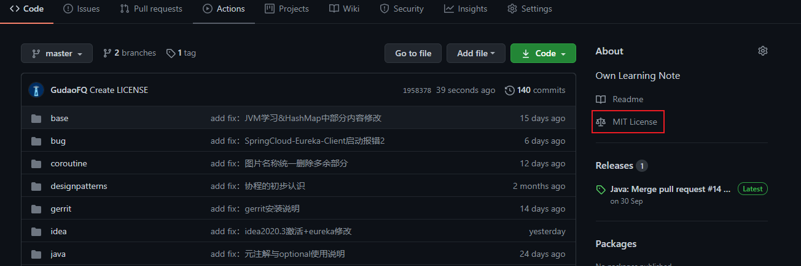

## GitHub开源证书添加详解

#### 说明
开源许可证即授权条款。开源软件并非完全没有限制。最基本的限制，就是开源软件强迫任何使用和修改该软件的人承认发起人的著作权和所有参与人的贡献。任何人拥有可以自由复制、修改、使用这些源代码的权利，不得设置针对任何人或团体领域的限制；不得限制开源软件的商业使用等。而许可证就是这样一个保证这些限制的法律文件。

#### 常见的开源许可证包括
* Apache License 2.0
    * 这类似于MIT许可证，但它同时还包含了贡献者向用户提供专利授权相关的条款
    * 使用该许可证的项目：Apache、SVN和NuGet
* GNU General Public License v3.0[GPL]
    * 这是一种copyleft许可证，要求修改项目代码的用户再次分发源码或二进制代码时，必须公布他的相关修改。V3版本与V2类似，但其进一步约束了在某些限制软件更改的硬件上的使用范围
    * 使用该许可证的项目：Linux、Git
* MIT License
    * 这是一个宽松的、简明扼要的许可证，只要用户在项目副本中包含了版权声明和许可声明，他们就可以拿你的代码做任何想做的事情，你也无需承担任何责任
    * 使用该许可证的项目：jQuery、Rails
    

#### 在项目首页，点击 `Create new file`

#### 创建文件名为 `LICENSE`

#### 输入 `LICENSE` ，GitHub就已经自动提示 `Choose a license template` 选项啦，点击进入

* 最左侧展示了 GitHub 可以选择的开源许可证名称，以MIT License为例，点击之后，中间部分显示具体开源许可证的内容。在此处，我们可以自由选择自己想要的许可证

#### 点击 `Review and submit` 进入下一步

* Commit directly to the master branch
    * 直接将此许可证提交到master分支
* Create a new branch for this commit and start a pull request
    * 建立一个分支，然后我们可以提PR到master，再进行合并
    
#### 此时就创建完成了

